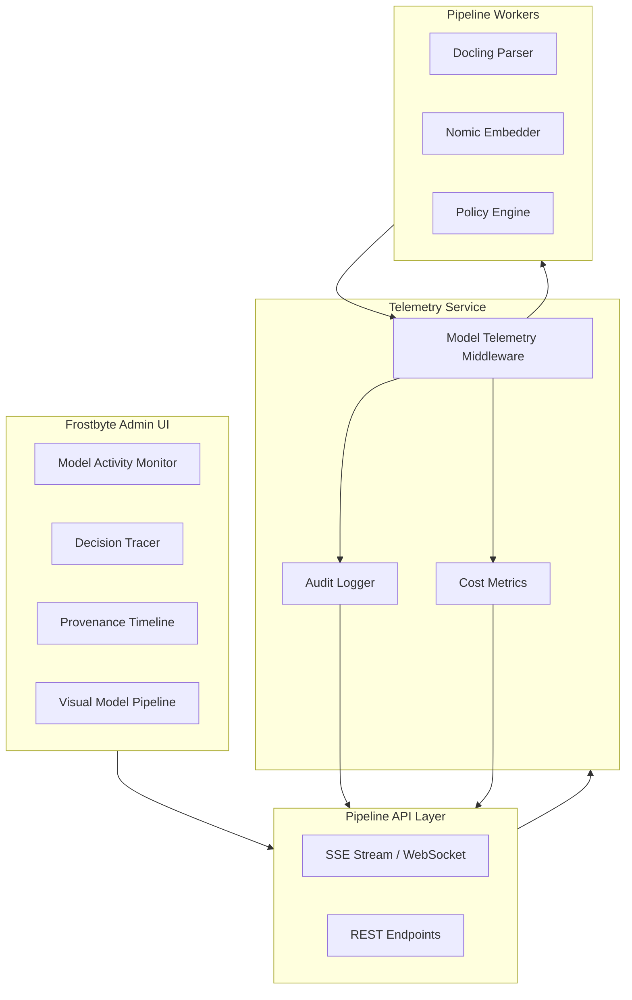
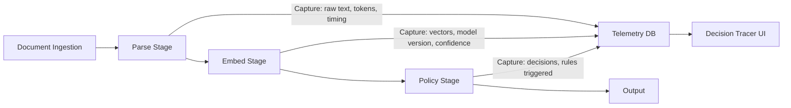

# Frostbyte ETL Admin Dashboard — Priority 1: Extreme Observability Layer (All-in-One PPP)

## Status

- **Canonical Source:** This file is the sole source of truth for Priority 1 implementation.
- **Version:** v1.0.0
- **Date:** 2026-02-14
- **Status:** Planning → Implementation Ready
- **Dependencies:** Priority 2 (Accessibility & Compliance) for WCAG-compliant components

### Changelog

- **v1.0.0 (2026-02-14):** Initial PRD based on comprehensive design review findings.

---

## Policy Summary (Non-Negotiable)

- **Core Principle:** "Eyes on machines at all times" — Every AI model action must be visible, traceable, and auditable.
- **Runtime Boundary:** TypeScript/React frontend, FastAPI backend (Python allowed for ML telemetry middleware).
- **Zero-Shot Minimum:** Model Activity Monitor dashboard + real-time SSE stream + basic decision tracing.
- **Observability Requirement:** All 10 critical observability gaps must be addressed.
- **ZSBC Enforcement:** No manual intervention for model telemetry collection; immutable audit trail required.

---

## Part 0 — System Definition

### 0.1 Naming

**Feature Name:** Frostbyte Model Observatory (FMO)

**Components:**
1. **Model Activity Monitor** — Real-time visual feed of all model operations
2. **Decision Tracer** — Interactive inspection of model inputs/outputs
3. **Provenance Timeline** — Model version history and deployment tracking
4. **Visual Model Pipeline** — Enhanced pipeline schematic with model identity

### 0.2 Architecture Flowchart — Model Observability Stack



### 0.3 Data Flow — Model Decision Tracing



---

## Part A — Gold Standard PPP + PRD

### Prompt (Intent / UPOS-7-VS)

#### Role / Persona

**AI Observability Engineer** building extreme visibility into multi-model ETL pipelines for compliance officers, ML engineers, and operations teams requiring:

- Real-time model activity monitoring
- Complete decision audit trails
- Cost and performance visibility
- Regulatory compliance (SOC2, GDPR)

#### Objective

Create a comprehensive model observability layer that makes AI/ML pipeline operations:

1. **Visible** — Real-time view of which models are running and what they're doing
2. **Traceable** — Every model decision can be inspected with inputs/outputs
3. **Auditable** — Complete provenance chain from document ingestion to output
4. **Cost-Transparent** — Token usage and costs visible per model, per document, per tenant

#### Scenario / Context

Current Frostbyte ETL Admin Dashboard has a fundamental observability gap:

- Cannot see which AI models are running in real-time
- No visibility into model inputs/outputs
- Cannot trace why a model made a specific decision
- Missing model version tracking and deployment history
- No cost visibility for token usage
- Audit logs don't include model-specific actions

This violates the core requirement: **"EXTREME OBSERVABILITY - eyes on machines at all times."**

#### Task

Build Frostbyte Model Observatory (4 integrated components):

**Component 1: Model Activity Monitor**
- Real-time event stream showing model operations
- Filterable by model, document, tenant, operation type
- Visual status indicators (idle/processing/error)
- Performance metrics (latency, throughput, error rate)

**Component 2: Decision Tracer**
- Interactive inspection of model inputs/outputs
- Side-by-side input/output comparison
- Explanation of model decisions where available
- Link to full audit trail for compliance

**Component 3: Provenance Timeline**
- Model version registry and deployment history
- Configuration change tracking with full audit
- Rollback capability with impact preview
- A/B testing results visualization

**Component 4: Visual Model Pipeline**
- Enhanced pipeline schematic showing model identity at each stage
- Live status indicators for each model
- Visual data flow between models
- Bottleneck detection and alerting

#### Format

Deliver:

1. **Backend Services:**
   - Model Telemetry Service (FastAPI middleware)
   - Audit persistence layer
   - Cost tracking service
   - SSE streaming endpoint

2. **Frontend Components:**
   - ModelActivityMonitor.tsx (real-time feed)
   - DecisionTracer.tsx (input/output inspection)
   - ProvenanceTimeline.tsx (version history)
   - Enhanced PipelineSchematic with model visibility

3. **Database Schema:**
   - Model events table
   - Decision traces table
   - Model versions table
   - Cost metrics table

4. **API Contracts:**
   - OpenAPI spec for all endpoints
   - SSE event format specification
   - WebSocket message schemas

#### Constraints

**Technical:**

- TypeScript/React for frontend (existing stack)
- FastAPI/Python for telemetry service
- PostgreSQL for audit persistence
- Redis for real-time stream buffering
- SSE for server-to-client streaming
- Event latency < 100ms from model execution to UI

**Observability:**

- Capture 100% of model invocations (no sampling for critical paths)
- Input/output storage with PII redaction
- Retention: 30 days for full traces, 1 year for audit summaries
- Immutable audit logs (append-only, signed)

**Performance:**

- Telemetry collection overhead < 5% of model execution time
- UI updates at 1Hz minimum for real-time feel
- Support 1000+ concurrent model operations
- Query response < 500ms for historical traces

**Security:**

- Model inputs/outputs encrypted at rest
- Field-level encryption for sensitive data
- Role-based access to traces (tenant isolation)
- No PII in telemetry logs

---

## Plan (Decisions / REASONS Log)

### Reflect: Intent Confirmed? Gaps?

**Intent Confirmed:**
- ✅ Critical observability gaps identified in design review
- ✅ "Eyes on machines" is non-negotiable requirement
- ✅ SOC2/GDPR compliance requires audit trails

**Gaps Identified:**
- ❌ No telemetry middleware exists in current pipeline
- ❌ Database schema for model events not defined
- ❌ SSE infrastructure not implemented
- ❌ Cost tracking mechanism absent

### Explore: Options Considered

#### Option 1: External APM Tool (Datadog, New Relic) — REJECTED
- Pros: Fast implementation, rich features
- Cons: Vendor lock-in, data leaves premises, cost
- Reason rejected: Violates privacy-first principle

#### Option 2: OpenTelemetry + Jaeger — REJECTED
- Pros: Open standard, vendor-neutral
- Cons: Complex setup, overkill for current needs
- Reason rejected: Too heavy for v1, team expertise gap

#### Option 3: Custom Telemetry Service — SELECTED
- Pros: Purpose-built, full control, integrated with existing stack
- Cons: Development time required
- Reason selected: Aligns with extreme observability requirement, enables custom features

### Analyze: Trade-offs

#### Architecture: Monolithic vs Microservice Telemetry
- **Selected:** Monolithic telemetry service (part of main API)
- **Trade-off:** Simpler deployment vs scalability
- **Why:** Current scale doesn't warrant microservices, can extract later

#### Storage: PostgreSQL vs Time-Series DB
- **Selected:** PostgreSQL with partitioning
- **Trade-off:** Familiar vs optimized for time-series
- **Why:** Team expertise, existing infrastructure, sufficient for v1

#### Real-time: SSE vs WebSocket vs Polling
- **Selected:** SSE for model events, WebSocket for tracer sessions
- **Trade-off:** Simplicity vs bidirectional capability
- **Why:** SSE sufficient for one-way streaming, WebSocket for interactive tracer

### Solve: Path Chosen

#### Phase 1: Telemetry Infrastructure (Days 1-5)

**Step 1.1: Create Model Telemetry Middleware**

```bash
set -euo pipefail

# Create telemetry service structure
mkdir -p pipeline/telemetry/{middleware,models,services,api}
```

Verify:
```bash
set -euo pipefail
test -d pipeline/telemetry/middleware && test -d pipeline/telemetry/models && echo "✅ PASS" || echo "❌ FAIL"
```

**Step 1.2: Implement Model Event Capture**

Create middleware that wraps all model calls:
- Capture input/output at each pipeline stage
- Record timing, token usage, model version
- Stream to SSE endpoint
- Persist to audit database

Verify:
```bash
set -euo pipefail
# Test event capture
curl -s http://localhost:8000/telemetry/test | jq '.status' | grep "ok"
```

**Step 1.3: Database Schema Migration**

```sql
-- Model events table
CREATE TABLE model_events (
    id UUID PRIMARY KEY DEFAULT gen_random_uuid(),
    timestamp TIMESTAMPTZ DEFAULT NOW(),
    tenant_id TEXT NOT NULL,
    document_id TEXT NOT NULL,
    stage TEXT NOT NULL, -- parse, embed, policy
    model_name TEXT NOT NULL,
    model_version TEXT NOT NULL,
    operation TEXT NOT NULL, -- process, classify, embed
    status TEXT NOT NULL, -- started, completed, failed
    duration_ms INTEGER,
    input_tokens INTEGER,
    output_tokens INTEGER,
    cost_usd DECIMAL(10,6),
    metadata JSONB
);

-- Decision traces table
CREATE TABLE decision_traces (
    id UUID PRIMARY KEY DEFAULT gen_random_uuid(),
    event_id UUID REFERENCES model_events(id),
    input_data JSONB,
    output_data JSONB,
    decision_rationale TEXT,
    confidence_score DECIMAL(3,2)
);

-- Model versions table
CREATE TABLE model_versions (
    id UUID PRIMARY KEY DEFAULT gen_random_uuid(),
    model_name TEXT NOT NULL,
    version TEXT NOT NULL,
    deployed_at TIMESTAMPTZ,
    deployed_by TEXT,
    configuration JSONB,
    is_active BOOLEAN DEFAULT false,
    UNIQUE(model_name, version)
);
```

Verify:
```bash
set -euo pipefail
# Run migrations
alembic upgrade head
# Verify tables exist
psql -c "\dt" | grep -E "model_events|decision_traces|model_versions"
```

#### Phase 2: Frontend Components (Days 6-12)

**Step 2.1: Model Activity Monitor Component**

```tsx
// packages/admin-dashboard/src/features/observability/ModelActivityMonitor.tsx
interface ModelActivity {
  id: string;
  timestamp: string;
  modelName: string;
  modelVersion: string;
  operation: string;
  documentId: string;
  status: 'running' | 'completed' | 'failed';
  durationMs: number;
  costUsd: number;
}

// Real-time feed with filtering
// Visual indicators for status
// Click to drill into decision details
```

**Step 2.2: Decision Tracer Component**

```tsx
// packages/admin-dashboard/src/features/observability/DecisionTracer.tsx
interface DecisionTrace {
  eventId: string;
  input: unknown;
  output: unknown;
  rationale?: string;
  confidence?: number;
}

// Side-by-side input/output view
// JSON tree expansion
// Link to audit trail
```

**Step 2.3: Provenance Timeline Component**

```tsx
// packages/admin-dashboard/src/features/observability/ProvenanceTimeline.tsx
interface ModelVersion {
  modelName: string;
  version: string;
  deployedAt: string;
  deployedBy: string;
  configuration: Record<string, unknown>;
  isActive: boolean;
}

// Timeline visualization
// Version comparison
// Rollback controls
```

**Step 2.4: Enhanced Pipeline Schematic**

```tsx
// Update existing PipelineSchematic to show:
// - Model identity at each stage (e.g., "Docling v2.70")
// - Live status indicators
// - Visual data flow animation
// - Bottleneck alerts
```

#### Phase 3: Integration & Testing (Days 13-18)

**Step 3.1: Wire up SSE Stream**

```bash
set -euo pipefail
# Verify SSE endpoint
curl -N -H "Accept: text/event-stream" http://localhost:8000/telemetry/stream | head -20
```

**Step 3.2: End-to-End Test**

```bash
set -euo pipefail
# Ingest test document
# Verify events appear in Activity Monitor
# Click through to Decision Tracer
# Verify audit trail complete
```

---

## Production (Outputs and Evidence)

### Artefacts (Paths/Links)

**Backend:**
- `pipeline/telemetry/middleware/model_capture.py` — Model call wrapper
- `pipeline/telemetry/services/event_service.py` — Event processing
- `pipeline/telemetry/api/sse_endpoint.py` — Streaming endpoint
- `migrations/versions/xxx_model_observability_tables.py` — DB schema

**Frontend:**
- `packages/admin-dashboard/src/features/observability/ModelActivityMonitor.tsx`
- `packages/admin-dashboard/src/features/observability/DecisionTracer.tsx`
- `packages/admin-dashboard/src/features/observability/ProvenanceTimeline.tsx`
- `packages/admin-dashboard/src/features/pipeline/EnhancedPipelineSchematic.tsx`

**API Contracts:**
- `schemas/telemetry/model_events.schema.json`
- `schemas/telemetry/decision_traces.schema.json`
- `schemas/telemetry/sse_events.schema.json`

### Verification Criteria

**Must Pass All:**

1. **Telemetry Capture Works**
   ```bash
   set -euo pipefail
   # Process document through pipeline
   # Query model_events table
   # Verify events recorded for each stage
   ```

2. **SSE Stream Delivers Events**
   ```bash
   set -euo pipefail
   curl -N http://localhost:8000/telemetry/stream | grep "data:"
   # Events appear in real-time
   ```

3. **Activity Monitor Displays Events**
   ```bash
   set -euo pipefail
   # UI shows model activity feed
   # Filter by tenant, document, model
   ```

4. **Decision Tracer Shows I/O**
   ```bash
   set -euo pipefail
   # Click event in Activity Monitor
   # Decision Tracer opens with input/output
   ```

5. **Provenance Timeline Tracks Versions**
   ```bash
   set -euo pipefail
   # Deploy new model version
   # Timeline shows deployment
   # Rollback available
   ```

---

## Risks / Edge Cases / Failure Modes

### Risk Register

#### RK-OBS-001: Telemetry Overhead Too High
- **Likelihood:** Medium
- **Impact:** High (slows pipeline)
- **Mitigation:** Async event publishing, batched writes
- **Contingency:** Sampling for non-critical paths

#### RK-OBS-002: Database Growth Unbounded
- **Likelihood:** High
- **Impact:** Medium (storage costs)
- **Mitigation:** Partitioning, automated archival
- **Contingency:** Aggressive retention policies

#### RK-OBS-003: SSE Connection Limits
- **Likelihood:** Medium
- **Impact:** Medium (scalability)
- **Mitigation:** Connection pooling, Redis pub/sub
- **Contingency:** Fallback to polling

#### RK-OBS-004: PII Leakage in Traces
- **Likelihood:** Low
- **Impact:** Critical (compliance)
- **Mitigation:** Automated PII detection/redaction
- **Contingency:** Manual audit process

### Edge Cases

1. **Model call fails before completion** — Capture partial event with error details
2. **SSE client disconnects** — Buffer events, resume on reconnect
3. **Tenant isolation breach** — Enforce tenant_id filtering at API level
4. **Clock skew between services** — Use centralized timestamp service

### Failure Modes

1. **Telemetry service down** — Pipeline continues, events logged to file for replay
2. **Database unavailable** — Buffer in Redis, retry with exponential backoff
3. **UI fails to load traces** — Show error with retry, maintain last known state

---

## Approval Needed By / Status

**Approvals Required:**

- [ ] Engineering Lead review of telemetry architecture
- [ ] Security review of PII handling
- [ ] Compliance review of audit trail completeness
- [ ] UX review of Activity Monitor design

**Current Status:** Planning Complete → Implementation Ready
