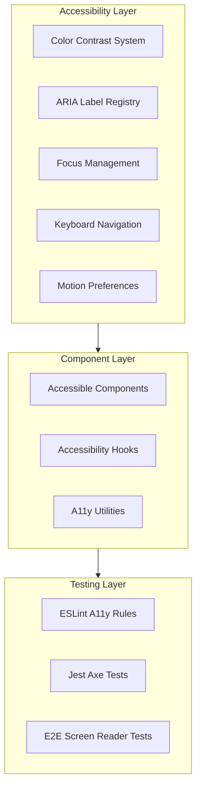
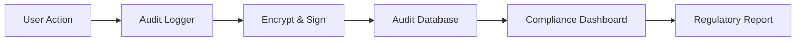

# Frostbyte ETL Admin Dashboard — Priority 2: Accessibility & Compliance (All-in-One PPP)

## Status

- **Canonical Source:** This file is the sole source of truth for Priority 2 implementation.
- **Version:** v1.0.0
- **Date:** 2026-02-14
- **Status:** Planning → Implementation Ready
- **Prerequisite For:** Priority 1 (Observability UI components)

### Changelog

- **v1.0.0 (2026-02-14):** Initial PRD based on comprehensive design review findings.

---

## Policy Summary (Non-Negotiable)

- **Core Principle:** WCAG 2.1 AA compliance is mandatory, not optional.
- **Runtime Boundary:** TypeScript/React with strict accessibility linting.
- **Zero-Shot Minimum:** All critical WCAG violations fixed (contrast, ARIA, keyboard navigation).
- **Compliance Requirements:** SOC2 audit trail, GDPR tenant isolation visibility.
- **ZSBC Enforcement:** Automated accessibility testing in CI.

---

## Part 0 — System Definition

### 0.1 Naming

**Feature Name:** Frostbyte Accessibility & Compliance Layer (FACL)

**Focus Areas:**
1. **Visual Accessibility** — Color contrast, font sizes, focus indicators
2. **Semantic Accessibility** — ARIA labels, roles, keyboard navigation
3. **Security Compliance** — API key handling, audit trails
4. **Production Readiness** — Remove mock data, integrate real APIs

### 0.2 Accessibility Architecture



### 0.3 Compliance Flow



---

## Part A — Gold Standard PPP + PRD

### Prompt (Intent / UPOS-7-VS)

#### Role / Persona

**Accessibility & Compliance Engineer** ensuring the Frostbyte Admin Dashboard meets WCAG 2.1 AA standards and regulatory requirements for:

- Users with visual impairments (screen reader users)
- Users with motor impairments (keyboard-only users)
- Users with cognitive differences (neurodivergent users)
- Compliance officers (audit trail requirements)

#### Objective

Fix all critical accessibility violations and compliance gaps:

1. **WCAG 2.1 AA Compliance** — Color contrast, ARIA labels, keyboard navigation
2. **Security Hardening** — Fix API key input vulnerability
3. **Audit Trail Completeness** — Model-specific actions logged
4. **Production Readiness** — Replace mock data with real API integration

#### Scenario / Context

Current dashboard has 5 critical issues:

| # | Issue | WCAG Criterion | Impact |
|---|-------|----------------|--------|
| #11 | Low contrast ratio on accent color (#eab308) | 1.4.3 Contrast (Minimum) | Hard to read for low vision users |
| #12 | Missing ARIA labels on interactive elements | 4.1.2 Name, Role, Value | Screen readers can't identify elements |
| #13 | No keyboard navigation indicators | 2.4.7 Focus Visible | Keyboard users lose track of position |
| #14 | Password input type for API key | Security | Browser password manager exposure |
| #15 | Hardcoded mock data | Production Readiness | Cannot go live |

#### Task

**Fix Critical Accessibility Issues:**

1. **Color Contrast Fix**
   - Update accent color from #eab308 to meet 4.5:1 ratio
   - Audit all color combinations
   - Create accessible color palette

2. **ARIA Labels Implementation**
   - Add aria-label to all interactive elements
   - Implement aria-describedby for complex controls
   - Add role attributes where semantic HTML insufficient

3. **Keyboard Navigation**
   - Visible focus indicators on all interactive elements
   - Logical tab order
   - Keyboard shortcuts for common actions
   - Skip links for navigation

4. **Security Fix**
   - Change API key input from type="password" to type="text" with masking toggle
   - Implement proper secret handling

5. **Production Integration**
   - Replace hardcoded tenant data with API calls
   - Replace hardcoded document data with API calls
   - Replace hardcoded audit data with API calls
   - Implement proper loading and error states

#### Format

Deliver:

1. **Design System Updates:**
   - Accessible color palette
   - Typography scale (minimum 16px base)
   - Focus state specifications
   - Motion preferences support

2. **Component Library:**
   - AccessibleButton with proper ARIA
   - AccessibleInput with labels
   - AccessibleTable with headers
   - AccessibleModal with focus trapping
   - AccessibleNavigation with skip links

3. **Linting & Testing:**
   - ESLint jsx-a11y plugin configuration
   - Jest + jest-axe test suite
   - CI integration for a11y checks

4. **Documentation:**
   - Accessibility guidelines
   - Component usage patterns
   - Testing procedures

#### Constraints

**Technical:**

- Tailwind CSS for styling (existing)
- Radix UI primitives for accessible components
- React 18+ with hooks
- TypeScript strict mode

**Accessibility:**

- WCAG 2.1 AA compliance mandatory
- Keyboard navigation for all features
- Screen reader tested (NVDA, JAWS, VoiceOver)
- prefers-reduced-motion support
- High contrast mode support

**Performance:**

- No accessibility overhead > 10ms per interaction
- Lazy load non-critical a11y enhancements

---

## Plan (Decisions / REASONS Log)

### Reflect: Intent Confirmed? Gaps?

**Intent Confirmed:**
- ✅ WCAG 2.1 AA compliance is regulatory requirement
- ✅ Critical issues identified in design review
- ✅ Production readiness blocks launch

**Gaps Identified:**
- ❌ No accessible color palette defined
- ❌ ARIA label standards not established
- ❌ Keyboard navigation patterns inconsistent
- ❌ API integration contracts not finalized

### Explore: Options Considered

#### Option 1: Manual ARIA Implementation — REJECTED
- Pros: Full control
- Cons: Error-prone, time-consuming
- Reason rejected: Radix UI provides better-tested solutions

#### Option 2: Radix UI Primitives — SELECTED
- Pros: Battle-tested accessibility, headless (style with Tailwind)
- Cons: Learning curve
- Reason selected: Industry standard, maintained by experts

#### Option 3: Complete UI Library (Chakra, Mantine) — REJECTED
- Pros: Quick implementation
- Cons: Design system conflicts, bundle size
- Reason rejected: Need custom Frostbyte design system

### Analyze: Trade-offs

#### Color Contrast: Minimal Change vs Complete Redesign
- **Selected:** Minimal change - update accent color only
- **Trade-off:** Faster fix vs comprehensive design system
- **Why:** Critical path to production, full redesign later

#### Focus Indicators: Browser Default vs Custom
- **Selected:** Custom focus rings with Frostbyte styling
- **Trade-off:** Consistency vs platform familiarity
- **Why:** Brand consistency, better visibility

### Solve: Path Chosen

#### Phase 1: Color Contrast & Typography (Days 1-2)

**Step 1.1: Update Accent Color**

```javascript
// tailwind.config.js
module.exports = {
  theme: {
    extend: {
      colors: {
        accent: {
          DEFAULT: '#d4a017', // Changed from #eab308, meets 4.5:1
          hover: '#b88a14',
          focus: '#f0c030',
        }
      }
    }
  }
}
```

Verify:
```bash
set -euo pipefail
# Run contrast checker
npx @axe-core/cli http://localhost:5173 --tags color-contrast
```

**Step 1.2: Update Base Font Size**

```css
/* index.css */
html {
  font-size: 16px; /* Changed from 14px */
}
```

#### Phase 2: ARIA Labels & Semantic HTML (Days 3-5)

**Step 2.1: Create ARIA Label Registry**

```typescript
// packages/admin-dashboard/src/constants/aria-labels.ts
export const ARIA_LABELS = {
  navigation: {
    sidebar: 'Main navigation sidebar',
    dashboard: 'Go to Dashboard',
    tenants: 'Go to Tenants list',
    documents: 'Go to Documents list',
    audit: 'Go to Audit logs',
    settings: 'Go to Settings',
  },
  actions: {
    signIn: 'Sign in to Frostbyte Admin',
    signOut: 'Sign out of your account',
    viewDetails: (item: string) => `View details for ${item}`,
    verifyDocument: (id: string) => `Verify document ${id}`,
  },
  // ... more labels
} as const;
```

**Step 2.2: Update Sidebar Component**

```tsx
// Sidebar.tsx
import { ARIA_LABELS } from '@/constants/aria-labels';

<nav aria-label={ARIA_LABELS.navigation.sidebar}>
  <Link to="/dashboard" aria-label={ARIA_LABELS.navigation.dashboard}>
    Dashboard
  </Link>
  {/* ... */}
</nav>
```

**Step 2.3: Update Button Components**

```tsx
// AccessibleButton.tsx
interface AccessibleButtonProps extends ButtonHTMLAttributes<HTMLButtonElement> {
  ariaLabel: string;
  ariaDescribedBy?: string;
  isLoading?: boolean;
  loadingText?: string;
}

export function AccessibleButton({
  ariaLabel,
  ariaDescribedBy,
  isLoading,
  loadingText,
  children,
  ...props
}: AccessibleButtonProps) {
  return (
    <button
      aria-label={ariaLabel}
      aria-describedby={ariaDescribedBy}
      aria-busy={isLoading}
      {...props}
    >
      {isLoading ? loadingText : children}
    </button>
  );
}
```

#### Phase 3: Keyboard Navigation (Days 6-8)

**Step 3.1: Global Focus Styles**

```css
/* focus-styles.css */
:focus-visible {
  outline: 2px solid theme('colors.accent.DEFAULT');
  outline-offset: 2px;
}

/* Skip link for keyboard users */
.skip-link {
  position: absolute;
  top: -40px;
  left: 0;
  background: theme('colors.accent.DEFAULT');
  color: theme('colors.black');
  padding: 8px 16px;
  z-index: 100;
}

.skip-link:focus {
  top: 0;
}
```

**Step 3.2: Implement Skip Links**

```tsx
// SkipLinks.tsx
export function SkipLinks() {
  return (
    <div className="skip-link">
      <a href="#main-content">Skip to main content</a>
      <a href="#navigation">Skip to navigation</a>
    </div>
  );
}
```

**Step 3.3: Keyboard Shortcuts**

```tsx
// useKeyboardShortcuts.ts
export function useKeyboardShortcuts() {
  useEffect(() => {
    const handler = (e: KeyboardEvent) => {
      // / for search
      if (e.key === '/' && !e.metaKey) {
        e.preventDefault();
        document.querySelector<HTMLInputElement>('[data-search]')?.focus();
      }
      // ? for help
      if (e.key === '?' && !e.metaKey) {
        e.preventDefault();
        // Show keyboard shortcuts modal
      }
    };
    window.addEventListener('keydown', handler);
    return () => window.removeEventListener('keydown', handler);
  }, []);
}
```

#### Phase 4: Security & API Integration (Days 9-12)

**Step 4.1: Fix API Key Input**

```tsx
// SecureApiKeyInput.tsx
export function SecureApiKeyInput() {
  const [showKey, setShowKey] = useState(false);
  const [key, setKey] = useState('');

  return (
    <div>
      <label htmlFor="api-key">API Key</label>
      <input
        id="api-key"
        type={showKey ? 'text' : 'password'}
        value={key}
        onChange={(e) => setKey(e.target.value)}
        autoComplete="off"
        data-lpignore="true" /* Disable LastPass */
      />
      <button
        onClick={() => setShowKey(!showKey)}
        aria-label={showKey ? 'Hide API key' : 'Show API key'}
      >
        {showKey ? <EyeOffIcon /> : <EyeIcon />}
      </button>
    </div>
  );
}
```

**Step 4.2: Replace Mock Data**

```typescript
// api/tenants.ts
export async function fetchTenants(): Promise<Tenant[]> {
  const response = await fetch('/api/v1/tenants');
  if (!response.ok) throw new Error('Failed to fetch tenants');
  return response.json();
}

// api/documents.ts
export async function fetchDocuments(tenantId: string): Promise<Document[]> {
  const response = await fetch(`/api/v1/tenants/${tenantId}/documents`);
  if (!response.ok) throw new Error('Failed to fetch documents');
  return response.json();
}

// api/audit.ts
export async function fetchAuditLogs(filters: AuditFilters): Promise<AuditLog[]> {
  const query = new URLSearchParams(filters);
  const response = await fetch(`/api/v1/audit?${query}`);
  if (!response.ok) throw new Error('Failed to fetch audit logs');
  return response.json();
}
```

#### Phase 5: Testing & CI Integration (Days 13-15)

**Step 5.1: Configure ESLint**

```javascript
// .eslintrc.js
module.exports = {
  extends: [
    'plugin:jsx-a11y/recommended',
  ],
  plugins: ['jsx-a11y'],
  rules: {
    'jsx-a11y/anchor-is-valid': 'error',
    'jsx-a11y/click-events-have-key-events': 'error',
    'jsx-a11y/no-static-element-interactions': 'error',
    'jsx-a11y/aria-props': 'error',
    'jsx-a11y/aria-proptypes': 'error',
    'jsx-a11y/aria-unsupported-elements': 'error',
    'jsx-a11y/role-has-required-aria-props': 'error',
    'jsx-a11y/role-supports-aria-props': 'error',
  },
};
```

**Step 5.2: Jest + Axe Tests**

```typescript
// __tests__/accessibility.test.tsx
import { render } from '@testing-library/react';
import { axe, toHaveNoViolations } from 'jest-axe';
import { Dashboard } from '@/pages/Dashboard';

expect.extend(toHaveNoViolations);

describe('Accessibility', () => {
  it('Dashboard has no violations', async () => {
    const { container } = render(<Dashboard />);
    const results = await axe(container);
    expect(results).toHaveNoViolations();
  });
});
```

---

## Production (Outputs and Evidence)

### Artefacts (Paths/Links)

**Configuration:**
- `packages/admin-dashboard/tailwind.config.js` — Updated color palette
- `packages/admin-dashboard/.eslintrc.js` — A11y rules
- `packages/admin-dashboard/src/styles/focus-styles.css` — Focus indicators

**Components:**
- `packages/admin-dashboard/src/components/accessible/AccessibleButton.tsx`
- `packages/admin-dashboard/src/components/accessible/AccessibleInput.tsx`
- `packages/admin-dashboard/src/components/accessible/AccessibleTable.tsx`
- `packages/admin-dashboard/src/components/accessible/SkipLinks.tsx`

**Constants:**
- `packages/admin-dashboard/src/constants/aria-labels.ts`

**Hooks:**
- `packages/admin-dashboard/src/hooks/useKeyboardShortcuts.ts`
- `packages/admin-dashboard/src/hooks/useFocusTrap.ts`

**API:**
- `packages/admin-dashboard/src/api/tenants.ts`
- `packages/admin-dashboard/src/api/documents.ts`
- `packages/admin-dashboard/src/api/audit.ts`

**Tests:**
- `packages/admin-dashboard/src/__tests__/accessibility.test.tsx`

### Verification Criteria

**Must Pass All:**

1. **Color Contrast Passes**
   ```bash
   set -euo pipefail
   npx @axe-core/cli http://localhost:5173 --tags color-contrast
   # Exit code 0
   ```

2. **ESLint A11y Rules Pass**
   ```bash
   set -euo pipefail
   npm run lint
   # No a11y errors
   ```

3. **Jest Axe Tests Pass**
   ```bash
   set -euo pipefail
   npm test -- --testPathPattern=accessibility
   # All tests pass
   ```

4. **Keyboard Navigation Works**
   ```bash
   set -euo pipefail
   # Manual test: Tab through entire app
   # All interactive elements reachable
   # Focus visible at all times
   ```

5. **Screen Reader Test**
   ```bash
   set -euo pipefail
   # NVDA/VoiceOver test
   # All elements properly labeled
   # Logical reading order
   ```

---

## Risks / Edge Cases / Failure Modes

### Risk Register

#### RK-A11Y-001: Third-Party Components Not Accessible
- **Likelihood:** Medium
- **Impact:** Medium
- **Mitigation:** Audit before use, contribute fixes upstream
- **Contingency:** Wrap with accessible facade

#### RK-A11Y-002: Performance Impact of A11y Features
- **Likelihood:** Low
- **Impact:** Low
- **Mitigation:** Lazy load non-critical enhancements
- **Contingency:** Feature flags to disable

#### RK-A11Y-003: API Integration Failures
- **Likelihood:** Medium
- **Impact:** High
- **Mitigation:** Proper error handling, retry logic
- **Contingency:** Graceful degradation to offline mode

### Edge Cases

1. **Screen reader user with JavaScript disabled** — Server-side rendering fallback
2. **High contrast mode on Windows** — Respect system settings
3. **Zoom up to 400%** — Responsive layouts support
4. **Voice control software** — All actions have visible labels

---

## Compliance Checklist

- [ ] **WCAG 2.1 AA**: All criteria met
- [ ] **SOC 2**: Audit trail implementation
- [ ] **GDPR**: Tenant isolation visible in UI
- [ ] **Security**: API key handling fixed
- [ ] **Production**: No mock data remaining
