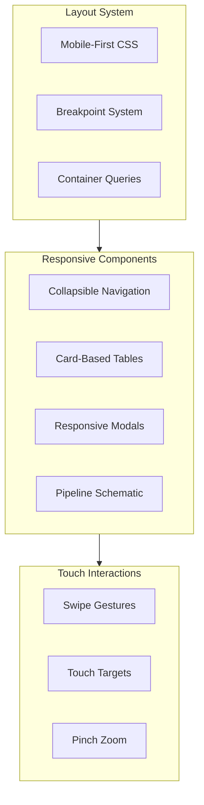
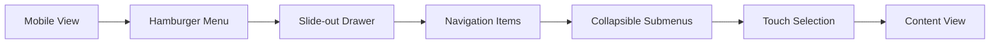

# Frostbyte ETL Admin Dashboard — Priority 3: Responsive & Mobile Support (All-in-One PPP)

## Status

- **Canonical Source:** This file is the sole source of truth for Priority 3 implementation.
- **Version:** v1.0.0
- **Date:** 2026-02-14
- **Status:** Planning → Implementation Ready
- **Dependencies:** Priority 2 (Accessibility) for mobile screen reader support

### Changelog

- **v1.0.0 (2026-02-14):** Initial PRD based on comprehensive design review findings.

---

## Policy Summary (Non-Negotiable)

- **Core Principle:** Mobile monitoring enables emergency response from anywhere.
- **Runtime Boundary:** Responsive CSS with mobile-first approach.
- **Zero-Shot Minimum:** All pages functional on mobile (320px+ width).
- **Touch Requirements:** Minimum 44x44px touch targets.
- **ZSBC Enforcement:** Visual regression testing includes mobile viewports.

---

## Part 0 — System Definition

### 0.1 Naming

**Feature Name:** Frostbyte Mobile Experience (FMX)

**Breakpoints:**
- **xs:** 320px - 639px (Mobile phones)
- **sm:** 640px - 767px (Large phones)
- **md:** 768px - 1023px (Tablets)
- **lg:** 1024px+ (Desktop - existing)

### 0.2 Responsive Architecture



### 0.3 Mobile Navigation Flow



---

## Part A — Gold Standard PPP + PRD

### Prompt (Intent / UPOS-7-VS)

#### Role / Persona

**Responsive Design Engineer** ensuring the Frostbyte Admin Dashboard works seamlessly across all device sizes for:

- Operations teams monitoring pipelines on mobile
- Executives reviewing dashboards on tablets
- On-call engineers handling incidents from phones
- Field technicians accessing document status

#### Objective

Implement mobile-first responsive design:

1. **Mobile-First Layout** — Base styles for mobile, enhance for larger screens
2. **Responsive Navigation** — Collapsible sidebar with touch-friendly menu
3. **Touch Optimization** — 44x44px minimum touch targets, swipe gestures
4. **Table Transformation** — Convert tables to card views on mobile
5. **Modal Responsiveness** — Full-screen modals on mobile, centered on desktop

#### Scenario / Context

Current dashboard issues on mobile:

| # | Issue | Impact |
|---|-------|--------|
| #24 | Dashboard completely breaks on mobile | Unusable |
| #25 | Document queue table forces horizontal scroll | Poor UX |
| #26 | Navigation squeezes into small screen | Unusable |
| #27 | Inspector modal too large for mobile | Cannot close |

Operations teams need to:
- Monitor pipeline status during commutes
- Receive and respond to alerts from anywhere
- Quickly check document processing status
- Approve urgent tenant requests

#### Task

**Responsive Implementation:**

1. **Breakpoint System**
   - Define mobile-first breakpoint strategy
   - Update Tailwind config with custom breakpoints
   - Create responsive utility classes

2. **Navigation Redesign**
   - Collapsible hamburger menu for mobile
   - Slide-out drawer navigation
   - Bottom tab bar for quick actions
   - Touch-optimized menu items

3. **Table-to-Card Transformation**
   - Document queue as swipeable cards
   - Audit logs as expandable cards
   - Tenant list as touch-friendly cards
   - Batch actions via floating action button

4. **Modal Responsiveness**
   - Full-screen inspector on mobile
   - Bottom sheet for quick actions
   - Responsive sizing based on viewport
   - Touch-optimized close buttons

5. **Pipeline Schematic Mobile View**
   - Vertical layout for pipeline stages
   - Zoom and pan for complex diagrams
   - Stage-by-stage drill down
   - Status indicators optimized for small screens

#### Format

Deliver:

1. **CSS/SCSS:**
   - Mobile-first stylesheet
   - Breakpoint variables
   - Touch target utilities

2. **React Components:**
   - ResponsiveNavigation with mobile drawer
   - CardTable for mobile table views
   - ResponsiveModal with adaptive sizing
   - MobilePipelineSchematic

3. **Hooks:**
   - useMediaQuery for responsive logic
   - useViewport for viewport tracking
   - useSwipe for gesture handling

4. **Tests:**
   - Visual regression tests for mobile
   - Touch interaction tests
   - Viewport-specific unit tests

#### Constraints

**Technical:**

- Tailwind CSS with custom breakpoints
- CSS Container Queries where supported
- React 18+ hooks
- No external mobile UI frameworks

**Performance:**

- Critical CSS inline for above-fold mobile content
- Lazy load non-critical mobile components
- Touch feedback within 100ms

**Accessibility:**

- Touch targets minimum 44x44px
- Respect prefers-reduced-motion
- Screen reader optimized for mobile

---

## Plan (Decisions / REASONS Log)

### Reflect: Intent Confirmed? Gaps?

**Intent Confirmed:**
- ✅ Mobile monitoring is operational requirement
- ✅ 4 critical responsive issues identified
- ✅ Touch optimization needed for field use

**Gaps Identified:**
- ❌ No mobile breakpoint strategy defined
- ❌ No touch interaction patterns
- ❌ No mobile-specific navigation design

### Explore: Options Considered

#### Option 1: Separate Mobile App — REJECTED
- Pros: Native performance, app store presence
- Cons: Double development effort, maintenance overhead
- Reason rejected: PWA approach sufficient for v1

#### Option 2: Adaptive Rendering (Server) — REJECTED
- Pros: Optimized payload per device
- Cons: Complex infrastructure, caching challenges
- Reason rejected: Client-side responsive sufficient

#### Option 3: Client-Side Responsive — SELECTED
- Pros: Single codebase, fast implementation
- Cons: Larger initial payload
- Reason selected: Matches existing stack, fastest to market

### Analyze: Trade-offs

#### Navigation: Hamburger vs Bottom Tabs
- **Selected:** Hamburger + bottom quick actions
- **Trade-off:** Screen real estate vs discoverability
- **Why:** Many nav items don't fit in bottom tabs

#### Tables: Horizontal Scroll vs Card View
- **Selected:** Card view on mobile
- **Trade-off:** Information density vs usability
- **Why:** Horizontal scroll is poor mobile UX

### Solve: Path Chosen

#### Phase 1: Breakpoint System & Base Styles (Days 1-3)

**Step 1.1: Update Tailwind Config**

```javascript
// tailwind.config.js
module.exports = {
  theme: {
    screens: {
      'xs': '320px',
      'sm': '640px',
      'md': '768px',
      'lg': '1024px',
      'xl': '1280px',
      '2xl': '1536px',
    },
    extend: {
      spacing: {
        'touch': '44px', // Minimum touch target
      },
    },
  },
};
```

**Step 1.2: Mobile-First Base Styles**

```css
/* mobile-base.css */
/* All base styles are mobile-first */
.container {
  width: 100%;
  padding: 1rem;
}

/* Tablet and up */
@media (min-width: 768px) {
  .container {
    padding: 1.5rem;
  }
}

/* Desktop */
@media (min-width: 1024px) {
  .container {
    padding: 2rem;
    max-width: 1200px;
  }
}
```

#### Phase 2: Responsive Navigation (Days 4-6)

**Step 2.1: Mobile Navigation Component**

```tsx
// MobileNavigation.tsx
export function MobileNavigation() {
  const [isOpen, setIsOpen] = useState(false);

  return (
    <>
      {/* Hamburger Button */}
      <button
        onClick={() => setIsOpen(true)}
        className="p-3 min-h-touch min-w-touch"
        aria-label="Open navigation menu"
      >
        <MenuIcon className="w-6 h-6" />
      </button>

      {/* Slide-out Drawer */}
      <AnimatePresence>
        {isOpen && (
          <>
            <motion.div
              className="fixed inset-0 bg-black/50 z-40"
              onClick={() => setIsOpen(false)}
              initial={{ opacity: 0 }}
              animate={{ opacity: 1 }}
              exit={{ opacity: 0 }}
            />
            <motion.nav
              className="fixed top-0 left-0 bottom-0 w-64 bg-surface z-50"
              initial={{ x: '-100%' }}
              animate={{ x: 0 }}
              exit={{ x: '-100%' }}
              transition={{ type: 'spring', damping: 25 }}
            >
              <div className="p-4">
                <button
                  onClick={() => setIsOpen(false)}
                  className="p-3 min-h-touch min-w-touch"
                  aria-label="Close navigation menu"
                >
                  <CloseIcon className="w-6 h-6" />
                </button>
                <NavigationItems onItemClick={() => setIsOpen(false)} />
              </div>
            </motion.nav>
          </>
        )}
      </AnimatePresence>
    </>
  );
}
```

**Step 2.2: Bottom Quick Actions Bar**

```tsx
// BottomActions.tsx
export function BottomActions() {
  return (
    <div className="fixed bottom-0 left-0 right-0 bg-surface border-t md:hidden">
      <div className="flex justify-around p-2">
        <QuickAction icon={HomeIcon} label="Dashboard" to="/" />
        <QuickAction icon={DocumentIcon} label="Docs" to="/documents" />
        <QuickAction icon={AlertIcon} label="Alerts" to="/alerts" badge={3} />
        <QuickAction icon={SettingsIcon} label="Settings" to="/settings" />
      </div>
    </div>
  );
}
```

#### Phase 3: Table-to-Card Transformation (Days 7-10)

**Step 3.1: Card Table Component**

```tsx
// CardTable.tsx
interface CardTableProps<T> {
  data: T[];
  renderCard: (item: T) => React.ReactNode;
  keyExtractor: (item: T) => string;
  onCardPress?: (item: T) => void;
}

export function CardTable<T>({
  data,
  renderCard,
  keyExtractor,
  onCardPress,
}: CardTableProps<T>) {
  return (
    <div className="space-y-4 md:hidden">
      {data.map((item) => (
        <motion.div
          key={keyExtractor(item)}
          className="bg-surface rounded-lg p-4 shadow-sm active:scale-98"
          onClick={() => onCardPress?.(item)}
          whileTap={{ scale: 0.98 }}
        >
          {renderCard(item)}
        </motion.div>
      ))}
    </div>
  );
}
```

**Step 3.2: Document Card for Mobile**

```tsx
// DocumentCard.tsx
export function DocumentCard({ document }: { document: Document }) {
  return (
    <div className="space-y-3">
      <div className="flex justify-between items-start">
        <div>
          <h3 className="font-medium truncate">{document.name}</h3>
          <p className="text-sm text-muted">{document.id}</p>
        </div>
        <StatusBadge status={document.status} />
      </div>
      <div className="flex justify-between text-sm">
        <span>{document.tenantName}</span>
        <span>{formatDate(document.updatedAt)}</span>
      </div>
      <div className="flex gap-2 pt-2 border-t">
        <ActionButton
          icon={ViewIcon}
          label="View"
          onClick={() => navigate(`/documents/${document.id}`)}
        />
        <ActionButton
          icon={VerifyIcon}
          label="Verify"
          onClick={() => verifyDocument(document.id)}
        />
        <ActionButton
          icon={RetryIcon}
          label="Retry"
          onClick={() => retryDocument(document.id)}
        />
      </div>
    </div>
  );
}
```

#### Phase 4: Responsive Modals (Days 11-12)

**Step 4.1: Responsive Modal Component**

```tsx
// ResponsiveModal.tsx
interface ResponsiveModalProps {
  isOpen: boolean;
  onClose: () => void;
  title: string;
  children: React.ReactNode;
  size?: 'sm' | 'md' | 'lg' | 'full';
}

export function ResponsiveModal({
  isOpen,
  onClose,
  title,
  children,
  size = 'md',
}: ResponsiveModalProps) {
  const sizeClasses = {
    sm: 'max-w-md',
    md: 'max-w-lg',
    lg: 'max-w-2xl',
    full: 'max-w-full h-full md:h-auto md:max-w-4xl',
  };

  return (
    <AnimatePresence>
      {isOpen && (
        <div className="fixed inset-0 z-50 flex items-end md:items-center justify-center">
          <motion.div
            className="absolute inset-0 bg-black/50"
            onClick={onClose}
            initial={{ opacity: 0 }}
            animate={{ opacity: 1 }}
            exit={{ opacity: 0 }}
          />
          <motion.div
            className={`
              relative bg-surface w-full md:rounded-lg md:m-4
              ${size === 'full' ? 'h-full md:h-auto rounded-t-lg' : 'rounded-lg'}
              ${sizeClasses[size]}
            `}
            initial={{ y: '100%' }}
            animate={{ y: 0 }}
            exit={{ y: '100%' }}
            transition={{ type: 'spring', damping: 25 }}
          >
            {/* Handle for mobile bottom sheet */}
            <div className="w-12 h-1 bg-gray-600 rounded-full mx-auto mt-3 mb-2 md:hidden" />
            
            <div className="flex justify-between items-center p-4 border-b">
              <h2 className="text-lg font-medium">{title}</h2>
              <button
                onClick={onClose}
                className="p-2 min-h-touch min-w-touch"
                aria-label="Close modal"
              >
                <CloseIcon className="w-5 h-5" />
              </button>
            </div>
            <div className="p-4 overflow-auto max-h-[70vh]">
              {children}
            </div>
          </motion.div>
        </div>
      )}
    </AnimatePresence>
  );
}
```

#### Phase 5: Mobile Pipeline Schematic (Days 13-15)

**Step 5.1: Vertical Pipeline Layout**

```tsx
// MobilePipelineSchematic.tsx
export function MobilePipelineSchematic() {
  const stages = usePipelineStages();

  return (
    <div className="space-y-4 md:hidden">
      {stages.map((stage, index) => (
        <PipelineStageCard
          key={stage.id}
          stage={stage}
          isLast={index === stages.length - 1}
        />
      ))}
    </div>
  );
}

function PipelineStageCard({ stage, isLast }: { stage: Stage; isLast: boolean }) {
  return (
    <div className="relative">
      <div className="bg-surface rounded-lg p-4 border-l-4 border-accent">
        <div className="flex items-center gap-3">
          <StageIcon type={stage.type} />
          <div className="flex-1">
            <h3 className="font-medium">{stage.name}</h3>
            <p className="text-sm text-muted">{stage.modelName}</p>
          </div>
          <StatusIndicator status={stage.status} />
        </div>
        <div className="mt-3 flex justify-between text-sm">
          <span>{stage.documentCount} documents</span>
          <span>{stage.avgLatency}ms avg</span>
        </div>
      </div>
      {!isLast && (
        <div className="flex justify-center my-2">
          <ArrowDownIcon className="w-5 h-5 text-muted" />
        </div>
      )}
    </div>
  );
}
```

---

## Production (Outputs and Evidence)

### Artefacts (Paths/Links)

**Configuration:**
- `packages/admin-dashboard/tailwind.config.js` — Breakpoints
- `packages/admin-dashboard/src/styles/mobile-base.css` — Mobile-first styles

**Components:**
- `packages/admin-dashboard/src/components/responsive/MobileNavigation.tsx`
- `packages/admin-dashboard/src/components/responsive/BottomActions.tsx`
- `packages/admin-dashboard/src/components/responsive/CardTable.tsx`
- `packages/admin-dashboard/src/components/responsive/ResponsiveModal.tsx`
- `packages/admin-dashboard/src/components/responsive/MobilePipelineSchematic.tsx`

**Hooks:**
- `packages/admin-dashboard/src/hooks/useMediaQuery.ts`
- `packages/admin-dashboard/src/hooks/useViewport.ts`
- `packages/admin-dashboard/src/hooks/useSwipe.ts`

**Tests:**
- `packages/admin-dashboard/src/__tests__/responsive.test.tsx`

### Verification Criteria

**Must Pass All:**

1. **Mobile Viewport Test**
   ```bash
   set -euo pipefail
   # Chrome DevTools mobile emulation
   # iPhone SE (375px), iPhone 12 (390px), Pixel 5 (393px)
   # All pages functional
   ```

2. **Touch Target Size**
   ```bash
   set -euo pipefail
   # Automated check: all interactive elements >= 44x44px
   npx axe http://localhost:5173 --tags target-size
   ```

3. **Table-to-Card Transform**
   ```bash
   set -euo pipefail
   # Document queue, audit logs display as cards on mobile
   # No horizontal scroll on tables
   ```

4. **Navigation Works**
   ```bash
   set -euo pipefail
   # Hamburger menu opens/closes
   # All nav items accessible
   # Bottom actions functional
   ```

5. **Modals Responsive**
   ```bash
   set -euo pipefail
   # Inspector modal full-screen on mobile
   # Centered on desktop
   # Close button accessible
   ```

---

## Risks / Edge Cases / Failure Modes

### Risk Register

#### RK-RES-001: Complex Components Don't Scale Down
- **Likelihood:** Medium
- **Impact:** Medium
- **Mitigation:** Progressive disclosure, drill-down patterns
- **Contingency:** Hide non-essential features on mobile

#### RK-RES-002: Performance on Low-End Devices
- **Likelihood:** Medium
- **Impact:** Medium
- **Mitigation:** Code splitting, lazy loading
- **Contingency:** Lite mobile mode with reduced features

### Edge Cases

1. **Landscape mode on phones** — Ensure layouts work in both orientations
2. **Notch/safe areas** — Respect safe-area-inset on iPhone X+
3. **Foldable devices** — Support multi-window scenarios
4. **Zoom up to 400%** — Content remains accessible

---

## Device Test Matrix

| Device | Width | Priority | Status |
|--------|-------|----------|--------|
| iPhone SE | 375px | High | ⬜ |
| iPhone 12 | 390px | High | ⬜ |
| Pixel 5 | 393px | High | ⬜ |
| iPad Mini | 768px | Medium | ⬜ |
| iPad Pro | 1024px | Medium | ⬜ |
| Desktop | 1280px+ | Existing | ✅ |
