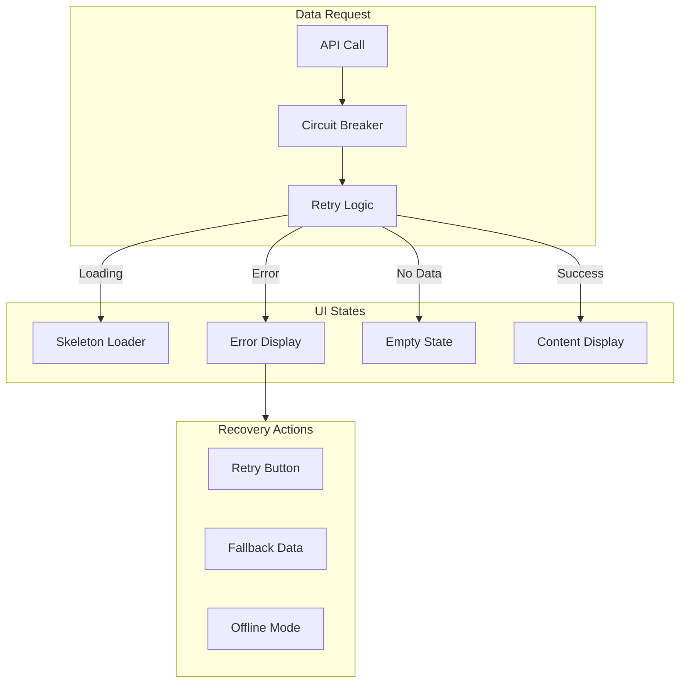
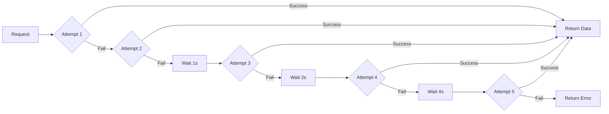

# Frostbyte ETL Admin Dashboard — Priority 4: Error Handling & Resilience (All-in-One PPP)

## Status

- **Canonical Source:** This file is the sole source of truth for Priority 4 implementation.
- **Version:** v1.0.0
- **Date:** 2026-02-14
- **Status:** Planning → Implementation Ready
- **Dependencies:** Priority 2 (API Integration) for error response handling

### Changelog

- **v1.0.0 (2026-02-14):** Initial PRD based on comprehensive design review findings.

---

## Policy Summary (Non-Negotiable)

- **Core Principle:** Failures are informative, recoverable, and never silent.
- **Runtime Boundary:** Bounded retries, circuit breakers, graceful degradation.
- **Zero-Shot Minimum:** All data fetches have loading states and error handling.
- **Resilience Requirements:** Max retry limits, exponential backoff, fallback UI.
- **ZSBC Enforcement:** Error scenarios tested in CI.

---

## Part 0 — System Definition

### 0.1 Naming

**Feature Name:** Frostbyte Resilience Layer (FRL)

**Resilience Patterns:**
1. **Loading States** — Skeleton loaders, progress indicators
2. **Error Handling** — Actionable error messages, recovery actions
3. **Retry Mechanisms** — Bounded retries with exponential backoff
4. **Pagination** — Cursor-based for large datasets
5. **Circuit Breakers** — Fail fast when services are down

### 0.2 Error Handling Architecture



### 0.3 Retry Flow



---

## Part A — Gold Standard PPP + PRD

### Prompt (Intent / UPOS-7-VS)

#### Role / Persona

**Reliability Engineer** ensuring the Frostbyte Admin Dashboard handles failures gracefully for:

- Operations teams who need to know when something breaks
- Users who need clear guidance on how to recover
- On-call engineers who need actionable error details
- Managers who need confidence in system reliability

#### Objective

Implement comprehensive error handling and resilience:

1. **Loading States** — Skeleton loaders for all data fetches
2. **Error Messages** — Actionable errors with recovery steps
3. **Retry Mechanisms** — Bounded retries with exponential backoff
4. **Pagination** — For document queue and audit logs
5. **Input Validation** — Helpful feedback on invalid inputs
6. **SSE Resilience** — Max retry limits, reconnection logic

#### Scenario / Context

Current dashboard issues:

| # | Issue | Impact |
|---|-------|--------|
| #28 | No loading states on data fetches | Users think app is frozen |
| #29 | Error states are minimal | Users don't know how to recover |
| #22 | No document retry mechanism | Failed docs stuck in error state |
| #37 | No pagination on document queue | Performance issues at scale |
| #38 | No pagination on audit gallery | Memory issues with large datasets |
| #34 | API health query retries indefinitely | Resource exhaustion |
| #35 | SSE reconnection has no max retries | Connection storms |
| #39 | Missing input validation | Invalid data accepted |
| #40 | Batch size input has no validation | Can break pipeline |

#### Task

**Resilience Implementation:**

1. **Skeleton Loaders**
   - Consistent skeleton components for all data types
   - Shimmer animation for perceived performance
   - Match content layout to reduce layout shift

2. **Error State Components**
   - Error boundaries for crash recovery
   - Inline error messages with context
   - Toast notifications for async errors
   - Error logging to monitoring service

3. **Retry System**
   - Exponential backoff (1s, 2s, 4s, 8s, 16s max)
   - Max 5 retry attempts
   - Manual retry button after exhaustion
   - Circuit breaker after repeated failures

4. **Pagination Implementation**
   - Cursor-based pagination for audit logs
   - Offset pagination for document queue
   - Infinite scroll option for mobile
   - Page size selector (10, 25, 50, 100)

5. **Input Validation**
   - Real-time validation with debounce
   - Helpful error messages
   - Visual indicators (red border, icon)
   - Prevent form submission until valid

6. **SSE Resilience**
   - Max reconnection attempts: 10
   - Exponential backoff for reconnects
   - Fallback to polling after max retries
   - Visual indicator when in fallback mode

#### Format

Deliver:

1. **UI Components:**
   - SkeletonCard, SkeletonTable, SkeletonChart
   - ErrorBoundary with fallback UI
   - ErrorToast for notifications
   - RetryButton with attempt counter

2. **Hooks:**
   - useQueryWithRetry — Data fetching with retry logic
   - useSSE — Resilient SSE connection
   - usePagination — Pagination state management
   - useValidation — Form validation hook

3. **Utilities:**
   - retry.ts — Retry logic with backoff
   - circuitBreaker.ts — Circuit breaker pattern
   - errorFormatter.ts — User-friendly error messages

4. **Tests:**
   - Error scenario tests
   - Retry logic tests
   - Loading state tests

#### Constraints

**Technical:**

- React Error Boundaries for crash handling
- React Query for data fetching (existing)
- Zod for input validation

**Reliability:**

- Max 5 retry attempts
- Exponential backoff max 16 seconds
- Circuit breaker opens after 10 failures in 60 seconds
- Fallback UI must be functional

**UX:**

- Loading states within 200ms of request
- Error messages within 100 characters
- Recovery actions clearly visible
- No silent failures

---

## Plan (Decisions / REASONS Log)

### Reflect: Intent Confirmed? Gaps?

**Intent Confirmed:**
- ✅ 9 resilience issues identified
- ✅ Critical for production readiness
- ✅ User confidence depends on error handling

**Gaps Identified:**
- ❌ No standardized error handling patterns
- ❌ No retry logic implementation
- ❌ No pagination strategy

### Explore: Options Considered

#### Option 1: Global Error Handler Only — REJECTED
- Pros: Simple implementation
- Cons: Loss of context, poor UX
- Reason rejected: Need granular error handling

#### Option 2: Component-Level Error Boundaries — SELECTED
- Pros: Graceful degradation, contextual recovery
- Cons: More code to maintain
- Reason selected: Best user experience

#### Option 3: Infinite Scroll vs Pagination — DECIDED
- **Document Queue:** Pagination (users need to jump to specific pages)
- **Audit Logs:** Infinite scroll (chronological exploration)
- **Tenant List:** Pagination (manageable dataset size)

### Solve: Path Chosen

#### Phase 1: Loading States (Days 1-3)

**Step 1.1: Skeleton Components**

```tsx
// SkeletonCard.tsx
export function SkeletonCard() {
  return (
    <div className="bg-surface rounded-lg p-4 animate-pulse">
      <div className="flex gap-4">
        <div className="w-12 h-12 bg-gray-700 rounded-full" />
        <div className="flex-1 space-y-2">
          <div className="h-4 bg-gray-700 rounded w-3/4" />
          <div className="h-3 bg-gray-700 rounded w-1/2" />
        </div>
      </div>
    </div>
  );
}

// SkeletonTable.tsx
export function SkeletonTable({ rows = 5 }: { rows?: number }) {
  return (
    <div className="space-y-3">
      {Array.from({ length: rows }).map((_, i) => (
        <div key={i} className="flex gap-4 animate-pulse">
          <div className="h-4 bg-gray-700 rounded flex-1" />
          <div className="h-4 bg-gray-700 rounded w-24" />
          <div className="h-4 bg-gray-700 rounded w-24" />
        </div>
      ))}
    </div>
  );
}
```

**Step 1.2: Dashboard Loading State**

```tsx
// DashboardSkeleton.tsx
export function DashboardSkeleton() {
  return (
    <div className="space-y-6">
      {/* Header skeleton */}
      <div className="flex justify-between items-center">
        <div className="h-8 bg-gray-700 rounded w-48 animate-pulse" />
        <div className="h-10 bg-gray-700 rounded w-32 animate-pulse" />
      </div>
      
      {/* Stats skeleton */}
      <div className="grid grid-cols-1 md:grid-cols-4 gap-4">
        {Array.from({ length: 4 }).map((_, i) => (
          <SkeletonCard key={i} />
        ))}
      </div>
      
      {/* Charts skeleton */}
      <div className="grid grid-cols-1 lg:grid-cols-2 gap-6">
        <div className="h-64 bg-gray-800 rounded-lg animate-pulse" />
        <div className="h-64 bg-gray-800 rounded-lg animate-pulse" />
      </div>
    </div>
  );
}
```

#### Phase 2: Error Handling (Days 4-6)

**Step 2.1: Error Boundary**

```tsx
// ErrorBoundary.tsx
interface Props {
  children: React.ReactNode;
  fallback?: React.ReactNode;
}

interface State {
  hasError: boolean;
  error?: Error;
}

export class ErrorBoundary extends React.Component<Props, State> {
  state: State = { hasError: false };

  static getDerivedStateFromError(error: Error): State {
    return { hasError: true, error };
  }

  componentDidCatch(error: Error, errorInfo: React.ErrorInfo) {
    // Log to monitoring service
    console.error('Error caught by boundary:', error, errorInfo);
    // TODO: Send to error tracking service
  }

  render() {
    if (this.state.hasError) {
      return (
        this.props.fallback || (
          <ErrorFallback
            error={this.state.error}
            onReset={() => this.setState({ hasError: false })}
          />
        )
      );
    }
    return this.props.children;
  }
}

// ErrorFallback.tsx
function ErrorFallback({ error, onReset }: { error?: Error; onReset: () => void }) {
  return (
    <div className="p-8 text-center">
      <ErrorIcon className="w-16 h-16 text-red-500 mx-auto mb-4" />
      <h2 className="text-xl font-semibold mb-2">Something went wrong</h2>
      <p className="text-muted mb-4">
        {error?.message || 'An unexpected error occurred'}
      </p>
      <div className="flex justify-center gap-3">
        <Button onClick={onReset}>Try Again</Button>
        <Button variant="secondary" onClick={() => window.location.reload()}>
          Reload Page
        </Button>
      </div>
    </div>
  );
}
```

**Step 2.2: API Error Formatter**

```typescript
// errorFormatter.ts
export interface FormattedError {
  title: string;
  message: string;
  action: string;
  canRetry: boolean;
}

export function formatError(error: unknown): FormattedError {
  // Network errors
  if (error instanceof TypeError && error.message === 'Failed to fetch') {
    return {
      title: 'Connection Error',
      message: 'Unable to connect to the server. Please check your internet connection.',
      action: 'Check your connection and try again.',
      canRetry: true,
    };
  }

  // HTTP errors
  if (error instanceof Response) {
    switch (error.status) {
      case 401:
        return {
          title: 'Session Expired',
          message: 'Your session has expired. Please sign in again.',
          action: 'Sign in to continue.',
          canRetry: false,
        };
      case 403:
        return {
          title: 'Access Denied',
          message: 'You do not have permission to perform this action.',
          action: 'Contact your administrator if you need access.',
          canRetry: false,
        };
      case 404:
        return {
          title: 'Not Found',
          message: 'The requested resource could not be found.',
          action: 'Check the URL or navigate back.',
          canRetry: false,
        };
      case 429:
        return {
          title: 'Rate Limited',
          message: 'Too many requests. Please slow down.',
          action: 'Wait a moment and try again.',
          canRetry: true,
        };
      case 500:
      case 502:
      case 503:
      case 504:
        return {
          title: 'Server Error',
          message: 'The server encountered an error.',
          action: 'Please try again in a few moments.',
          canRetry: true,
        };
      default:
        return {
          title: 'Error',
          message: `An error occurred (${error.status}).`,
          action: 'Please try again.',
          canRetry: true,
        };
    }
  }

  // Default
  return {
    title: 'Error',
    message: error instanceof Error ? error.message : 'An unexpected error occurred',
    action: 'Please try again.',
    canRetry: true,
  };
}
```

#### Phase 3: Retry Logic (Days 7-9)

**Step 3.1: Retry Utility**

```typescript
// retry.ts
export interface RetryOptions {
  maxAttempts?: number;
  baseDelay?: number;
  maxDelay?: number;
  shouldRetry?: (error: unknown) => boolean;
}

export async function withRetry<T>(
  fn: () => Promise<T>,
  options: RetryOptions = {}
): Promise<T> {
  const {
    maxAttempts = 5,
    baseDelay = 1000,
    maxDelay = 16000,
    shouldRetry = () => true,
  } = options;

  let lastError: unknown;

  for (let attempt = 1; attempt <= maxAttempts; attempt++) {
    try {
      return await fn();
    } catch (error) {
      lastError = error;
      
      if (attempt === maxAttempts || !shouldRetry(error)) {
        throw error;
      }

      // Exponential backoff with jitter
      const delay = Math.min(
        baseDelay * Math.pow(2, attempt - 1),
        maxDelay
      );
      const jitter = Math.random() * 1000;
      await sleep(delay + jitter);
    }
  }

  throw lastError;
}

function sleep(ms: number): Promise<void> {
  return new Promise(resolve => setTimeout(resolve, ms));
}
```

**Step 3.2: React Query with Retry**

```tsx
// useQueryWithRetry.ts
export function useQueryWithRetry<T>(
  key: string[],
  fetcher: () => Promise<T>,
  options?: UseQueryOptions<T>
) {
  return useQuery({
    queryKey: key,
    queryFn: () => withRetry(fetcher, {
      maxAttempts: 5,
      shouldRetry: (error) => {
        // Don't retry 4xx errors (client errors)
        if (error instanceof Response && error.status >= 400 && error.status < 500) {
          return false;
        }
        return true;
      },
    }),
    retry: false, // We handle retry in queryFn
    ...options,
  });
}
```

**Step 3.3: Document Retry Button**

```tsx
// DocumentRetryButton.tsx
export function DocumentRetryButton({ documentId }: { documentId: string }) {
  const [isRetrying, setIsRetrying] = useState(false);
  const queryClient = useQueryClient();

  const handleRetry = async () => {
    setIsRetrying(true);
    try {
      await withRetry(
        () => api.documents.retry(documentId),
        { maxAttempts: 3 }
      );
      // Invalidate and refetch
      queryClient.invalidateQueries(['documents']);
      toast.success('Document retry initiated');
    } catch (error) {
      toast.error('Failed to retry document. Please try again.');
    } finally {
      setIsRetrying(false);
    }
  };

  return (
    <Button
      onClick={handleRetry}
      disabled={isRetrying}
      loading={isRetrying}
      size="sm"
    >
      <RetryIcon className="w-4 h-4 mr-2" />
      Retry
    </Button>
  );
}
```

#### Phase 4: Pagination (Days 10-12)

**Step 4.1: Pagination Hook**

```tsx
// usePagination.ts
interface PaginationState {
  page: number;
  pageSize: number;
  totalCount: number;
  totalPages: number;
}

export function usePagination(defaultPageSize = 25) {
  const [state, setState] = useState<Omit<PaginationState, 'totalCount' | 'totalPages'>>({
    page: 1,
    pageSize: defaultPageSize,
  });

  const setPage = useCallback((page: number) => {
    setState(prev => ({ ...prev, page }));
  }, []);

  const setPageSize = useCallback((pageSize: number) => {
    setState({ page: 1, pageSize });
  }, []);

  return {
    ...state,
    setPage,
    setPageSize,
  };
}
```

**Step 4.2: Paginated Document Queue**

```tsx
// PaginatedDocumentQueue.tsx
export function PaginatedDocumentQueue() {
  const { page, pageSize, setPage, setPageSize } = usePagination(25);
  const { data, isLoading, error } = useQueryWithRetry(
    ['documents', page, pageSize],
    () => api.documents.list({ page, pageSize })
  );

  if (isLoading) return <SkeletonTable rows={pageSize} />;
  if (error) return <ErrorDisplay error={error} onRetry={() => window.location.reload()} />;
  if (!data?.items.length) return <EmptyState />;

  return (
    <div>
      <DocumentTable documents={data.items} />
      <Pagination
        page={page}
        pageSize={pageSize}
        totalCount={data.totalCount}
        onPageChange={setPage}
        onPageSizeChange={setPageSize}
      />
    </div>
  );
}
```

**Step 4.3: Pagination Component**

```tsx
// Pagination.tsx
interface PaginationProps {
  page: number;
  pageSize: number;
  totalCount: number;
  onPageChange: (page: number) => void;
  onPageSizeChange: (size: number) => void;
}

export function Pagination({
  page,
  pageSize,
  totalCount,
  onPageChange,
  onPageSizeChange,
}: PaginationProps) {
  const totalPages = Math.ceil(totalCount / pageSize);
  const start = (page - 1) * pageSize + 1;
  const end = Math.min(page * pageSize, totalCount);

  return (
    <div className="flex items-center justify-between py-4">
      <div className="text-sm text-muted">
        Showing {start}-{end} of {totalCount} documents
      </div>
      
      <div className="flex items-center gap-4">
        <select
          value={pageSize}
          onChange={(e) => onPageSizeChange(Number(e.target.value))}
          className="bg-surface border rounded px-2 py-1"
        >
          <option value={10}>10 per page</option>
          <option value={25}>25 per page</option>
          <option value={50}>50 per page</option>
          <option value={100}>100 per page</option>
        </select>

        <div className="flex gap-1">
          <Button
            variant="ghost"
            size="sm"
            disabled={page === 1}
            onClick={() => onPageChange(page - 1)}
          >
            Previous
          </Button>
          <span className="px-3 py-1">
            Page {page} of {totalPages}
          </span>
          <Button
            variant="ghost"
            size="sm"
            disabled={page >= totalPages}
            onClick={() => onPageChange(page + 1)}
          >
            Next
          </Button>
        </div>
      </div>
    </div>
  );
}
```

#### Phase 5: Input Validation (Days 13-14)

**Step 5.1: Validation Schema**

```typescript
// validation.ts
import { z } from 'zod';

export const documentIdSchema = z
  .string()
  .min(1, 'Document ID is required')
  .regex(/^[a-zA-Z0-9-_]+$/, 'Only alphanumeric characters, hyphens, and underscores allowed');

export const batchSizeSchema = z
  .number()
  .int('Must be a whole number')
  .min(1, 'Batch size must be at least 1')
  .max(1000, 'Batch size cannot exceed 1000');

export const tenantNameSchema = z
  .string()
  .min(1, 'Tenant name is required')
  .max(100, 'Tenant name cannot exceed 100 characters');
```

**Step 5.2: Validated Input Component**

```tsx
// ValidatedInput.tsx
interface ValidatedInputProps extends InputHTMLAttributes<HTMLInputElement> {
  label: string;
  schema: z.ZodSchema;
  onValidationChange?: (isValid: boolean) => void;
}

export function ValidatedInput({
  label,
  schema,
  onValidationChange,
  ...props
}: ValidatedInputProps) {
  const [error, setError] = useState<string | null>(null);
  const [touched, setTouched] = useState(false);

  const validate = useCallback((value: unknown) => {
    try {
      schema.parse(value);
      setError(null);
      onValidationChange?.(true);
    } catch (e) {
      if (e instanceof z.ZodError) {
        setError(e.errors[0].message);
        onValidationChange?.(false);
      }
    }
  }, [schema, onValidationChange]);

  return (
    <div className="space-y-1">
      <label htmlFor={props.id} className="text-sm font-medium">
        {label}
      </label>
      <input
        {...props}
        className={`
          w-full px-3 py-2 rounded border
          ${error && touched ? 'border-red-500' : 'border-gray-600'}
          ${error && touched ? 'focus:ring-red-500' : 'focus:ring-accent'}
        `}
        onChange={(e) => {
          props.onChange?.(e);
          validate(e.target.value);
        }}
        onBlur={(e) => {
          setTouched(true);
          props.onBlur?.(e);
          validate(e.target.value);
        }}
      />
      {error && touched && (
        <p className="text-sm text-red-500">{error}</p>
      )}
    </div>
  );
}
```

#### Phase 6: SSE Resilience (Days 15-16)

**Step 6.1: Resilient SSE Hook**

```tsx
// useSSE.ts
interface SSEOptions {
  url: string;
  maxReconnectAttempts?: number;
  reconnectDelay?: number;
}

export function useSSE<T>(options: SSEOptions) {
  const [data, setData] = useState<T[]>([]);
  const [isConnected, setIsConnected] = useState(false);
  const [isFallback, setIsFallback] = useState(false);
  const reconnectAttempts = useRef(0);
  const eventSourceRef = useRef<EventSource | null>(null);

  const connect = useCallback(() => {
    const eventSource = new EventSource(options.url);
    eventSourceRef.current = eventSource;

    eventSource.onopen = () => {
      setIsConnected(true);
      setIsFallback(false);
      reconnectAttempts.current = 0;
    };

    eventSource.onmessage = (event) => {
      const parsed = JSON.parse(event.data);
      setData(prev => [...prev, parsed]);
    };

    eventSource.onerror = () => {
      setIsConnected(false);
      eventSource.close();

      const maxAttempts = options.maxReconnectAttempts ?? 10;
      
      if (reconnectAttempts.current < maxAttempts) {
        reconnectAttempts.current++;
        const delay = Math.min(
          options.reconnectDelay ?? 1000 * Math.pow(2, reconnectAttempts.current),
          30000
        );
        setTimeout(connect, delay);
      } else {
        // Fall back to polling
        setIsFallback(true);
      }
    };
  }, [options.url, options.maxReconnectAttempts, options.reconnectDelay]);

  useEffect(() => {
    connect();
    return () => eventSourceRef.current?.close();
  }, [connect]);

  return { data, isConnected, isFallback };
}
```

---

## Production (Outputs and Evidence)

### Artefacts (Paths/Links)

**Components:**
- `packages/admin-dashboard/src/components/skeleton/SkeletonCard.tsx`
- `packages/admin-dashboard/src/components/skeleton/SkeletonTable.tsx`
- `packages/admin-dashboard/src/components/error/ErrorBoundary.tsx`
- `packages/admin-dashboard/src/components/error/ErrorDisplay.tsx`
- `packages/admin-dashboard/src/components/pagination/Pagination.tsx`
- `packages/admin-dashboard/src/components/input/ValidatedInput.tsx`

**Hooks:**
- `packages/admin-dashboard/src/hooks/useQueryWithRetry.ts`
- `packages/admin-dashboard/src/hooks/usePagination.ts`
- `packages/admin-dashboard/src/hooks/useSSE.ts`
- `packages/admin-dashboard/src/hooks/useValidation.ts`

**Utilities:**
- `packages/admin-dashboard/src/utils/retry.ts`
- `packages/admin-dashboard/src/utils/errorFormatter.ts`
- `packages/admin-dashboard/src/utils/validation.ts`

### Verification Criteria

**Must Pass All:**

1. **Loading States Display**
   ```bash
   set -euo pipefail
   # Throttle network to Slow 3G
   # Verify skeleton loaders appear within 200ms
   ```

2. **Error Handling Works**
   ```bash
   set -euo pipefail
   # Block API requests
   # Verify error messages display
   # Recovery actions available
   ```

3. **Retry Logic Bounded**
   ```bash
   set -euo pipefail
   # Verify max 5 retry attempts
   # Exponential backoff increases
   # Manual retry available after exhaustion
   ```

4. **Pagination Functional**
   ```bash
   set -euo pipefail
   # Document queue paginated
   # Page size selector works
   # Navigation between pages works
   ```

5. **Input Validation Active**
   ```bash
   set -euo pipefail
   # Invalid inputs show error messages
   # Form submission blocked until valid
   # Real-time validation works
   ```

6. **SSE Resilient**
   ```bash
   set -euo pipefail
   # Max 10 reconnection attempts
   # Fallback to polling after max retries
   # Visual indicator shows fallback mode
   ```

---

## Risks / Edge Cases / Failure Modes

### Risk Register

#### RK-ERR-001: Retry Storm During Outage
- **Likelihood:** Medium
- **Impact:** High (amplify outage)
- **Mitigation:** Exponential backoff with jitter, circuit breakers
- **Contingency:** Circuit breaker opens after threshold

#### RK-ERR-002: Pagination Conflicts with Real-time Updates
- **Likelihood:** Medium
- **Impact:** Low (stale data)
- **Mitigation:** Version tokens, optimistic updates
- **Contingency:** Manual refresh button

### Edge Cases

1. **User changes page size while on last page** — Reset to page 1
2. **Total count changes during pagination** — Adjust total pages dynamically
3. **Validation fires on every keystroke** — Debounce validation
4. **SSE reconnects but misses events** — Request event history on reconnect

---

## Error Message Style Guide

| Error Type | Title | Message Template |
|------------|-------|------------------|
| Network | Connection Error | "Unable to connect to {service}. Please check your internet connection." |
| Auth | Session Expired | "Your session has expired. Please sign in again." |
| Permission | Access Denied | "You do not have permission to {action}." |
| Not Found | Not Found | "{Resource} could not be found." |
| Server | Server Error | "We're experiencing technical difficulties. Please try again." |
| Validation | Invalid Input | "{field} must {requirement}." |
