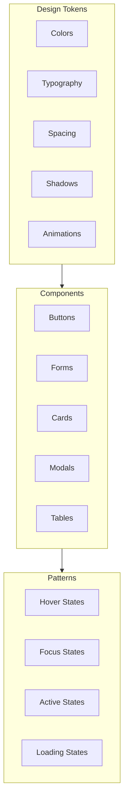
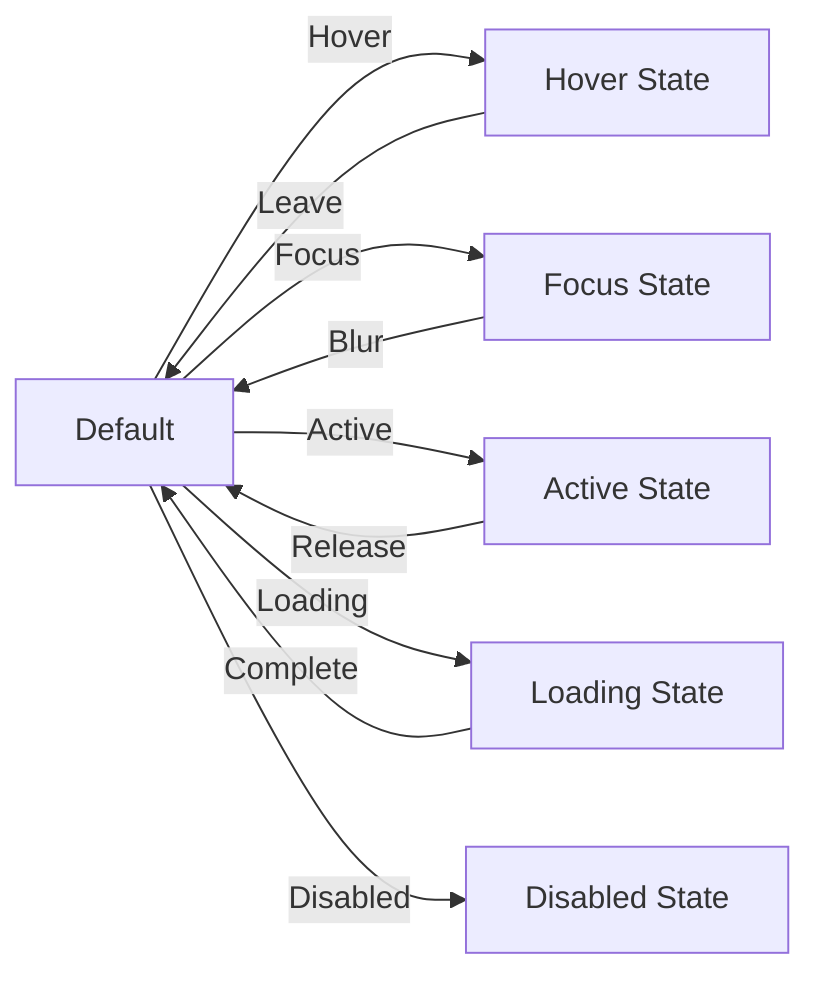

# Frostbyte ETL Admin Dashboard — Priority 5: UX Polish & Consistency (All-in-One PPP)

## Status

- **Canonical Source:** This file is the sole source of truth for Priority 5 implementation.
- **Version:** v1.0.0
- **Date:** 2026-02-14
- **Status:** Planning → Implementation Ready
- **Dependencies:** Priorities 1-4 (foundation complete)

### Changelog

- **v1.0.0 (2026-02-14):** Initial PRD based on comprehensive design review findings.

---

## Policy Summary (Non-Negotiable)

- **Core Principle:** Consistency breeds confidence; polish signals quality.
- **Runtime Boundary:** Design system tokens, component library, motion guidelines.
- **Zero-Shot Minimum:** All buttons consistent, transitions added, empty states designed.
- **Quality Requirements:** Professional finish, maintainable codebase, complete pages.
- **ZSBC Enforcement:** Visual regression testing, design token validation.

---

## Part 0 — System Definition

### 0.1 Naming

**Feature Name:** Frostbyte Design System (FDS)

**Focus Areas:**
1. **Design Tokens** — Colors, typography, spacing, shadows
2. **Component Consistency** — Button styles, casing, spacing
3. **Micro-interactions** — Hover states, transitions, animations
4. **Page Completion** — Settings, Jobs, Onboarding pages
5. **Navigation Enhancement** — Breadcrumbs, keyboard shortcuts

### 0.2 Design System Architecture



### 0.3 Component State Flow



---

## Part A — Gold Standard PPP + PRD

### Prompt (Intent / UPOS-7-VS)

#### Role / Persona

**UI/UX Designer & Frontend Engineer** delivering a polished, professional Frostbyte Admin Dashboard for:

- Daily users who need consistent, predictable interfaces
- New users who need clear guidance and feedback
- Power users who appreciate efficiency and shortcuts
- Stakeholders who judge quality by visual finish

#### Objective

Standardize patterns and improve micro-interactions:

1. **Design System** — Documented tokens for colors, typography, spacing
2. **Component Consistency** — Standardized button styles, casing, spacing
3. **Micro-interactions** — Hover states, transitions, loading spinners
4. **Page Completion** — Build out Settings, Jobs, Onboarding pages
5. **Navigation Enhancement** — Add breadcrumb navigation, keyboard shortcuts

#### Scenario / Context

Current dashboard inconsistencies:

| # | Issue | Impact |
|---|-------|--------|
| #41 | Inconsistent button styles ([SIGN IN] vs [VIEW] vs [VERIFY]) | Looks unprofessional |
| #42 | Mixed text casing conventions | Cognitive load |
| #43 | Inconsistent spacing between sections | Visual disorder |
| #44 | Panel shadow style repeated manually | Maintenance burden |
| #45 | No hover states on tenant chamber cards | Poor feedback |
| #46 | Pipeline node buttons have no active state | No selection feedback |
| #47 | Table row hover too subtle | Hard to track |
| #48 | No transition animations | Feels abrupt |
| #49 | Inspector modal appears/disappears instantly | Disorienting |
| #50 | No loading spinner on buttons | Unclear if action started |
| #51 | Document queue reorder buttons always visible | Visual clutter |
| #52 | Audit verify button state not persistent | Confusing |
| #53 | Online status indicator has no tooltip | Unclear meaning |
| #54 | Pipeline schematic arrows static | No flow indication |
| #55 | Failed document row only has left border | Not prominent enough |
| #56 | Tenant inactive state too subtle | Hard to distinguish |
| #61 | Settings page completely empty | Non-functional |
| #62 | Jobs page stub with no functionality | Non-functional |
| #60 | No breadcrumb navigation | Lost in hierarchy |
| #67 | No keyboard shortcuts | Power user friction |

#### Task

**UX Polish Implementation:**

1. **Design Tokens**
   - Color palette with semantic names
   - Typography scale
   - Spacing scale
   - Shadow system
   - Animation timing

2. **Button Standardization**
   - Three variants: primary, secondary, ghost
   - Three sizes: sm, md, lg
   - Consistent casing: Sentence case
   - Loading state with spinner
   - All states: default, hover, focus, active, disabled, loading

3. **Spacing & Layout**
   - Consistent section spacing (space-y-6 standard)
   - Container max-widths
   - Grid gutters
   - Extract panel shadow to theme

4. **Micro-interactions**
   - 150ms transitions on state changes
   - Hover scale on interactive cards
   - Active press feedback
   - Loading spinners on async actions
   - Modal fade in/out
   - Pipeline arrow animations

5. **Empty States**
   - Illustrations for no documents, no tenants, no jobs
   - Helpful guidance text
   - Call-to-action buttons

6. **Page Completion**
   - Settings page with provider configuration
   - Jobs page with job management
   - Onboarding with working documentation links

7. **Navigation Enhancement**
   - Breadcrumb component
   - Keyboard shortcuts modal
   - Shortcut hints in tooltips

#### Format

Deliver:

1. **Design System:**
   - `design-tokens.json` — Machine-readable tokens
   - `DESIGN_SYSTEM.md` — Human documentation
   - Storybook stories for all components

2. **Component Library:**
   - Standardized Button component
   - Standardized Card component
   - Standardized Input components
   - Animation primitives

3. **Completed Pages:**
   - Settings.tsx with provider config
   - JobList.tsx with job management
   - Onboard.tsx with working links

4. **Enhanced Components:**
   - Breadcrumb navigation
   - KeyboardShortcuts modal
   - Empty state illustrations

#### Constraints

**Technical:**

- Tailwind CSS with custom theme extension
- Framer Motion for animations
- Lucide React for icons
- No external UI libraries

**Design:**

- Consistent 8px grid system
- 150ms standard transition duration
- prefers-reduced-motion support
- Dark theme only (existing)

**Performance:**

- CSS transitions preferred over JS animations
- will-change on animated elements
- No animation on initial render for above-fold content

---

## Plan (Decisions / REASONS Log)

### Reflect: Intent Confirmed? Gaps?

**Intent Confirmed:**
- ✅ 19 UX polish issues identified
- ✅ Professional finish required for production
- ✅ Page completion blocks launch

**Gaps Identified:**
- ❌ No design token documentation
- ❌ No component state specifications
- ❌ Empty page implementations

### Explore: Options Considered

#### Option 1: Third-Party Design System — REJECTED
- Pros: Complete system, fast implementation
- Cons: Overrides needed, bundle bloat
- Reason rejected: Need Frostbyte-specific design

#### Option 2: Custom Design System — SELECTED
- Pros: Perfect fit, full control, minimal size
- Cons: Implementation time
- Reason selected: Long-term maintainability

#### Animation: CSS vs JS Library
- **Selected:** CSS transitions + Framer Motion for complex
- **Trade-off:** Performance vs capability
- **Why:** CSS for simple, Framer for orchestrated animations

### Solve: Path Chosen

#### Phase 1: Design Tokens (Days 1-2)

**Step 1.1: Create Design Tokens**

```json
// design-tokens.json
{
  "version": "1.0.0",
  "colors": {
    "surface": {
      "DEFAULT": "#1a1a1a",
      "elevated": "#242424",
      "overlay": "rgba(0, 0, 0, 0.8)"
    },
    "text": {
      "primary": "#ffffff",
      "secondary": "#a1a1aa",
      "muted": "#71717a"
    },
    "accent": {
      "DEFAULT": "#d4a017",
      "hover": "#b88a14",
      "focus": "#f0c030",
      "muted": "rgba(212, 160, 23, 0.2)"
    },
    "semantic": {
      "success": "#22c55e",
      "warning": "#eab308",
      "error": "#ef4444",
      "info": "#3b82f6"
    }
  },
  "typography": {
    "fontFamily": {
      "sans": ["Inter", "system-ui", "sans-serif"],
      "mono": ["JetBrains Mono", "monospace"]
    },
    "sizes": {
      "xs": "0.75rem",
      "sm": "0.875rem",
      "base": "1rem",
      "lg": "1.125rem",
      "xl": "1.25rem",
      "2xl": "1.5rem",
      "3xl": "1.875rem"
    }
  },
  "spacing": {
    "scale": [0, 1, 2, 3, 4, 5, 6, 8, 10, 12, 16, 20, 24, 32, 40, 48, 64, 80, 96],
    "section": "1.5rem"
  },
  "shadows": {
    "sm": "0 1px 2px 0 rgba(0, 0, 0, 0.3)",
    "DEFAULT": "0 4px 6px -1px rgba(0, 0, 0, 0.4), 0 2px 4px -1px rgba(0, 0, 0, 0.2)",
    "lg": "0 10px 15px -3px rgba(0, 0, 0, 0.5), 0 4px 6px -2px rgba(0, 0, 0, 0.3)",
    "panel": "0 4px 6px -1px rgba(0, 0, 0, 0.3), 0 0 0 1px rgba(255, 255, 255, 0.05)"
  },
  "animation": {
    "duration": {
      "fast": "100ms",
      "normal": "150ms",
      "slow": "300ms"
    },
    "easing": {
      "default": "cubic-bezier(0.4, 0, 0.2, 1)",
      "bounce": "cubic-bezier(0.68, -0.55, 0.265, 1.55)"
    }
  }
}
```

**Step 1.2: Update Tailwind Config**

```javascript
// tailwind.config.js
const tokens = require('./design-tokens.json');

module.exports = {
  theme: {
    extend: {
      colors: tokens.colors,
      fontFamily: tokens.typography.fontFamily,
      fontSize: tokens.typography.sizes,
      boxShadow: tokens.shadows,
      transitionDuration: tokens.animation.duration,
      transitionTimingFunction: tokens.animation.easing,
    },
  },
};
```

#### Phase 2: Component Standardization (Days 3-6)

**Step 2.1: Standardized Button**

```tsx
// Button.tsx
interface ButtonProps extends ButtonHTMLAttributes<HTMLButtonElement> {
  variant?: 'primary' | 'secondary' | 'ghost' | 'danger';
  size?: 'sm' | 'md' | 'lg';
  loading?: boolean;
  leftIcon?: React.ReactNode;
  rightIcon?: React.ReactNode;
}

export function Button({
  variant = 'primary',
  size = 'md',
  loading = false,
  leftIcon,
  rightIcon,
  children,
  className,
  disabled,
  ...props
}: ButtonProps) {
  const baseStyles = `
    inline-flex items-center justify-center font-medium
    transition-all duration-normal ease-default
    focus:outline-none focus:ring-2 focus:ring-accent focus:ring-offset-2
    disabled:opacity-50 disabled:cursor-not-allowed
  `;

  const variants = {
    primary: `
      bg-accent text-black
      hover:bg-accent-hover
      active:bg-accent-focus active:scale-95
    `,
    secondary: `
      bg-surface-elevated text-primary border border-gray-700
      hover:bg-surface hover:border-gray-600
      active:bg-surface active:scale-95
    `,
    ghost: `
      bg-transparent text-secondary
      hover:bg-accent-muted hover:text-accent
      active:scale-95
    `,
    danger: `
      bg-error text-white
      hover:bg-red-600
      active:scale-95
    `,
  };

  const sizes = {
    sm: 'px-3 py-1.5 text-sm rounded',
    md: 'px-4 py-2 text-base rounded-md',
    lg: 'px-6 py-3 text-lg rounded-lg',
  };

  return (
    <button
      className={`
        ${baseStyles}
        ${variants[variant]}
        ${sizes[size]}
        ${className || ''}
      `}
      disabled={disabled || loading}
      {...props}
    >
      {loading && (
        <LoadingSpinner className="w-4 h-4 mr-2 animate-spin" />
      )}
      {!loading && leftIcon && (
        <span className="mr-2">{leftIcon}</span>
      )}
      {children}
      {!loading && rightIcon && (
        <span className="ml-2">{rightIcon}</span>
      )}
    </button>
  );
}
```

**Step 2.2: Standardized Card**

```tsx
// Card.tsx
interface CardProps {
  children: React.ReactNode;
  className?: string;
  hoverable?: boolean;
  onClick?: () => void;
}

export function Card({ children, className, hoverable, onClick }: CardProps) {
  return (
    <div
      onClick={onClick}
      className={`
        bg-surface-elevated rounded-lg shadow-panel p-4
        transition-all duration-normal ease-default
        ${hoverable ? 'hover:shadow-lg hover:-translate-y-0.5 cursor-pointer' : ''}
        ${onClick ? 'active:scale-98' : ''}
        ${className || ''}
      `}
    >
      {children}
    </div>
  );
}
```

**Step 2.3: Update All Buttons to New Standard**

```tsx
// Before: [SIGN IN]
<button className="px-4 py-2 bg-yellow-600">[SIGN IN]</button>

// After: Sign in
<Button variant="primary" loading={isLoading}>
  Sign in
</Button>
```

#### Phase 3: Micro-interactions (Days 7-9)

**Step 3.1: Modal Transitions**

```tsx
// AnimatedModal.tsx
import { motion, AnimatePresence } from 'framer-motion';

export function AnimatedModal({ isOpen, onClose, children, title }: ModalProps) {
  return (
    <AnimatePresence>
      {isOpen && (
        <>
          <motion.div
            className="fixed inset-0 bg-black/50 z-40"
            onClick={onClose}
            initial={{ opacity: 0 }}
            animate={{ opacity: 1 }}
            exit={{ opacity: 0 }}
            transition={{ duration: 0.15 }}
          />
          <motion.div
            className="fixed inset-0 z-50 flex items-center justify-center p-4"
            initial={{ opacity: 0 }}
            animate={{ opacity: 1 }}
            exit={{ opacity: 0 }}
          >
            <motion.div
              className="bg-surface-elevated rounded-lg shadow-lg max-w-lg w-full"
              initial={{ scale: 0.95, opacity: 0, y: 20 }}
              animate={{ scale: 1, opacity: 1, y: 0 }}
              exit={{ scale: 0.95, opacity: 0, y: 20 }}
              transition={{ 
                duration: 0.2,
                ease: [0.4, 0, 0.2, 1]
              }}
            >
              <div className="p-4 border-b">
                <h2 className="text-lg font-semibold">{title}</h2>
              </div>
              <div className="p-4">{children}</div>
            </motion.div>
          </motion.div>
        </>
      )}
    </AnimatePresence>
  );
}
```

**Step 3.2: Pipeline Arrow Animation**

```tsx
// AnimatedPipelineArrow.tsx
export function AnimatedPipelineArrow() {
  return (
    <div className="relative flex items-center justify-center w-8">
      <motion.div
        className="absolute w-full h-0.5 bg-accent/30"
      />
      <motion.div
        className="absolute w-full h-0.5 bg-accent"
        initial={{ scaleX: 0, originX: 0 }}
        animate={{ scaleX: [0, 1, 1, 0] }}
        transition={{
          duration: 2,
          repeat: Infinity,
          ease: "linear",
          times: [0, 0.4, 0.6, 1]
        }}
      />
      <motion.svg
        className="w-4 h-4 text-accent relative z-10"
        initial={{ x: -10, opacity: 0 }}
        animate={{ x: 0, opacity: 1 }}
        transition={{ duration: 0.5, repeat: Infinity }}
      >
        <path d="M0 0 L8 4 L0 8 Z" fill="currentColor" />
      </motion.svg>
    </div>
  );
}
```

**Step 3.3: Tenant Chamber Hover State**

```tsx
// TenantChamber.tsx
export function TenantChamber({ tenant }: { tenant: Tenant }) {
  const [isHovered, setIsHovered] = useState(false);

  return (
    <motion.div
      className={`
        relative p-4 rounded-lg border-2 cursor-pointer
        ${tenant.isActive ? 'border-accent' : 'border-gray-700'}
        bg-surface-elevated
      `}
      onHoverStart={() => setIsHovered(true)}
      onHoverEnd={() => setIsHovered(false)}
      whileHover={{ scale: 1.02 }}
      whileTap={{ scale: 0.98 }}
      animate={{
        boxShadow: isHovered 
          ? '0 10px 25px -5px rgba(212, 160, 23, 0.2)'
          : '0 4px 6px -1px rgba(0, 0, 0, 0.3)'
      }}
    >
      <div className="flex justify-between items-center">
        <h3 className="font-medium">{tenant.name}</h3>
        <StatusBadge 
          status={tenant.isActive ? 'active' : 'inactive'}
          className={tenant.isActive ? '' : 'opacity-50'}
        />
      </div>
      {isHovered && (
        <motion.div
          initial={{ opacity: 0, y: 10 }}
          animate={{ opacity: 1, y: 0 }}
          className="mt-2 text-sm text-secondary"
        >
          Click to manage tenant
        </motion.div>
      )}
    </motion.div>
  );
}
```

#### Phase 4: Empty States (Days 10-11)

**Step 4.1: Empty State Component**

```tsx
// EmptyState.tsx
interface EmptyStateProps {
  icon: React.ReactNode;
  title: string;
  description: string;
  action?: {
    label: string;
    onClick: () => void;
  };
}

export function EmptyState({ icon, title, description, action }: EmptyStateProps) {
  return (
    <div className="flex flex-col items-center justify-center py-16 text-center">
      <div className="w-24 h-24 rounded-full bg-accent-muted flex items-center justify-center mb-6">
        {icon}
      </div>
      <h3 className="text-xl font-semibold mb-2">{title}</h3>
      <p className="text-secondary max-w-sm mb-6">{description}</p>
      {action && (
        <Button onClick={action.onClick} variant="primary">
          {action.label}
        </Button>
      )}
    </div>
  );
}
```

**Step 4.2: Document Queue Empty State**

```tsx
// DocumentQueueEmpty.tsx
export function DocumentQueueEmpty() {
  return (
    <EmptyState
      icon={<DocumentIcon className="w-12 h-12 text-accent" />}
      title="No documents yet"
      description="Upload your first document to start processing. Documents will appear here once ingested."
      action={{
        label: "Upload document",
        onClick: () => navigate('/documents/upload')
      }}
    />
  );
}
```

#### Phase 5: Page Completion (Days 12-16)

**Step 5.1: Settings Page**

```tsx
// Settings.tsx
export function Settings() {
  return (
    <div className="space-y-6">
      <h1 className="text-2xl font-bold">Settings</h1>
      
      <Card>
        <h2 className="text-lg font-semibold mb-4">LLM Providers</h2>
        <ProviderConfig />
      </Card>

      <Card>
        <h2 className="text-lg font-semibold mb-4">Pipeline Configuration</h2>
        <PipelineSettings />
      </Card>

      <Card>
        <h2 className="text-lg font-semibold mb-4">Notifications</h2>
        <NotificationSettings />
      </Card>
    </div>
  );
}

function ProviderConfig() {
  const { providers, updateProvider } = useProviders();

  return (
    <div className="space-y-4">
      {providers.map((provider) => (
        <div key={provider.id} className="flex items-center justify-between p-3 bg-surface rounded">
          <div className="flex items-center gap-3">
            <provider.icon className="w-6 h-6" />
            <div>
              <p className="font-medium">{provider.name}</p>
              <p className="text-sm text-secondary">
                {provider.isConfigured ? 'Configured' : 'Not configured'}
              </p>
            </div>
          </div>
          <Button
            variant={provider.isConfigured ? 'secondary' : 'primary'}
            size="sm"
            onClick={() => updateProvider(provider.id)}
          >
            {provider.isConfigured ? 'Edit' : 'Configure'}
          </Button>
        </div>
      ))}
    </div>
  );
}
```

**Step 5.2: Jobs Page**

```tsx
// JobList.tsx
export function JobList() {
  const { jobs, isLoading } = useJobs();

  if (isLoading) return <SkeletonTable rows={5} />;
  if (!jobs.length) return <JobListEmpty />;

  return (
    <div className="space-y-6">
      <div className="flex justify-between items-center">
        <h1 className="text-2xl font-bold">Jobs</h1>
        <Button leftIcon={<PlusIcon />} onClick={() => createJob()}>
          New Job
        </Button>
      </div>

      <Card>
        <table className="w-full">
          <thead>
            <tr className="border-b">
              <th className="text-left py-3 px-4">Job Name</th>
              <th className="text-left py-3 px-4">Status</th>
              <th className="text-left py-3 px-4">Progress</th>
              <th className="text-left py-3 px-4">Started</th>
              <th className="text-left py-3 px-4">Actions</th>
            </tr>
          </thead>
          <tbody>
            {jobs.map((job) => (
              <tr key={job.id} className="border-b hover:bg-surface/50 transition-colors">
                <td className="py-3 px-4">{job.name}</td>
                <td className="py-3 px-4"><JobStatusBadge status={job.status} /></td>
                <td className="py-3 px-4"><ProgressBar progress={job.progress} /></td>
                <td className="py-3 px-4 text-secondary">{formatDate(job.startedAt)}</td>
                <td className="py-3 px-4">
                  <JobActions job={job} />
                </td>
              </tr>
            ))}
          </tbody>
        </table>
      </Card>
    </div>
  );
}
```

#### Phase 6: Navigation Enhancement (Days 17-18)

**Step 6.1: Breadcrumb Component**

```tsx
// Breadcrumb.tsx
interface BreadcrumbItem {
  label: string;
  href?: string;
}

interface BreadcrumbProps {
  items: BreadcrumbItem[];
}

export function Breadcrumb({ items }: BreadcrumbProps) {
  return (
    <nav aria-label="Breadcrumb" className="mb-4">
      <ol className="flex items-center gap-2 text-sm">
        {items.map((item, index) => (
          <li key={index} className="flex items-center gap-2">
            {index > 0 && (
              <ChevronRightIcon className="w-4 h-4 text-secondary" />
            )}
            {item.href && index < items.length - 1 ? (
              <Link
                to={item.href}
                className="text-secondary hover:text-primary transition-colors"
              >
                {item.label}
              </Link>
            ) : (
              <span className="text-primary font-medium">{item.label}</span>
            )}
          </li>
        ))}
      </ol>
    </nav>
  );
}

// Usage on Document Detail page:
<Breadcrumb
  items={[
    { label: 'Documents', href: '/documents' },
    { label: document.name }
  ]}
/>
```

**Step 6.2: Keyboard Shortcuts**

```tsx
// KeyboardShortcuts.tsx
const SHORTCUTS = [
  { key: '/', description: 'Focus search' },
  { key: 'g d', description: 'Go to Dashboard' },
  { key: 'g t', description: 'Go to Tenants' },
  { key: 'g d', description: 'Go to Documents' },
  { key: 'g a', description: 'Go to Audit' },
  { key: '?', description: 'Show keyboard shortcuts' },
  { key: 'esc', description: 'Close modal / Cancel' },
];

export function KeyboardShortcutsModal() {
  const [isOpen, setIsOpen] = useState(false);

  useEffect(() => {
    const handler = (e: KeyboardEvent) => {
      if (e.key === '?' && !e.metaKey && !e.ctrlKey) {
        e.preventDefault();
        setIsOpen(true);
      }
      if (e.key === 'Escape') {
        setIsOpen(false);
      }
    };
    window.addEventListener('keydown', handler);
    return () => window.removeEventListener('keydown', handler);
  }, []);

  return (
    <AnimatedModal
      isOpen={isOpen}
      onClose={() => setIsOpen(false)}
      title="Keyboard Shortcuts"
    >
      <div className="grid grid-cols-2 gap-4">
        {SHORTCUTS.map((shortcut) => (
          <div key={shortcut.key} className="flex justify-between items-center">
            <span className="text-secondary">{shortcut.description}</span>
            <kbd className="px-2 py-1 bg-surface rounded text-sm font-mono">
              {shortcut.key}
            </kbd>
          </div>
        ))}
      </div>
    </AnimatedModal>
  );
}
```

---

## Production (Outputs and Evidence)

### Artefacts (Paths/Links)

**Design System:**
- `packages/admin-dashboard/design-tokens.json`
- `packages/admin-dashboard/DESIGN_SYSTEM.md`

**Components:**
- `packages/admin-dashboard/src/components/design-system/Button.tsx`
- `packages/admin-dashboard/src/components/design-system/Card.tsx`
- `packages/admin-dashboard/src/components/design-system/EmptyState.tsx`
- `packages/admin-dashboard/src/components/design-system/Breadcrumb.tsx`
- `packages/admin-dashboard/src/components/design-system/AnimatedModal.tsx`

**Pages:**
- `packages/admin-dashboard/src/pages/Settings.tsx`
- `packages/admin-dashboard/src/pages/JobList.tsx`
- `packages/admin-dashboard/src/pages/Onboard.tsx` (updated)

**Hooks:**
- `packages/admin-dashboard/src/hooks/useKeyboardShortcuts.ts`

### Verification Criteria

**Must Pass All:**

1. **Buttons Consistent**
   ```bash
   set -euo pipefail
   # Audit all button usage
   # All use standardized Button component
   # Sentence case labels
   ```

2. **Design Tokens Applied**
   ```bash
   set -euo pipefail
   # No hardcoded colors outside tokens
   # No hardcoded shadows outside tokens
   # Consistent spacing scale used
   ```

3. **Transitions Present**
   ```bash
   set -euo pipefail
   # Modal fade in/out
   # Hover states animate
   # Loading spinners on async actions
   ```

4. **Empty States Designed**
   ```bash
   set -euo pipefail
   # Document queue has empty state
   # Tenant list has empty state
   # Job list has empty state
   ```

5. **Pages Complete**
   ```bash
   set -euo pipefail
   # Settings page functional
   # Jobs page functional
   # Onboarding links working
   ```

6. **Navigation Enhanced**
   ```bash
   set -euo pipefail
   # Breadcrumbs on detail pages
   # Keyboard shortcuts modal works
   # ? key opens shortcuts
   ```

---

## Risks / Edge Cases / Failure Modes

### Risk Register

#### RK-POL-001: Animation Performance Issues
- **Likelihood:** Low
- **Impact:** Medium
- **Mitigation:** prefers-reduced-motion, CSS transforms only
- **Contingency:** Disable animations for affected users

#### RK-POL-002: Design System Adoption Incomplete
- **Likelihood:** Medium
- **Impact:** Low
- **Mitigation:** ESLint rules, code review checklist
- **Contingency:** Gradual migration acceptable

### Edge Cases

1. **User has reduced motion preference** — Respect prefers-reduced-motion
2. **JavaScript disabled** — Fallback to CSS-only transitions
3. **Old browser without CSS custom properties** — Graceful degradation

---

## Design System Checklist

- [ ] **Colors:** All colors from tokens
- [ ] **Typography:** Type scale implemented
- [ ] **Spacing:** 8px grid system
- [ ] **Shadows:** Consistent elevation system
- [ ] **Buttons:** All variants working
- [ ] **Cards:** Hover states implemented
- [ ] **Animations:** 150ms standard duration
- [ ] **Accessibility:** Reduced motion support
- [ ] **Documentation:** DESIGN_SYSTEM.md complete
