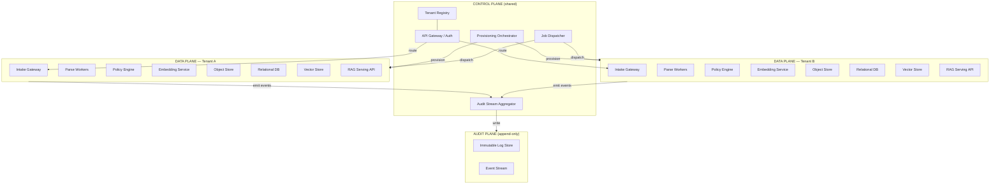
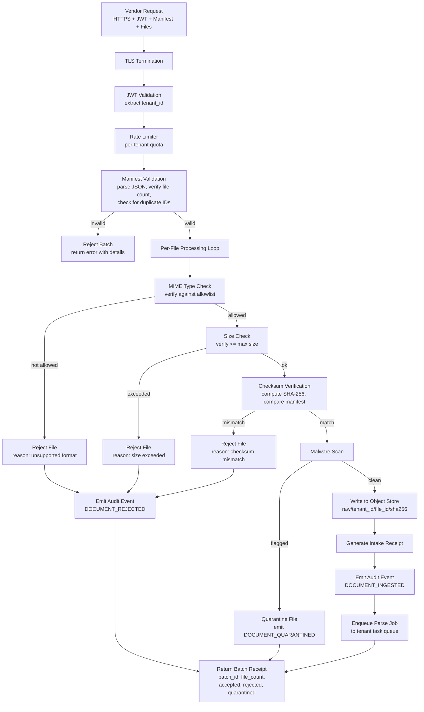
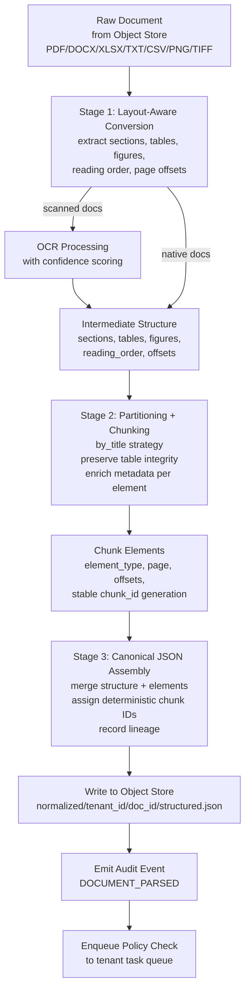
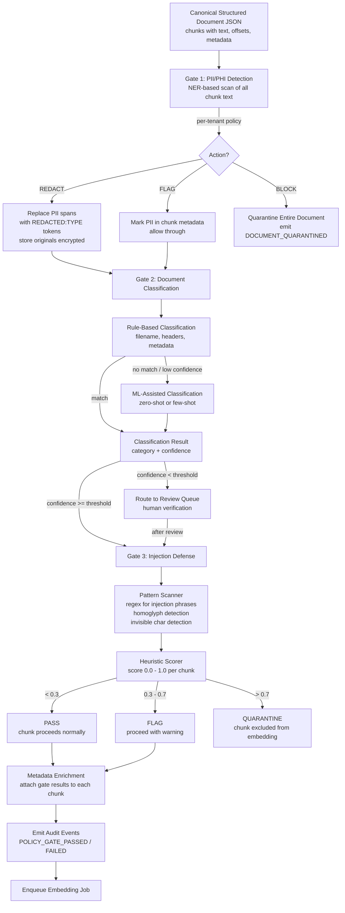
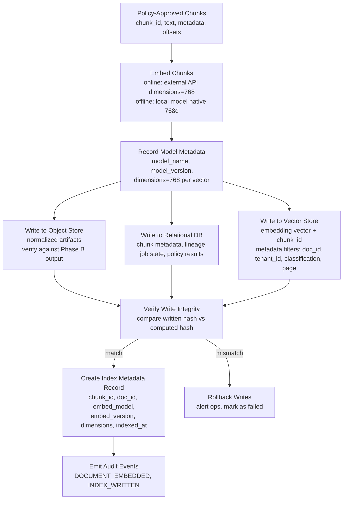
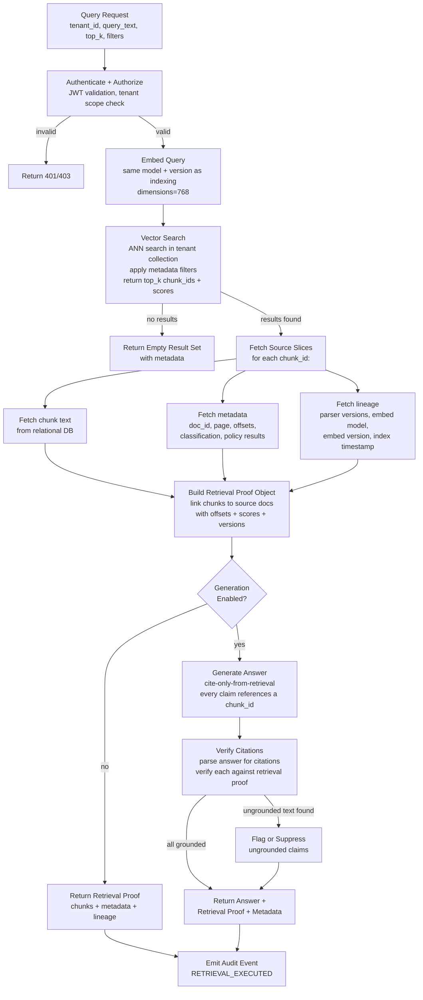
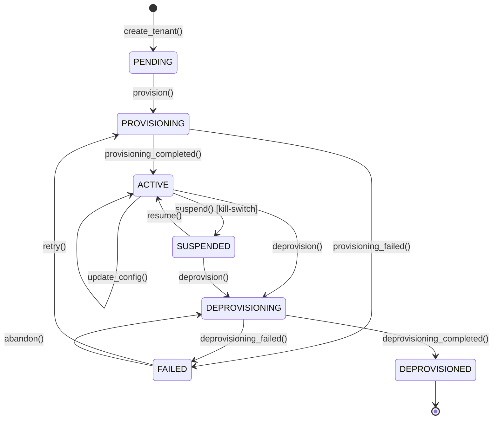

# Frostbyte Multi-Tenant ETL Pipeline — Product Requirements Document

## Document Conventions

This document is the single authoritative reference for what the Frostbyte multi-tenant ETL pipeline does, who it serves, how data flows through it, how tenants are managed, what is monitored, and what API contracts exist. Every subsequent planning artifact (isolation architecture, audit design, implementation plans, deployment specs, team documentation) references this document.

**Requirement IDs and Section Mapping:**

| Requirement ID | Section | Title |
|----------------|---------|-------|
| PRD-01 | Section 1 | Executive Summary |
| PRD-02 | Section 2 | Pipeline Phase Specifications |
| PRD-03 | Section 3 | Tenant Lifecycle Management |
| PRD-04 | Section 4 | Monitoring and Observability |
| PRD-05 | Section 5 | API Contract Specification |

**Schema notation:** All schemas are shown as JSON examples with inline field descriptions. Field types follow JSON conventions: `string`, `number`, `boolean`, `array`, `object`. Timestamps use UTC ISO 8601 format (`2026-02-08T14:30:00Z`). UUIDs use v7 (time-ordered) unless otherwise noted.

**Diagram notation:** All data flow diagrams use Mermaid syntax. Each diagram shows typed inputs, transformations, and typed outputs.

**Audit event notation:** Each pipeline phase lists the audit events it emits. Event type names use UPPER_SNAKE_CASE. The full audit event schema is defined in Section 2 and referenced throughout.

---

## 1. Executive Summary (PRD-01)

### 1.1 What

Frostbyte is a multi-tenant document ETL pipeline that transforms unstructured documents into structured, searchable, and retrievable data with full provenance. The core contract is: **document in, structure out, stored in relational database and vector index**. The pipeline ingests vendor-submitted document batches, normalizes them through layout-aware parsing, applies configurable governance policies (PII detection, document classification, injection defense), generates vector embeddings, and serves retrieval results with verifiable provenance chains. Every tenant operates in a fully isolated environment with dedicated compute, storage, and encryption. The system runs in two modes -- an online API-driven mode for cloud deployments and an offline air-gapped Docker mode for environments where no outbound network calls are permitted -- with identical pipeline logic in both modes.

### 1.2 Why

Frostbyte serves regulated industries (legal, healthcare, finance, government) where data sovereignty is non-negotiable. Documents are the primary medium of record in these industries, and organizations need to transform document corpora into searchable, retrievable knowledge bases for analysis, compliance, and decision support. Five problems drive the need for this system:

1. **Ambiguous requirements cause repeated rework and missed deadlines** -- Vendors submitting documents need clear intake specifications, machine-readable manifest schemas, and immediate feedback on what was received and what was rejected.
2. **Black-box ingestion erodes trust** -- When a pipeline parses documents without visibility into what was extracted and what was dropped, vendors cannot verify completeness. Every document must produce an acceptance report detailing extraction results.
3. **Sovereignty anxiety blocks adoption** -- Regulated organizations need provable assurance that their data does not flow to unauthorized external services, that tenant boundaries are enforced by construction (not by policy), and that encryption keys are tenant-scoped.
4. **Retrieval mismatch causes "fluent wrong" answers** -- RAG systems that return plausible but incorrect answers undermine trust. Every retrieval result must include a provenance proof linking each claim to a specific source chunk with byte offsets in the original document.
5. **Offline deployments break** -- Air-gapped environments have unique constraints (no outbound network, limited hardware, infrequent updates). The offline bundle must be self-contained, self-verifying, and updatable via signed packages.

### 1.3 Who

Four personas interact with the system. Each has distinct responsibilities and touchpoints.

**Dana (Vendor Data Operations Lead)**
Dana is accountable for submitting documents to the pipeline on schedule. She has limited engineering support and high risk sensitivity. Her primary questions are: "Did you receive everything?", "What did you parse and what did you drop?", and "Where does our data go?" Dana submits document batches with manifests, reads acceptance reports, runs test queries to verify retrieval quality, and escalates issues when results do not match source documents. Dana interacts with the Intake API (batch submission, receipt retrieval), Query API (test queries), and the vendor acceptance report.

**Frode (Frostbyte Platform Owner)**
Frode manages the overall platform. He provisions new tenants, monitors pipeline health across all tenants, manages tenant kill-switches when incidents occur, and makes architectural decisions about capacity, scaling, and feature rollout. Frode interacts with the Admin API (tenant provisioning, suspension, configuration), the platform-wide monitoring dashboard, and the audit log for incident investigation.

**Engineers**
Engineers implement pipeline phases, debug processing failures, extend the system with new document formats or governance policies, and maintain the infrastructure. Engineers reference this PRD for system behavior specifications, the API contracts for integration points, and the pipeline phase specifications for data flow understanding.

**Auditors**
Auditors query the audit log to verify compliance with data handling requirements. They export compliance evidence for regulatory reviews, verify provenance chains from document intake through retrieval, and confirm that tenant isolation boundaries are maintained. Auditors interact with the Audit API (event queries, provenance chain requests, evidence export).

### 1.4 How

The system follows a three-tier architecture separating concerns across control, data, and audit planes:

The **control plane** is a shared, multi-tenant service layer that manages tenant lifecycle (provisioning, configuration, suspension, deprovisioning), routes API requests to the correct tenant data plane, dispatches processing jobs, and aggregates audit events. The control plane never touches document content -- it manages routing, identity, and metering only. A compromise of the control plane does not expose document content.

The **data plane** is instantiated per-tenant as a fully isolated environment. Each tenant's data plane contains its own intake gateway, parsing workers, policy engine, embedding service, object store, relational database, vector store, and serving API. Blast radius is limited to one tenant by construction. In online mode, each data plane runs on dedicated infrastructure; in offline mode, the data plane is a self-contained application stack.

The **audit plane** is an append-only, immutable log store. Data planes emit structured audit events for every pipeline step. The audit plane accepts writes from all tenant data planes but enforces write-only semantics -- no update, no delete. Operations teams and auditors read from the audit plane through dedicated query endpoints.



### 1.5 Deployment Modes

**Online Mode (Cloud Deployment)**

In online mode, the system runs on dedicated cloud infrastructure with per-tenant isolated environments. The control plane manages tenant provisioning, creates isolated compute and storage resources, configures network boundaries with firewall rules that deny all cross-tenant traffic, and routes API requests through a centralized gateway with JWT-based authentication. Embedding generation uses an external embeddings API endpoint (configured with `dimensions: 768` to match offline mode). The audit plane runs as a centralized append-only database accessible to operations and compliance teams. Tenants access the system via tenant-scoped API endpoints.

**Offline Mode (Air-Gapped Docker Bundle)**

In offline mode, the entire data plane collapses into a single Docker Compose stack running on an air-gapped host with zero outbound network calls. The control plane is replaced by static tenant configuration files. Embedding generation uses a local embedding model running in a dedicated container, producing 768-dimensional vectors identical in structure to the online mode output. The audit plane writes to a local append-only store included in the Docker stack. The bundle includes all container images, model weights, malware signatures, and configuration files required for operation. Network isolation is enforced structurally via Docker's `internal: true` network setting, which prevents containers from reaching external networks regardless of host configuration. Updates are delivered as signed tarballs verified before installation.

The pipeline code is identical across both modes. Only infrastructure provisioning and embedding routing differ. This architectural constraint ensures that documents processed offline produce the same structured output as documents processed online, and that vectors generated in either mode occupy the same 768-dimensional embedding space.

### 1.6 Anti-Features

The following features are deliberately excluded from the system. Each exclusion prevents scope creep, reduces attack surface, or avoids architectural complexity that conflicts with the system's core guarantees.

| Anti-Feature | Why Excluded |
|---|---|
| **Cross-tenant aggregation or analytics** | Fundamentally violates isolation-by-construction. Even "anonymized" cross-tenant data creates re-identification risk. Platform health metrics (job counts, latency, error rates) contain zero document content and are sufficient for operational insight. |
| **LLM-in-the-loop parsing** | LLMs are non-deterministic: the same document produces different structures on different runs. This breaks deterministic chunking, stable chunk IDs, audit trail reproducibility, and offline sovereignty (sending content to external LLMs violates air-gap guarantees). Deterministic parsers handle structure extraction; LLMs are reserved for downstream retrieval/generation only. |
| **Shared vector index with tenant filtering** | Metadata-filter-based tenant isolation in vector stores is fragile. One missing filter, one library bug, and Tenant A retrieves Tenant B's chunks. Per-tenant vector collections provide physical isolation that eliminates this class of data leakage. |
| **Real-time streaming ingestion** | Documents in this domain arrive in batches with manifests, not as continuous streams. Streaming infrastructure adds complexity (exactly-once semantics, backpressure, reordering) for a use case that does not require it. Manifest-based completeness checks are impossible with streaming. |
| **Auto-correction of parse errors** | Silently "fixing" extraction errors means the stored representation may not match the source document. In legal and compliance contexts, the stored representation must faithfully reflect the source. Parse issues are reported in the acceptance report; the vendor decides the remediation path. |
| **Universal document format support** | Every new format adds parsing complexity, test surface, and security attack vectors. The system supports an explicit, tested allowlist of formats. Unsupported formats are rejected at the intake gateway with clear error messages. The allowlist is expanded deliberately with full test coverage per addition. |

---

## 2. Pipeline Phase Specifications (PRD-02)

The pipeline processes documents through five sequential phases. Each phase has defined inputs, transformations, outputs, error handling behavior, and audit events. Documents flow strictly forward through phases; a document cannot skip a phase or proceed past a phase without completing it. Failed documents are quarantined with diagnostic information and do not propagate to subsequent phases.

### Audit Event Schema

Every pipeline phase emits structured audit events. All events conform to this schema:

```json
{
  "event_id": "01957a3c-8b2e-7000-a000-000000000001",
  "tenant_id": "tenant_abc",
  "event_type": "DOCUMENT_INGESTED",
  "timestamp": "2026-02-08T14:30:00Z",
  "actor": "system",
  "resource_type": "document",
  "resource_id": "file_001",
  "details": {
    "component": "intake-gateway",
    "input_hash": "sha256:a1b2c3d4e5f6...",
    "output_hash": "sha256:f6e5d4c3b2a1...",
    "pipeline_version": "1.0.0",
    "duration_ms": 234,
    "status": "success"
  },
  "previous_event_id": null
}
```

**Field descriptions:**

| Field | Type | Description |
|-------|------|-------------|
| `event_id` | string (UUID v7) | Time-ordered unique identifier for this event |
| `tenant_id` | string | Tenant that owns the resource |
| `event_type` | string (enum) | Machine-readable event type (defined per phase below) |
| `timestamp` | string (ISO 8601) | Server-side UTC timestamp; never client-supplied |
| `actor` | string | `"system"` for automated actions, or a user identifier for manual actions |
| `resource_type` | string (enum) | One of: `document`, `chunk`, `query`, `tenant`, `batch` |
| `resource_id` | string | Identifier of the resource this event pertains to |
| `details.component` | string | Pipeline component that generated this event |
| `details.input_hash` | string | SHA-256 hash of the input to this processing step |
| `details.output_hash` | string | SHA-256 hash of the output of this processing step |
| `details.pipeline_version` | string | Version of the pipeline code that generated this event |
| `details.duration_ms` | number | Processing time in milliseconds |
| `details.status` | string (enum) | One of: `success`, `failure`, `quarantined` |
| `previous_event_id` | string or null | UUID of the preceding event in this resource's lineage chain |

---

### 2.1 Phase A -- Intake Gateway (Trust Boundary)

The intake gateway is the first contact point for untrusted documents entering the pipeline. It authenticates the submitter, validates the batch manifest, verifies file integrity, scans for malware, and generates immutable intake receipts. No document content is interpreted at this phase -- the gateway treats files as opaque blobs to be validated and stored.

#### Inputs

Vendor batch uploads arrive via HTTPS or SFTP. Each batch submission includes:

- **Manifest**: A JSON document listing all files in the batch with their expected checksums, MIME types, and metadata.
- **Files**: The document files referenced in the manifest.
- **Authentication**: A Bearer JWT token containing the `tenant_id` claim.

**Manifest schema:**

```json
{
  "batch_id": "batch_2026-02-08_001",
  "tenant_id": "tenant_abc",
  "file_count": 3,
  "files": [
    {
      "file_id": "file_001",
      "filename": "contract_2024.pdf",
      "mime_type": "application/pdf",
      "size_bytes": 2457600,
      "sha256": "a1b2c3d4e5f67890..."
    }
  ],
  "submitted_at": "2026-02-08T14:00:00Z",
  "submitter": "dana@vendor.example.com"
}
```

#### Transformations

The intake gateway processes each batch through the following sequence:

1. **TLS termination** -- All connections are encrypted. Unencrypted connections are rejected.
2. **JWT validation** -- Extract `tenant_id` from token claims. Reject if token is expired, malformed, or does not match the target tenant endpoint.
3. **Rate limit enforcement** -- Check per-tenant quota (100 requests/minute). Return 429 if exceeded.
4. **Manifest validation** -- Parse manifest JSON. Verify expected file count matches submitted files. Verify no duplicate file IDs. Reject the entire batch if the manifest is malformed or file count mismatches.
5. **Per-file processing loop** -- For each file in the manifest:
   - **MIME type check** -- Verify against allowlist: `application/pdf`, `application/vnd.openxmlformats-officedocument.wordprocessingml.document` (DOCX), `application/vnd.openxmlformats-officedocument.spreadsheetml.sheet` (XLSX), `text/plain`, `text/csv`, `image/png`, `image/tiff`. Reject file if MIME type is not on the allowlist.
   - **Size check** -- Reject file if size exceeds the configured maximum (default: 500 MB per file).
   - **Checksum verification** -- Compute SHA-256 hash of the received file. Compare with the hash declared in the manifest. Reject file if mismatch.
   - **Malware scan** -- Scan the file using the malware scanning service. Quarantine file if flagged.
   - **Write to object store** -- Store the raw file at path `raw/{tenant_id}/{file_id}/{sha256}`. The path includes the content hash to enable deduplication and integrity verification.
   - **Generate intake receipt** -- Create an immutable receipt recording the file's acceptance.
   - **Emit audit event** -- Emit `DOCUMENT_INGESTED` (on acceptance), `DOCUMENT_REJECTED` (on rejection), or `DOCUMENT_QUARANTINED` (on quarantine).
   - **Enqueue parse job** -- For accepted files, enqueue a parse job to the tenant's task queue.
6. **Return batch receipt** -- Aggregate per-file results into a batch receipt.



#### Outputs

**Intake receipt** (one per accepted file):

```json
{
  "receipt_id": "01957a3c-8b2e-7000-a000-000000000002",
  "tenant_id": "tenant_abc",
  "batch_id": "batch_2026-02-08_001",
  "file_id": "file_001",
  "original_filename": "contract_2024.pdf",
  "mime_type": "application/pdf",
  "size_bytes": 2457600,
  "sha256": "a1b2c3d4e5f67890...",
  "scan_result": "clean",
  "received_at": "2026-02-08T14:30:00Z",
  "storage_path": "raw/tenant_abc/file_001/a1b2c3d4e5f67890",
  "status": "accepted"
}
```

| Field | Type | Description |
|-------|------|-------------|
| `receipt_id` | string (UUID v7) | Unique identifier for this receipt |
| `tenant_id` | string | Tenant that owns this file |
| `batch_id` | string | Batch this file belongs to |
| `file_id` | string | Identifier from the manifest |
| `original_filename` | string | Original filename as submitted |
| `mime_type` | string | Verified MIME type |
| `size_bytes` | number | File size in bytes |
| `sha256` | string | SHA-256 hash of file content |
| `scan_result` | string (enum) | `clean`, `quarantined`, or `skipped` |
| `received_at` | string (ISO 8601) | Server-side receipt timestamp |
| `storage_path` | string | Object store path where raw file is stored |
| `status` | string (enum) | `accepted`, `rejected`, or `quarantined` |

**Batch receipt** (one per batch):

```json
{
  "batch_id": "batch_2026-02-08_001",
  "tenant_id": "tenant_abc",
  "file_count": 10,
  "accepted": 8,
  "rejected": 1,
  "quarantined": 1,
  "receipts": ["receipt_id_1", "receipt_id_2"],
  "rejected_files": [
    {
      "file_id": "file_003",
      "reason": "CHECKSUM_MISMATCH",
      "message": "Expected SHA-256 a1b2... but computed c3d4..."
    }
  ],
  "quarantined_files": [
    {
      "file_id": "file_007",
      "reason": "MALWARE_DETECTED",
      "message": "Malware scan flagged: Trojan.PDF-123"
    }
  ],
  "received_at": "2026-02-08T14:30:05Z"
}
```

#### Error Handling

| Error Condition | Action | Response |
|-----------------|--------|----------|
| Manifest is malformed or missing | Reject entire batch | 400 with error details |
| Manifest file count does not match submitted files | Reject entire batch | 400 with expected vs actual count |
| File MIME type not on allowlist | Reject individual file | File marked `rejected` in batch receipt with reason `UNSUPPORTED_FORMAT` |
| File exceeds maximum size | Reject individual file | File marked `rejected` with reason `SIZE_EXCEEDED` |
| File checksum does not match manifest | Reject individual file | File marked `rejected` with reason `CHECKSUM_MISMATCH` |
| Malware detected | Quarantine individual file | File marked `quarantined` with reason `MALWARE_DETECTED`; file stored in quarantine path, not processed further |
| Duplicate file ID in manifest | Reject entire batch | 400 with duplicate file IDs listed |

#### Audit Events Emitted

| Event Type | Trigger | Resource Type | Key Details |
|------------|---------|---------------|-------------|
| `BATCH_RECEIVED` | Batch submission begins processing | batch | file_count, submitter |
| `DOCUMENT_INGESTED` | File passes all checks and is stored | document | sha256, mime_type, storage_path |
| `DOCUMENT_REJECTED` | File fails a validation check | document | rejection_reason, failed_check |
| `DOCUMENT_QUARANTINED` | Malware scan flags the file | document | scan_engine, threat_name |

---

### 2.2 Phase B -- Document Normalization (Parsing)

The parsing phase transforms raw documents from the object store into a canonical structured representation. Two complementary parsing stages run in sequence: a layout-aware conversion stage extracts document structure (tables, figures, sections, reading order, page offsets), and a partitioning stage segments the structured output into chunks with enriched metadata and stable identifiers.

#### Inputs

Raw document files retrieved from the object store. Supported formats: PDF, DOCX, XLSX, TXT, CSV, PNG, TIFF. Each file is identified by its `file_id` and `sha256` hash from the intake receipt.

#### Transformations

The parsing pipeline runs two stages in sequence, followed by canonical JSON assembly:

**Stage 1 -- Layout-Aware Conversion:**

- Processes the raw document to extract structural elements: sections, headings, paragraphs, tables (with row/column structure preserved), figures, reading order, and page-level position offsets.
- For PDFs: Extracts text, identifies layout regions, preserves table structures as data frames, records page numbers and character offsets.
- For DOCX: Extracts structured content from the XML representation, preserves heading hierarchy and table structures.
- For scanned documents (PNG, TIFF, image-heavy PDFs): Applies OCR with confidence scoring. Pages with OCR confidence below a threshold are flagged for review.
- Output: An intermediate structured representation with document layout information.

**Stage 2 -- Partitioning and Chunking:**

- Partitions the structured representation into discrete elements (paragraphs, table rows, list items, headings).
- Applies a structure-aware chunking strategy (`by_title`): chunk boundaries respect document structure (section breaks, heading changes). Tables are never split across chunks. List items are kept together.
- Enriches each element with metadata: element type (paragraph, table, heading, list, figure), page number, character offsets within the page.
- Generates stable, deterministic chunk IDs: `chunk_id = hash(doc_id + page + start_offset + end_offset)`. The same document processed multiple times produces identical chunk IDs.
- Output: A list of chunk elements with metadata.

**Stage 3 -- Canonical JSON Assembly:**

- Merges the layout structure from Stage 1 with the chunk elements from Stage 2.
- Assigns deterministic chunk IDs.
- Records lineage information: SHA-256 of the raw input, parser versions used, and the parse timestamp.
- Writes the canonical structured document JSON to the object store at path `normalized/{tenant_id}/{doc_id}/structured.json`.



#### Outputs

**Canonical Structured Document JSON** (one per document):

```json
{
  "doc_id": "doc_01957a3c",
  "file_id": "file_001",
  "tenant_id": "tenant_abc",
  "sections": [
    {
      "section_id": "sec_001",
      "title": "Payment Terms",
      "level": 2,
      "page": 3,
      "start_char": 4520,
      "end_char": 5890
    }
  ],
  "tables": [
    {
      "table_id": "tbl_001",
      "page": 5,
      "rows": 12,
      "columns": 4,
      "cells": [["Header1", "Header2", "Header3", "Header4"]],
      "start_char": 8900,
      "end_char": 10200
    }
  ],
  "figures": [
    {
      "figure_id": "fig_001",
      "page": 7,
      "caption": "Organizational Chart",
      "start_char": 14000,
      "end_char": 14500
    }
  ],
  "reading_order": ["sec_001", "tbl_001", "sec_002", "fig_001"],
  "chunks": [
    {
      "chunk_id": "chk_a1b2c3d4",
      "text": "The payment terms specify net-30 from invoice date...",
      "page": 3,
      "start_char": 4520,
      "end_char": 4890,
      "element_type": "paragraph",
      "metadata": {
        "section_title": "Payment Terms",
        "heading_level": 2
      }
    }
  ],
  "lineage": {
    "raw_sha256": "a1b2c3d4e5f67890...",
    "stage1_parser_version": "1.0.0",
    "stage2_parser_version": "1.0.0",
    "parse_timestamp": "2026-02-08T14:35:00Z"
  },
  "stats": {
    "page_count": 42,
    "section_count": 15,
    "table_count": 8,
    "figure_count": 3,
    "chunk_count": 127,
    "total_characters": 98500,
    "ocr_pages": 0,
    "ocr_avg_confidence": null
  }
}
```

| Field | Type | Description |
|-------|------|-------------|
| `doc_id` | string | Unique document identifier |
| `file_id` | string | Reference to the intake receipt file_id |
| `tenant_id` | string | Tenant that owns this document |
| `sections[]` | array | Document sections with titles, levels, and offsets |
| `tables[]` | array | Extracted tables with row/column counts and cell content |
| `figures[]` | array | Detected figures with captions |
| `reading_order[]` | array | Ordered list of section/table/figure IDs reflecting document flow |
| `chunks[]` | array | Chunked content with text, offsets, and metadata |
| `chunks[].chunk_id` | string | Deterministic ID: `hash(doc_id + page + start_offset + end_offset)` |
| `chunks[].element_type` | string | `paragraph`, `table`, `heading`, `list_item`, `figure_caption` |
| `lineage` | object | Parser versions and input hash for reproducibility |
| `stats` | object | Extraction statistics for acceptance reporting |

#### Error Handling

| Error Condition | Action | Consequence |
|-----------------|--------|-------------|
| Parse failure (entire file) | Mark document as `parse_failed`. Log failure reason. Include in acceptance report. | Document does not proceed to Phase C. Audit event `DOCUMENT_PARSE_FAILED` emitted. |
| Partial extraction (some elements not extractable) | Flag dropped content in the `stats` object. Continue processing extractable content. | Acceptance report includes "dropped content" details. Audit event `CONTENT_DROPPED` emitted per dropped element. |
| OCR fallback for scanned documents | Apply OCR. Record OCR confidence per page. | Low-confidence pages flagged in acceptance report. |
| Corrupted file (cannot be opened) | Mark as `parse_failed` with reason `FILE_CORRUPTED`. | Same as parse failure. |

#### Audit Events Emitted

| Event Type | Trigger | Resource Type | Key Details |
|------------|---------|---------------|-------------|
| `DOCUMENT_PARSED` | Document successfully parsed and canonical JSON written | document | chunk_count, page_count, parser_versions |
| `DOCUMENT_PARSE_FAILED` | Parsing failed for the entire document | document | failure_reason, parser_versions |
| `CONTENT_DROPPED` | Extractable content was dropped during parsing | document | dropped_element_type, page, reason |

---

### 2.3 Phase C -- Policy Gates and Enrichment

The policy phase applies three sequential governance gates to every parsed document before it can proceed to embedding and storage. All three gates run BEFORE embedding. This is a hard architectural constraint: malicious or sensitive content must never reach the vector store where it could influence retrieval results or be served to users.

#### Inputs

Canonical Structured Document JSON from Phase B, containing chunks with text content, element types, page offsets, and parsing metadata.

#### Transformations

Three gates run in sequence. A document must pass all three gates (or have gate results recorded) before proceeding.

**Gate 1 -- PII/PHI Detection:**

- Runs NER-based scanning on all chunk text content.
- Detects: names, Social Security Numbers, email addresses, phone numbers, physical addresses, dates of birth, medical record numbers, financial account numbers.
- Action is configurable per tenant:
  - `REDACT`: Replace PII span with `[REDACTED:TYPE]` (e.g., `[REDACTED:SSN]`). Original content stored in encrypted form accessible only via admin API.
  - `FLAG`: Mark the chunk metadata with PII types found. Allow through without modification.
  - `BLOCK`: Quarantine the entire document. No chunks proceed to embedding.
- Records: PII types found, spans detected, action taken per span.

**Gate 2 -- Document Classification:**

- Classifies the document into one of the following categories: `contract`, `invoice`, `SOP`, `policy`, `correspondence`, `legal_filing`, `other`.
- Classification runs in two stages:
  1. **Rule-based first**: Filename patterns (e.g., `*_contract_*.pdf`), header keywords (e.g., "AGREEMENT", "INVOICE"), and metadata fields.
  2. **ML-assisted second**: If rule-based classification produces no match or low confidence, apply a trained classifier.
- If classification confidence is below the configured threshold, the document is routed to a review queue for human verification.
- Records: classification category, confidence score, classifier version, whether human override was applied.

**Gate 3 -- Injection Defense:**

- Scans all chunk text for patterns indicating document injection attempts:
  1. **Pattern scanner**: Regex patterns for known injection phrases ("ignore previous instructions", "you are now", "system:", "assistant:", "do not mention", "forget everything").
  2. **Homoglyph detection**: Identifies Unicode lookalike characters used to hide instructions (e.g., Cyrillic characters substituted for Latin).
  3. **Invisible character detection**: Detects zero-width characters, right-to-left overrides, and other Unicode control characters that can hide text.
- **Heuristic scorer**: Produces a score from 0.0 to 1.0 for each chunk based on pattern matches, unusual character distributions, and instruction-like sentence structures.
- **Action based on score**:
  - Score < 0.3: `PASS` -- chunk proceeds normally.
  - Score 0.3 - 0.7: `FLAG` -- chunk proceeds with a warning flag in metadata. Review recommended.
  - Score > 0.7: `QUARANTINE` -- chunk is quarantined. The chunk is not embedded, not stored in the vector index, and not served via retrieval.
- Records: injection score, patterns matched, action taken.

After all three gates complete, deterministic chunk IDs are confirmed, and metadata from all three gates is attached to each chunk.



#### Outputs

**Policy-enriched chunks** (per chunk):

```json
{
  "chunk_id": "chk_a1b2c3d4",
  "doc_id": "doc_01957a3c",
  "tenant_id": "tenant_abc",
  "text": "The payment terms specify net-30 from invoice date...",
  "metadata": {
    "pii_scan_result": "clean",
    "pii_types_found": [],
    "pii_action_taken": "none",
    "classification": "contract",
    "classification_confidence": 0.94,
    "classifier_version": "1.0.0",
    "human_override": false,
    "injection_score": 0.02,
    "injection_patterns_matched": [],
    "injection_action_taken": "pass"
  },
  "offsets": {
    "page": 3,
    "start_char": 4520,
    "end_char": 4890
  },
  "element_type": "paragraph",
  "section_title": "Payment Terms"
}
```

| Field | Type | Description |
|-------|------|-------------|
| `chunk_id` | string | Deterministic chunk identifier |
| `doc_id` | string | Parent document identifier |
| `tenant_id` | string | Tenant that owns this chunk |
| `text` | string | Chunk text content (may contain `[REDACTED:TYPE]` tokens if PII was redacted) |
| `metadata.pii_scan_result` | string (enum) | `clean`, `pii_found`, `redacted`, `blocked` |
| `metadata.pii_types_found` | array of strings | PII types detected (e.g., `["SSN", "EMAIL"]`). Never contains actual PII content. |
| `metadata.pii_action_taken` | string (enum) | `none`, `redacted`, `flagged`, `blocked` |
| `metadata.classification` | string (enum) | `contract`, `invoice`, `SOP`, `policy`, `correspondence`, `legal_filing`, `other` |
| `metadata.classification_confidence` | number (0.0-1.0) | Classifier confidence score |
| `metadata.classifier_version` | string | Version of the classifier used |
| `metadata.human_override` | boolean | Whether a human corrected the classification |
| `metadata.injection_score` | number (0.0-1.0) | Injection likelihood score |
| `metadata.injection_patterns_matched` | array of strings | Pattern names that triggered (e.g., `["ignore_previous"]`). Never contains document content. |
| `metadata.injection_action_taken` | string (enum) | `pass`, `flag`, `quarantine` |
| `offsets.page` | number | Page number in the source document |
| `offsets.start_char` | number | Start character offset within the page |
| `offsets.end_char` | number | End character offset within the page |

#### Error Handling

| Error Condition | Action | Consequence |
|-----------------|--------|-------------|
| PII `BLOCK` action triggered | Quarantine entire document | No chunks from this document proceed to Phase D. Audit event `DOCUMENT_QUARANTINED` emitted with reason `PII_BLOCK_POLICY`. |
| Injection score > 0.7 on any chunk | Quarantine the specific chunk | Chunk excluded from embedding. Other chunks in the same document may proceed if they pass. Audit event `DOCUMENT_QUARANTINED` emitted per quarantined chunk. |
| Classification low confidence (below threshold) | Route to review queue | Document held until human review completes. If review queue is not available, document proceeds with `classification: "other"` and `human_override: false`. |
| PII scanner unavailable | Fail the document | Document does not proceed. Marked as `policy_failed`. Retry after scanner recovery. |

#### Audit Events Emitted

| Event Type | Trigger | Resource Type | Key Details |
|------------|---------|---------------|-------------|
| `POLICY_GATE_PASSED` | Document/chunk passes a gate | document | gate_name (pii/classification/injection), result_summary |
| `POLICY_GATE_FAILED` | Document/chunk fails a gate | document | gate_name, failure_reason, action_taken |
| `DOCUMENT_QUARANTINED` | Document or chunk quarantined by policy | document | quarantine_reason (PII_BLOCK, INJECTION_HIGH_SCORE), gate_name |
| `PII_DETECTED` | PII found in a document (regardless of action) | document | pii_types_found (list of type names only, never content), action_taken |

---

### 2.4 Phase D -- Embedding and Storage

The embedding and storage phase generates vector embeddings for all policy-approved chunks and writes them to three isolated stores: the object store (normalized artifacts), the relational database (chunk metadata, lineage, job state), and the vector store (embeddings with metadata for similarity search).

Both deployment modes lock to 768-dimensional embeddings. In online mode, embedding generation uses an external API endpoint configured with `dimensions: 768`. In offline mode, embedding generation uses a local model that produces native 768-dimensional vectors. This enables cross-mode vector compatibility: vectors generated in either mode occupy the same embedding space. Switching embedding models requires full re-indexing of all affected tenant data.

#### Inputs

Policy-approved chunks from Phase C. Each chunk includes text content, policy gate metadata, offsets, and a deterministic chunk ID.

#### Transformations

1. **Embed chunks**: Generate a 768-dimensional vector for each chunk's text content.
   - Online mode: Call the external embeddings API with `dimensions: 768` parameter.
   - Offline mode: Run the local embedding model container to generate native 768d vectors.
   - Record the model name and version for every vector generated.
2. **Write to three stores** (all writes within the scope of one tenant):
   - **Object store**: Write the normalized canonical JSON artifact (already written in Phase B, verified here).
   - **Relational database**: Write chunk metadata rows including chunk_id, doc_id, tenant_id, text content, offsets, policy metadata, lineage information, embedding model version, and index timestamp.
   - **Vector store**: Write the embedding vector with chunk_id as the point ID and metadata filter fields (doc_id, tenant_id, classification, page number) for filtered search.
3. **Verify write integrity**: After all three writes complete, compare the SHA-256 hash of the written data against the computed hash. If any mismatch is detected, the write is rolled back.



#### Outputs

**Index metadata record** (one per chunk batch):

```json
{
  "chunk_id": "chk_a1b2c3d4",
  "doc_id": "doc_01957a3c",
  "tenant_id": "tenant_abc",
  "embed_model": "text-embedding-3-small",
  "embed_version": "2024-01-25",
  "embed_dimensions": 768,
  "vector_sha256": "e7f8a9b0c1d2...",
  "indexed_at": "2026-02-08T14:40:00Z"
}
```

| Field | Type | Description |
|-------|------|-------------|
| `chunk_id` | string | Deterministic chunk identifier (matches Phase B/C) |
| `doc_id` | string | Parent document identifier |
| `tenant_id` | string | Tenant that owns this chunk |
| `embed_model` | string | Name of the embedding model used |
| `embed_version` | string | Version of the embedding model |
| `embed_dimensions` | number | Dimensionality of the vector (always 768) |
| `vector_sha256` | string | SHA-256 hash of the embedding vector bytes |
| `indexed_at` | string (ISO 8601) | Timestamp when the vector was written to the index |

The three stores serve different access patterns and retention policies:

| Store | Contents | Access Pattern | Retention |
|-------|----------|----------------|-----------|
| Object Store | Raw uploads, normalized canonical JSON | Immutable blob read for reprocessing and audit | Configurable per tenant; source of truth for re-indexing |
| Relational DB | Chunk metadata, lineage, job state, classifications, PII findings, tenant config | ACID queries, joins, acceptance report generation | Long-term; powers governance queries |
| Vector Store | Embedding vectors with chunk_id and metadata filter fields | ANN similarity search with metadata filtering | Rebuildable from source; rebuild on model change |

#### Error Handling

| Error Condition | Action | Consequence |
|-----------------|--------|-------------|
| Embedding API failure | Retry with exponential backoff (attempts at 10s, 60s, 300s; max 3 retries) | After max retries, mark chunks as `embed_failed`, route to dead-letter queue, alert ops. |
| Partial write (one store succeeds, others fail) | Execute compensating rollback: delete successful writes, mark job as failed | Ensure no partial data persists. Retry the entire batch write. |
| Dimension mismatch assertion failure | Halt immediately and alert | If the embedding API returns vectors with dimensions != 768, this is a configuration error. Do not write to vector store. Alert ops for investigation. |
| Vector store unavailable | Retry with backoff (same policy as embedding failure) | After max retries, mark as `index_failed`, alert ops. |

#### Audit Events Emitted

| Event Type | Trigger | Resource Type | Key Details |
|------------|---------|---------------|-------------|
| `DOCUMENT_EMBEDDED` | All chunks for a document have been embedded | document | chunk_count, embed_model, embed_version, embed_dimensions |
| `INDEX_WRITTEN` | Chunk batch written to all three stores | chunk | chunk_ids (list), store_writes (object, relational, vector) |
| `EMBEDDING_FAILED` | Embedding generation failed after retries | document | failure_reason, retry_count, embed_model |

---

### 2.5 Phase E -- Serving (RAG Retrieval)

The serving phase handles query requests from authenticated users, retrieves relevant chunks from the vector store, fetches source metadata and lineage from the relational database and object store, and returns results with a verifiable retrieval proof object. If answer generation is enabled, the serving layer enforces a **cite-only-from-retrieval** constraint: every claim in a generated answer must reference a chunk_id from the retrieval proof. Ungrounded text is flagged or suppressed. This is a hard architectural constraint, not a prompt engineering suggestion.

#### Inputs

**Query request:**

```json
{
  "tenant_id": "tenant_abc",
  "query_text": "What are the payment terms in the 2024 contract?",
  "top_k": 5,
  "filters": {
    "classification": "contract",
    "date_range": {
      "start": "2024-01-01",
      "end": "2024-12-31"
    },
    "doc_ids": ["doc_01957a3c"]
  }
}
```

| Field | Type | Description |
|-------|------|-------------|
| `tenant_id` | string | Tenant scope for the query (extracted from JWT, not user-supplied) |
| `query_text` | string | Natural language query |
| `top_k` | number | Maximum number of chunks to return (default: 5, max: 50) |
| `filters.classification` | string (optional) | Filter by document classification |
| `filters.date_range` | object (optional) | Filter by document ingestion date range |
| `filters.doc_ids` | array (optional) | Restrict search to specific document IDs |

#### Transformations

1. **Authenticate and authorize**: Validate the Bearer JWT. Extract `tenant_id` from token claims. Verify the token has `query` scope. Reject if token is expired, malformed, or does not match the tenant endpoint.
2. **Embed query**: Generate a 768-dimensional vector for the query text using the same embedding model and version used for indexing. The model version must match; if a mismatch is detected, return a degraded response with a warning.
3. **Vector search**: Execute an ANN (Approximate Nearest Neighbor) search against the tenant's vector collection. Apply metadata filters (classification, date range, document IDs). Return the top_k chunk IDs with similarity scores.
4. **Fetch source slices**: For each returned chunk_id:
   - Fetch the chunk text from the relational database (or object store).
   - Fetch metadata: doc_id, original_filename, page, start_char, end_char, classification, policy gate results.
   - Fetch lineage: parser versions, embedding model, embedding version, index timestamp.
5. **Build retrieval proof**: Assemble a proof object linking each chunk to its source document with byte offsets, similarity score, and model version.
6. **Return response**: Return the retrieval proof. If generation is enabled, generate an answer constrained to cite only from the returned chunks.
7. **Emit audit event**: Log the query execution with chunk IDs returned (no content in the audit event).



#### Outputs

**Retrieval response:**

```json
{
  "query_id": "01957a3c-8b2e-7000-a000-000000000010",
  "tenant_id": "tenant_abc",
  "chunks": [
    {
      "chunk_id": "chk_a1b2c3d4",
      "doc_id": "doc_01957a3c",
      "original_filename": "contract_2024.pdf",
      "text": "The payment terms specify net-30 from invoice date...",
      "page": 3,
      "start_char": 4520,
      "end_char": 4890,
      "similarity_score": 0.91,
      "classification": "contract",
      "embed_model": "text-embedding-3-small",
      "embed_version": "2024-01-25",
      "source_sha256": "a1b2c3d4e5f67890..."
    }
  ],
  "timestamp": "2026-02-08T15:00:00Z",
  "model_version_match": true,
  "generation": null
}
```

**Retrieval response with generation:**

```json
{
  "query_id": "01957a3c-8b2e-7000-a000-000000000011",
  "tenant_id": "tenant_abc",
  "chunks": [],
  "timestamp": "2026-02-08T15:00:05Z",
  "model_version_match": true,
  "generation": {
    "answer": "The payment terms in the 2024 contract specify net-30 from invoice date [chk_a1b2c3d4]. Late payments incur a 1.5% monthly fee [chk_e5f6a7b8].",
    "cited_chunks": ["chk_a1b2c3d4", "chk_e5f6a7b8"],
    "ungrounded_claims": [],
    "suppressed": false
  }
}
```

| Field | Type | Description |
|-------|------|-------------|
| `query_id` | string (UUID v7) | Unique query identifier for audit trail |
| `tenant_id` | string | Tenant scope of this query |
| `chunks[]` | array | Retrieved chunks with source context |
| `chunks[].similarity_score` | number (0.0-1.0) | Cosine similarity between query and chunk vectors |
| `chunks[].source_sha256` | string | SHA-256 of the raw source file for provenance |
| `timestamp` | string (ISO 8601) | Query execution timestamp |
| `model_version_match` | boolean | Whether query embedding model matches index model |
| `generation.answer` | string or null | Generated answer with inline chunk references |
| `generation.cited_chunks` | array | Chunk IDs cited in the generated answer |
| `generation.ungrounded_claims` | array | Any claims that could not be linked to a retrieved chunk |
| `generation.suppressed` | boolean | Whether ungrounded content was suppressed |

#### Error Handling

| Error Condition | Action | Response |
|-----------------|--------|----------|
| Authentication failure | Reject request | 401 Unauthorized |
| Authorization failure (wrong tenant) | Reject request | 403 Forbidden |
| No results found | Return empty result set with metadata | 200 with empty `chunks` array and `generation: null` |
| Embedding model version mismatch | Proceed with degraded response, set `model_version_match: false` | 200 with warning header. Alert ops for investigation. |
| Vector store unavailable | Service unavailable | 503 with `Retry-After` header |
| Generation produces ungrounded text | Flag ungrounded claims in response | 200 with `ungrounded_claims` populated and `suppressed: true` if suppression is enabled |

#### Audit Events Emitted

| Event Type | Trigger | Resource Type | Key Details |
|------------|---------|---------------|-------------|
| `RETRIEVAL_EXECUTED` | Query executed and results returned | query | query_id, chunk_ids_returned (list), result_count, model_version_match. Never includes query text or chunk content. |
| `GENERATION_EXECUTED` | Answer generated from retrieval results | query | query_id, cited_chunks, ungrounded_claims_count, suppressed |

---

## 3. Tenant Lifecycle Management (PRD-03)

Tenants are the fundamental isolation boundary in the system. Each tenant represents a customer organization whose documents, processing, storage, and audit events are fully isolated from all other tenants. The tenant lifecycle is managed through a formal state machine with defined states, transitions, triggers, pre-conditions, actions, and rollback capabilities.

### 3.1 Tenant States

The system defines seven tenant states:

| State | Description | Active Processing | API Access | Data Retained |
|-------|-------------|-------------------|------------|---------------|
| `PENDING` | Tenant record created, awaiting provisioning | No | No | No (no resources exist) |
| `PROVISIONING` | Infrastructure resources being created | No | No | Partial (being created) |
| `ACTIVE` | Fully operational, accepting requests | Yes | Yes | Yes |
| `SUSPENDED` | Temporarily disabled (kill-switch activated) | No (paused) | No (blocked) | Yes (intact) |
| `DEPROVISIONING` | Resources being destroyed, data being purged | No | No | Being deleted |
| `DEPROVISIONED` | All resources destroyed, data purged | No | No | No |
| `FAILED` | Provisioning or deprovisioning failed | No | No | Partial (may need cleanup) |

### 3.2 State Diagram



### 3.3 State Transition Table

| Transition | Trigger | Pre-conditions | Actions | Audit Event | Rollback |
|------------|---------|---------------|---------|-------------|----------|
| `[*]` -> `PENDING` | `create_tenant()` API call | Valid tenant configuration submitted (name, contact, tier, policy config). No tenant with same ID exists. | Create tenant record in registry with state=PENDING. Validate configuration schema. Assign tenant_id. | `TENANT_CREATED` | Delete tenant record from registry. |
| `PENDING` -> `PROVISIONING` | `provision()` API call or automatic after creation | Tenant exists with state=PENDING. Configuration is complete and valid. | Begin infrastructure creation sequence (see Section 3.4). Set state=PROVISIONING. Record provisioning start timestamp. | `TENANT_PROVISION_STARTED` | Delete all partially created resources. Reset state to PENDING. |
| `PROVISIONING` -> `ACTIVE` | `provisioning_completed()` automatic trigger | All infrastructure resources created and healthy. Health checks pass for all provisioned services. | Enable API routing for tenant. Register health check endpoints. Set state=ACTIVE. Record provisioning completion timestamp and duration. | `TENANT_PROVISIONED` | N/A (only triggered on success). |
| `PROVISIONING` -> `FAILED` | `provisioning_failed()` automatic trigger | Any resource creation step fails after retries. | Log failure details (which step failed, error message, partial resources created). Set state=FAILED. Record list of partially created resources for cleanup. | `TENANT_PROVISION_FAILED` | N/A (failure state captures what needs cleanup). |
| `ACTIVE` -> `ACTIVE` | `update_config()` API call | Tenant exists with state=ACTIVE. New configuration is valid. Change is non-disruptive (does not require re-provisioning). | Apply configuration change. Record old and new configuration values. | `TENANT_CONFIG_UPDATED` | Revert to previous configuration. |
| `ACTIVE` -> `SUSPENDED` | `suspend()` API call (kill-switch) | Tenant exists with state=ACTIVE. | **Instant suspension sequence** (see Section 3.5): (1) Disable API routing for tenant (< 1 second), (2) Pause all processing jobs (drain tenant queue), (3) Revoke tenant API keys (invalidate in gateway cache), (4) Set state=SUSPENDED. | `TENANT_SUSPENDED` | Resume (SUSPENDED -> ACTIVE). |
| `SUSPENDED` -> `ACTIVE` | `resume()` API call | Tenant exists with state=SUSPENDED. Resume authorized by platform admin. | **Resume sequence**: (1) Re-enable API routing, (2) Resume paused processing jobs, (3) Issue new API keys, (4) Set state=ACTIVE. | `TENANT_RESUMED` | Re-suspend (ACTIVE -> SUSPENDED). |
| `ACTIVE` -> `DEPROVISIONING` | `deprovision()` API call | Tenant exists with state=ACTIVE. Deprovision confirmed (requires explicit confirmation parameter). | Begin data deletion cascade (see Section 3.6). Set state=DEPROVISIONING. | `TENANT_DEPROVISION_STARTED` | Cannot undo after data deletion begins. Requires explicit confirmation before starting. |
| `SUSPENDED` -> `DEPROVISIONING` | `deprovision()` API call | Tenant exists with state=SUSPENDED. Deprovision confirmed. | Same as ACTIVE -> DEPROVISIONING. | `TENANT_DEPROVISION_STARTED` | Cannot undo after data deletion begins. |
| `DEPROVISIONING` -> `DEPROVISIONED` | `deprovisioning_completed()` automatic trigger | All resources deleted. All data purged across all stores. Deletion verified. | Remove tenant from active registry (keep tombstone record for audit). Set state=DEPROVISIONED. | `TENANT_DEPROVISIONED` | N/A (irreversible). |
| `DEPROVISIONING` -> `FAILED` | `deprovisioning_failed()` automatic trigger | Deletion cascade fails (e.g., store unavailable, permission error). | Log failure details. Record which stores still contain data. Set state=FAILED. | `TENANT_DEPROVISION_FAILED` | Manual intervention required. |
| `FAILED` -> `PROVISIONING` | `retry()` API call | Tenant exists with state=FAILED. Previous failure was during provisioning. Root cause addressed. | Clean up partial resources from failed attempt. Restart provisioning from the beginning. | `TENANT_PROVISION_RETRY` | Same as PROVISIONING -> FAILED rollback. |
| `FAILED` -> `DEPROVISIONING` | `abandon()` API call | Tenant exists with state=FAILED. Previous failure was during provisioning. Decision to abandon rather than retry. | Begin cleanup of all partial resources. Delete any data that was created. | `TENANT_ABANDONED` | N/A (cleanup of failed state). |

### 3.4 Provisioning Actions Detail

When a tenant transitions from `PENDING` to `PROVISIONING` to `ACTIVE`, the following sequence executes. Each step is logged as a sub-event within the `TENANT_PROVISION_STARTED` audit trail.

| Step | Action | Online Mode | Offline Mode Equivalent |
|------|--------|-------------|------------------------|
| 1 | Create isolated project/environment | Create cloud project with tenant-scoped API token | Create Docker network with `internal: true` |
| 2 | Provision compute | Create server(s) with labels: tenant_id, environment, role | Allocate container resources in Docker Compose |
| 3 | Provision networking | Create private network (tenant-scoped CIDR). Create firewall rules: allow inbound HTTPS from gateway only, allow internal traffic within tenant network, DENY all cross-tenant traffic, DENY outbound (except embedding API if online) | Docker internal network handles isolation |
| 4 | Provision object storage | Create tenant-scoped bucket with dedicated access credentials | Create tenant-scoped directory with volume mount |
| 5 | Provision relational database | Create tenant-scoped database with dedicated database user. Configure access controls to restrict connections to tenant network only | Create tenant-scoped database in shared instance with dedicated user |
| 6 | Provision vector store | Create tenant-scoped collection with dedicated API key | Create tenant-scoped collection in local instance |
| 7 | Provision secrets | Generate tenant API keys. Generate database credentials. Generate object store credentials. Store all credentials in the control plane secret manager | Generate credentials and store in local config |
| 8 | Configure DNS | Create DNS record: `{tenant_id}.pipeline.frostbyte.io` -> tenant API endpoint | N/A (localhost access) |
| 9 | Register in tenant registry | Record provisioning state, endpoints, health check URLs, configuration | Record in local config file |
| 10 | Run health checks | Verify all services are reachable and responding | Verify all containers are healthy |
| 11 | Emit completion event | Emit `TENANT_PROVISIONED` audit event | Same |

### 3.5 Kill-Switch Specification

The kill-switch (ACTIVE -> SUSPENDED) must be **instant and reversible**.

**Instant** means:
1. **Disable API routing** -- The API gateway stops routing requests to the tenant's data plane within 1 second of the suspend command. Any in-flight requests are allowed to complete (no abrupt connection termination), but no new requests are accepted.
2. **Pause all processing jobs** -- The task queue drains: currently running jobs are allowed to complete, but no new jobs are dequeued for this tenant. Queue depth is frozen.
3. **Revoke tenant API keys** -- Invalidate all active API keys for this tenant in the gateway's authentication cache. Subsequent requests with revoked keys receive 401 responses.
4. **Emit audit event** -- `TENANT_SUSPENDED` with actor, reason, and timestamp.

**Reversible** means:
1. **SUSPENDED -> ACTIVE** restores full functionality:
   - Re-enable API routing (new requests accepted).
   - Resume paused processing jobs (queue resumes dequeuing).
   - Issue new API keys (old revoked keys remain revoked; new keys distributed to authorized users).
2. All data remains intact during suspension. No data is deleted or modified.
3. The audit trail records both the suspension and the resumption, creating a clear timeline.

### 3.6 Deprovisioning Actions Detail

When a tenant transitions to `DEPROVISIONING`, the following deletion cascade executes:

| Step | Action | Verification |
|------|--------|-------------|
| 1 | Disable API routing and revoke keys | Same as suspension steps 1 and 3 |
| 2 | Drain and delete all pending jobs | Verify task queue is empty for this tenant |
| 3 | Delete all vectors from vector store | Verify collection is empty, then delete collection |
| 4 | Delete all rows from relational database | Verify tables are empty, then drop tenant database |
| 5 | Delete all objects from object store | Verify bucket is empty, then delete bucket |
| 6 | Delete all compute resources | Verify servers are terminated |
| 7 | Delete network resources | Verify private network and firewall rules removed |
| 8 | Tombstone audit events | Replace content references in audit events with deletion records. Preserve audit event structure for compliance. |
| 9 | Remove DNS record | Verify DNS no longer resolves |
| 10 | Update tenant registry | Set state=DEPROVISIONED. Retain tombstone record with deprovisioning timestamp and reason. |

Each step includes a verification check. If any verification fails, the deprovisioning process halts and transitions to FAILED state with details about which step failed and what resources remain.

---

## 4. Monitoring and Observability (PRD-04)

Monitoring and observability requirements are defined with concrete metric names, alert conditions, severity levels, and log schemas. Monitoring is operational (how is the system performing?); audit is compliance (what happened to this document?). They are separate systems with separate retention policies.

### 4.1 Job Tracking

Every batch submitted to the pipeline generates a set of jobs that progress through defined stages. Job status is tracked per file within a batch and is queryable via the Intake API (see Section 5.1).

**Job status model:**

| Status | Description |
|--------|-------------|
| `QUEUED` | Job created and waiting in the tenant's task queue |
| `PROCESSING` | Job actively being processed by a worker |
| `COMPLETED` | Job finished successfully |
| `FAILED` | Job failed after all retries exhausted |

**Per-stage granularity:**

Each file tracks its progress through five stages independently:

| Stage | Queue Name | Description |
|-------|-----------|-------------|
| `intake` | `{tenant_id}.intake` | File validation and storage |
| `parse` | `{tenant_id}.parse` | Document normalization |
| `policy` | `{tenant_id}.policy` | Policy gate evaluation |
| `embed` | `{tenant_id}.embed` | Embedding generation |
| `index` | `{tenant_id}.index` | Three-store write |

**Job status response schema** (returned by `GET /api/v1/ingest/{tenant_id}/batch/{batch_id}`):

```json
{
  "batch_id": "batch_2026-02-08_001",
  "tenant_id": "tenant_abc",
  "status": "processing",
  "submitted_at": "2026-02-08T14:30:00Z",
  "updated_at": "2026-02-08T14:35:00Z",
  "summary": {
    "total_files": 10,
    "completed": 6,
    "processing": 2,
    "queued": 1,
    "failed": 1
  },
  "files": [
    {
      "file_id": "file_001",
      "original_filename": "contract_2024.pdf",
      "stages": {
        "intake": "completed",
        "parse": "completed",
        "policy": "completed",
        "embed": "processing",
        "index": "queued"
      },
      "current_stage": "embed",
      "error": null
    },
    {
      "file_id": "file_003",
      "original_filename": "damaged_scan.tiff",
      "stages": {
        "intake": "completed",
        "parse": "failed",
        "policy": "queued",
        "embed": "queued",
        "index": "queued"
      },
      "current_stage": "parse",
      "error": {
        "stage": "parse",
        "code": "PARSE_FAILED",
        "message": "OCR could not extract text from pages 3-7",
        "retry_count": 3,
        "last_retry_at": "2026-02-08T14:33:00Z"
      }
    }
  ]
}
```

### 4.2 Metrics Specification

All metrics follow the naming convention `frostbyte_{component}_{measurement}_{unit}`. Labels are used for tenant-level and component-level breakdowns.

| Metric Name | Type | Labels | Description |
|-------------|------|--------|-------------|
| `frostbyte_intake_files_total` | counter | `tenant_id`, `status` (accepted/rejected/quarantined) | Total files processed by the intake gateway |
| `frostbyte_intake_batch_size` | histogram | `tenant_id` | Number of files per batch submission |
| `frostbyte_parse_duration_seconds` | histogram | `tenant_id`, `parser` (stage1/stage2) | Time to parse a single document per stage |
| `frostbyte_parse_chunks_total` | counter | `tenant_id` | Total chunks produced by parsing |
| `frostbyte_parse_failures_total` | counter | `tenant_id`, `reason` (corrupted/unsupported/ocr_failed) | Parse failures by reason |
| `frostbyte_policy_gate_results_total` | counter | `tenant_id`, `gate` (pii/classification/injection), `result` (pass/flag/quarantine/block) | Policy gate outcomes |
| `frostbyte_policy_gate_duration_seconds` | histogram | `tenant_id`, `gate` (pii/classification/injection) | Time to evaluate each policy gate |
| `frostbyte_embed_duration_seconds` | histogram | `tenant_id`, `model` (online_api/local_model) | Time to generate embeddings per batch |
| `frostbyte_embed_dimension_assertions_total` | counter | `tenant_id`, `result` (pass/fail) | Dimension assertion results (fail = configuration error) |
| `frostbyte_retrieval_latency_seconds` | histogram | `tenant_id` | End-to-end retrieval query latency |
| `frostbyte_retrieval_results_total` | counter | `tenant_id`, `result_count_bucket` (0/1-5/6-20/21-50) | Distribution of result counts per query |
| `frostbyte_retrieval_model_mismatch_total` | counter | `tenant_id` | Queries where embedding model version did not match index |
| `frostbyte_storage_bytes` | gauge | `tenant_id`, `store` (object/relational/vector) | Storage utilization per tenant per store |
| `frostbyte_storage_objects_total` | gauge | `tenant_id`, `store` (object/relational/vector) | Object/row/vector count per tenant per store |
| `frostbyte_celery_queue_length` | gauge | `tenant_id`, `queue` (parse/policy/embed/index) | Number of pending jobs per tenant per queue |
| `frostbyte_celery_dlq_depth` | gauge | `tenant_id` | Dead-letter queue depth per tenant |
| `frostbyte_celery_task_duration_seconds` | histogram | `tenant_id`, `task` (parse/policy/embed/index) | Task execution duration |
| `frostbyte_tenant_state` | gauge | `tenant_id`, `state` (pending/provisioning/active/suspended/deprovisioning/deprovisioned/failed) | Current state of each tenant (value 1 for current state, 0 for others) |
| `frostbyte_api_request_duration_seconds` | histogram | `tenant_id`, `endpoint`, `method`, `status_code` | API request latency |
| `frostbyte_api_rate_limit_rejections_total` | counter | `tenant_id`, `endpoint` | Requests rejected by rate limiting |

### 4.3 Alert Conditions

| Severity | Alert Name | Condition | Action |
|----------|-----------|-----------|--------|
| **CRITICAL** | `ParseFailureRateHigh` | `rate(frostbyte_parse_failures_total[15m]) / rate(frostbyte_intake_files_total[15m]) > 0.5` for any tenant | Page on-call engineer. Investigate parser health. Consider pausing intake for affected tenant. |
| **CRITICAL** | `TenantStorageCapacityExhausted` | `frostbyte_storage_bytes{store="object"} / tenant_storage_quota > 0.9` for any tenant | Alert ops. Auto-throttle intake for affected tenant. Notify tenant admin of approaching capacity limit. |
| **CRITICAL** | `DimensionAssertionFailure` | `frostbyte_embed_dimension_assertions_total{result="fail"} > 0` | Page on-call engineer. Halt embedding pipeline. Investigate embedding API configuration change. |
| **HIGH** | `DeadLetterQueueGrowth` | `frostbyte_celery_dlq_depth > 10` for any tenant sustained for 5 minutes | Alert ops. Investigate failed jobs. Check for systematic failures (parser crash, API outage). |
| **HIGH** | `EmbeddingAPIErrorRate` | `rate(frostbyte_embed_duration_seconds_count{status="error"}[5m]) / rate(frostbyte_embed_duration_seconds_count[5m]) > 0.1` | Alert ops. Check embedding API status. Consider switching to fallback model if available. |
| **HIGH** | `ModelVersionMismatchRate` | `rate(frostbyte_retrieval_model_mismatch_total[1h]) / rate(frostbyte_retrieval_results_total[1h]) > 0.05` | Alert ops. Re-indexing may be required for affected tenant. |
| **MEDIUM** | `IntakeRejectionRateHigh` | `rate(frostbyte_intake_files_total{status="rejected"}[1h]) / rate(frostbyte_intake_files_total[1h]) > 0.2` for any tenant | Notify tenant admin. Investigate whether vendor is submitting unsupported formats. |
| **MEDIUM** | `ParseDurationP95High` | `histogram_quantile(0.95, frostbyte_parse_duration_seconds) > 300` for any tenant | Investigate. Check for unusually large or complex documents. Consider scaling parse workers. |
| **MEDIUM** | `PolicyQuarantineRateHigh` | `rate(frostbyte_policy_gate_results_total{result="quarantine"}[1h]) / rate(frostbyte_policy_gate_results_total[1h]) > 0.1` for any tenant | Investigate. High quarantine rate may indicate adversarial vendor submissions or misconfigured policies. |
| **MEDIUM** | `RetrievalLatencyP95High` | `histogram_quantile(0.95, frostbyte_retrieval_latency_seconds) > 5` for any tenant | Investigate. Check vector store performance. Consider index optimization. |
| **LOW** | `AfterHoursBatchSubmission` | `frostbyte_intake_batch_size_count` and submission hour outside 06:00-22:00 UTC for tenant | Log only. No action required. May indicate automated submission or timezone difference. |
| **LOW** | `TenantStorageGrowthTrend` | `predict_linear(frostbyte_storage_bytes[7d], 30*24*3600) > tenant_storage_quota` | Notify ops. Tenant projected to exceed storage quota within 30 days. |

### 4.4 Log Requirements

All application logs must be structured JSON. Logs are operational records for debugging and performance analysis. They are distinct from audit events (which are compliance records for provenance and accountability).

**Required fields on every log line:**

| Field | Type | Description |
|-------|------|-------------|
| `timestamp` | string (ISO 8601) | UTC timestamp of the log event |
| `level` | string (enum) | `debug`, `info`, `warning`, `error`, `critical` |
| `tenant_id` | string or null | Tenant context (null for control plane events not tied to a specific tenant) |
| `request_id` | string | Correlation ID for tracing a request across services |
| `component` | string | Pipeline component that generated this log (e.g., `intake-gateway`, `parse-worker`, `policy-engine`) |
| `message` | string | Human-readable log message |

**Example log line:**

```json
{
  "timestamp": "2026-02-08T14:30:01Z",
  "level": "info",
  "tenant_id": "tenant_abc",
  "request_id": "req-01957a3c",
  "component": "intake-gateway",
  "message": "File accepted: file_001, mime=application/pdf, size=2457600"
}
```

**Content rules (mandatory):**

- **NEVER** log document text content (chunk text, table cells, extracted paragraphs).
- **NEVER** log PII (names, SSNs, emails, addresses) even if detected by the PII scanner.
- **NEVER** log query text from retrieval requests.
- **NEVER** log API keys, database credentials, or encryption keys.
- Log structural metadata only: file_id, doc_id, chunk_id, content hashes, MIME types, file sizes, event types, status codes.
- If content is needed for debugging, log a `content_hash` (SHA-256), never the content itself.
- Error messages from parsers must be sanitized before logging. Parser exceptions often include document content in the error string; these must be redacted.

**Log retention:** Operational logs are retained for 30 days. This is independent of audit event retention (which follows regulatory requirements, typically 7 years).

### 4.5 Dashboard Requirements

**Per-Tenant Dashboard** (accessible to tenant admins and Frostbyte operators):

| Panel | Metrics | Visualization |
|-------|---------|---------------|
| Batch Status Timeline | `frostbyte_intake_files_total` by status over time | Stacked area chart |
| Current Batch Progress | Job status per file for latest batch | Table with stage progress bars |
| Parse Quality Metrics | Parse success/failure rate, chunks per document, dropped content rate | Gauge + trend line |
| Storage Utilization | `frostbyte_storage_bytes` by store | Stacked bar with quota line |
| Retrieval Latency Distribution | `frostbyte_retrieval_latency_seconds` histogram | Heatmap |
| Active Alerts | Current alerts for this tenant | Alert list with severity |
| Policy Gate Results | Gate pass/flag/quarantine rates over time | Stacked area chart per gate |

**Platform-Wide Dashboard** (accessible to Frostbyte operators only):

| Panel | Metrics | Visualization |
|-------|---------|---------------|
| Tenant Count by State | `frostbyte_tenant_state` aggregated | Pie chart |
| Aggregate Throughput | Total `frostbyte_intake_files_total` across tenants | Counter with trend |
| Error Rates | Parse failures, embedding errors, policy quarantines | Time series per error type |
| Resource Utilization | Aggregate storage, queue depths | Gauge per resource |
| Queue Health | `frostbyte_celery_queue_length` and `frostbyte_celery_dlq_depth` per tenant | Table with sparklines |
| SLA Compliance | Retrieval latency p95, parse latency p95 vs SLA targets | Gauge with threshold markers |

---

## 5. API Contract Specification (PRD-05)

All API endpoints follow RESTful conventions. The API is versioned via URL path (`/api/v1/`). All request and response bodies use JSON. All timestamps use UTC ISO 8601 format.

### 5.1 Authentication Model

All endpoints require a Bearer JWT token in the `Authorization` header:

```
Authorization: Bearer <jwt_token>
```

**Token claims:**

| Claim | Type | Description |
|-------|------|-------------|
| `sub` | string | Subject identifier (user or service account) |
| `tenant_id` | string | Tenant scope (present for tenant-scoped endpoints) |
| `role` | string (enum) | `tenant_user`, `tenant_admin`, `admin`, `auditor` |
| `scopes` | array of strings | Permitted operations: `ingest`, `query`, `admin`, `audit` |
| `exp` | number | Expiration timestamp (Unix epoch) |
| `iat` | number | Issued-at timestamp (Unix epoch) |
| `jti` | string | JWT ID for revocation checking |

**Role-endpoint mapping:**

| Role | Intake API | Query API | Admin API | Audit API |
|------|-----------|-----------|-----------|-----------|
| `tenant_user` | Read own receipts | Query own tenant | No | No |
| `tenant_admin` | Full intake access | Full query access | No | Read own tenant |
| `admin` | Full access | Full access | Full access | Full access |
| `auditor` | No | No | No | Full access |

### 5.2 Rate Limits

| Endpoint Group | Rate Limit | Scope |
|----------------|-----------|-------|
| Intake API | 100 requests/minute | Per tenant |
| Query API | 1000 requests/minute | Per tenant |
| Admin API | 60 requests/minute | Global (all admin users) |
| Audit API | 300 requests/minute | Per tenant |

When a rate limit is exceeded, the API returns a `429 Too Many Requests` response with a `Retry-After` header indicating the number of seconds to wait.

### 5.3 Standard Error Envelope

All error responses use this envelope format:

```json
{
  "success": false,
  "error": {
    "code": "MACHINE_READABLE_CODE",
    "message": "Human-readable message describing the error",
    "details": [
      {
        "field": "files[0].mime_type",
        "value": "application/x-executable",
        "constraint": "must be one of: application/pdf, ..."
      }
    ],
    "request_id": "req-01957a3c-8b2e"
  }
}
```

| Field | Type | Description |
|-------|------|-------------|
| `success` | boolean | Always `false` for error responses |
| `error.code` | string | Machine-readable error code (UPPER_SNAKE_CASE) |
| `error.message` | string | Human-readable description safe to display to end users |
| `error.details` | array | Optional structured details about the error (e.g., validation failures) |
| `error.request_id` | string | Correlation ID for the request, matches audit trail |

**Standard error codes:**

| HTTP Status | Error Code | Description |
|-------------|-----------|-------------|
| 400 | `VALIDATION_ERROR` | Request body or parameters failed validation |
| 400 | `MANIFEST_INVALID` | Batch manifest is malformed or incomplete |
| 400 | `MANIFEST_FILE_COUNT_MISMATCH` | Manifest declares N files but M were submitted |
| 400 | `DUPLICATE_FILE_ID` | Manifest contains duplicate file IDs |
| 401 | `AUTHENTICATION_REQUIRED` | Missing or malformed Authorization header |
| 401 | `TOKEN_EXPIRED` | JWT has expired |
| 401 | `TOKEN_REVOKED` | JWT has been revoked (e.g., after tenant suspension) |
| 403 | `INSUFFICIENT_PERMISSIONS` | Authenticated user lacks required scope/role |
| 403 | `TENANT_SUSPENDED` | Tenant is in SUSPENDED state; requests blocked |
| 404 | `RESOURCE_NOT_FOUND` | Requested resource does not exist |
| 409 | `TENANT_ALREADY_EXISTS` | Attempted to create a tenant with an existing ID |
| 409 | `INVALID_STATE_TRANSITION` | Requested state change is not valid from current state |
| 429 | `RATE_LIMIT_EXCEEDED` | Per-tenant or global rate limit exceeded |
| 500 | `INTERNAL_ERROR` | Unexpected server error |
| 503 | `SERVICE_UNAVAILABLE` | Dependent service is unavailable |

---

### 5.4 Intake API

#### `POST /api/v1/ingest/{tenant_id}/batch`

Submit a document batch for ingestion.

**Auth:** Bearer JWT with `ingest` scope. Token `tenant_id` must match path `tenant_id`.

**Rate limit:** 100 req/min per tenant.

**Request:** Multipart form data.

| Part | Type | Description |
|------|------|-------------|
| `manifest` | JSON | Batch manifest (see Section 2.1 manifest schema) |
| `files[]` | binary | Document files referenced in the manifest |

**Success response (202 Accepted):**

```json
{
  "success": true,
  "data": {
    "batch_id": "batch_2026-02-08_001",
    "tenant_id": "tenant_abc",
    "file_count": 10,
    "accepted": 8,
    "rejected": 1,
    "quarantined": 1,
    "receipts": [
      {
        "receipt_id": "01957a3c-8b2e-7000-a000-000000000002",
        "file_id": "file_001",
        "status": "accepted"
      }
    ],
    "rejected_files": [
      {
        "file_id": "file_003",
        "reason": "CHECKSUM_MISMATCH",
        "message": "Expected SHA-256 a1b2... but computed c3d4..."
      }
    ],
    "quarantined_files": [
      {
        "file_id": "file_007",
        "reason": "MALWARE_DETECTED",
        "message": "Malware scan flagged: Trojan.PDF-123"
      }
    ],
    "received_at": "2026-02-08T14:30:05Z"
  }
}
```

**Error responses:**

| Status | Code | Condition |
|--------|------|-----------|
| 400 | `MANIFEST_INVALID` | Manifest JSON is malformed or missing required fields |
| 400 | `MANIFEST_FILE_COUNT_MISMATCH` | File count in manifest does not match number of uploaded files |
| 400 | `DUPLICATE_FILE_ID` | Manifest contains duplicate file IDs |
| 401 | `AUTHENTICATION_REQUIRED` | Missing or invalid JWT |
| 401 | `TOKEN_EXPIRED` | JWT has expired |
| 403 | `INSUFFICIENT_PERMISSIONS` | Token does not have `ingest` scope |
| 403 | `TENANT_SUSPENDED` | Tenant is suspended |
| 429 | `RATE_LIMIT_EXCEEDED` | Intake rate limit exceeded |
| 500 | `INTERNAL_ERROR` | Server error during processing |

---

#### `GET /api/v1/ingest/{tenant_id}/batch/{batch_id}`

Get the current status of a batch, including per-file stage progress.

**Auth:** Bearer JWT with `ingest` scope. Token `tenant_id` must match path `tenant_id`.

**Rate limit:** 100 req/min per tenant.

**Request:** No body. Path parameters only.

**Success response (200 OK):**

```json
{
  "success": true,
  "data": {
    "batch_id": "batch_2026-02-08_001",
    "tenant_id": "tenant_abc",
    "status": "processing",
    "submitted_at": "2026-02-08T14:30:00Z",
    "updated_at": "2026-02-08T14:35:00Z",
    "summary": {
      "total_files": 10,
      "completed": 6,
      "processing": 2,
      "queued": 1,
      "failed": 1
    },
    "files": [
      {
        "file_id": "file_001",
        "original_filename": "contract_2024.pdf",
        "stages": {
          "intake": "completed",
          "parse": "completed",
          "policy": "completed",
          "embed": "processing",
          "index": "queued"
        },
        "current_stage": "embed",
        "error": null
      }
    ]
  }
}
```

**Error responses:**

| Status | Code | Condition |
|--------|------|-----------|
| 401 | `AUTHENTICATION_REQUIRED` | Missing or invalid JWT |
| 403 | `INSUFFICIENT_PERMISSIONS` | Token does not have `ingest` scope |
| 403 | `TENANT_SUSPENDED` | Tenant is suspended |
| 404 | `RESOURCE_NOT_FOUND` | Batch ID does not exist for this tenant |
| 429 | `RATE_LIMIT_EXCEEDED` | Rate limit exceeded |
| 500 | `INTERNAL_ERROR` | Server error |

---

#### `GET /api/v1/ingest/{tenant_id}/receipt/{receipt_id}`

Get an individual intake receipt for a single file.

**Auth:** Bearer JWT with `ingest` scope. Token `tenant_id` must match path `tenant_id`.

**Rate limit:** 100 req/min per tenant.

**Request:** No body. Path parameters only.

**Success response (200 OK):**

```json
{
  "success": true,
  "data": {
    "receipt_id": "01957a3c-8b2e-7000-a000-000000000002",
    "tenant_id": "tenant_abc",
    "batch_id": "batch_2026-02-08_001",
    "file_id": "file_001",
    "original_filename": "contract_2024.pdf",
    "mime_type": "application/pdf",
    "size_bytes": 2457600,
    "sha256": "a1b2c3d4e5f67890...",
    "scan_result": "clean",
    "received_at": "2026-02-08T14:30:00Z",
    "storage_path": "raw/tenant_abc/file_001/a1b2c3d4e5f67890",
    "status": "accepted"
  }
}
```

**Error responses:**

| Status | Code | Condition |
|--------|------|-----------|
| 401 | `AUTHENTICATION_REQUIRED` | Missing or invalid JWT |
| 403 | `INSUFFICIENT_PERMISSIONS` | Token does not have `ingest` scope |
| 403 | `TENANT_SUSPENDED` | Tenant is suspended |
| 404 | `RESOURCE_NOT_FOUND` | Receipt ID does not exist for this tenant |
| 429 | `RATE_LIMIT_EXCEEDED` | Rate limit exceeded |
| 500 | `INTERNAL_ERROR` | Server error |

---

### 5.5 Query API

#### `POST /api/v1/query/{tenant_id}/search`

Execute a RAG retrieval query against the tenant's indexed documents.

**Auth:** Bearer JWT with `query` scope. Token `tenant_id` must match path `tenant_id`.

**Rate limit:** 1000 req/min per tenant.

**Request body:**

```json
{
  "query_text": "What are the payment terms in the 2024 contract?",
  "top_k": 5,
  "filters": {
    "classification": "contract",
    "date_range": {
      "start": "2024-01-01",
      "end": "2024-12-31"
    },
    "doc_ids": ["doc_01957a3c"]
  },
  "include_generation": false
}
```

| Field | Type | Required | Description |
|-------|------|----------|-------------|
| `query_text` | string | Yes | Natural language query (max 10,000 characters) |
| `top_k` | number | No | Number of chunks to return (default: 5, min: 1, max: 50) |
| `filters.classification` | string | No | Filter by document classification |
| `filters.date_range.start` | string (date) | No | Filter by ingestion date (inclusive start) |
| `filters.date_range.end` | string (date) | No | Filter by ingestion date (inclusive end) |
| `filters.doc_ids` | array of strings | No | Restrict search to specific document IDs |
| `include_generation` | boolean | No | Whether to generate an answer from retrieved chunks (default: false) |

**Success response (200 OK):**

```json
{
  "success": true,
  "data": {
    "query_id": "01957a3c-8b2e-7000-a000-000000000010",
    "tenant_id": "tenant_abc",
    "chunks": [
      {
        "chunk_id": "chk_a1b2c3d4",
        "doc_id": "doc_01957a3c",
        "original_filename": "contract_2024.pdf",
        "text": "The payment terms specify net-30 from invoice date...",
        "page": 3,
        "start_char": 4520,
        "end_char": 4890,
        "similarity_score": 0.91,
        "classification": "contract",
        "embed_model": "text-embedding-3-small",
        "embed_version": "2024-01-25",
        "source_sha256": "a1b2c3d4e5f67890..."
      }
    ],
    "timestamp": "2026-02-08T15:00:00Z",
    "model_version_match": true,
    "generation": null
  }
}
```

**Error responses:**

| Status | Code | Condition |
|--------|------|-----------|
| 400 | `VALIDATION_ERROR` | Invalid query parameters (e.g., top_k out of range, malformed filters) |
| 401 | `AUTHENTICATION_REQUIRED` | Missing or invalid JWT |
| 403 | `INSUFFICIENT_PERMISSIONS` | Token does not have `query` scope |
| 403 | `TENANT_SUSPENDED` | Tenant is suspended |
| 429 | `RATE_LIMIT_EXCEEDED` | Query rate limit exceeded |
| 500 | `INTERNAL_ERROR` | Server error |
| 503 | `SERVICE_UNAVAILABLE` | Vector store unavailable; include `Retry-After` header |

---

#### `GET /api/v1/query/{tenant_id}/document/{doc_id}`

Get document metadata and its list of chunks.

**Auth:** Bearer JWT with `query` scope. Token `tenant_id` must match path `tenant_id`.

**Rate limit:** 1000 req/min per tenant.

**Request:** No body. Path parameters only.

**Success response (200 OK):**

```json
{
  "success": true,
  "data": {
    "doc_id": "doc_01957a3c",
    "tenant_id": "tenant_abc",
    "file_id": "file_001",
    "original_filename": "contract_2024.pdf",
    "mime_type": "application/pdf",
    "size_bytes": 2457600,
    "sha256": "a1b2c3d4e5f67890...",
    "classification": "contract",
    "classification_confidence": 0.94,
    "page_count": 42,
    "chunk_count": 127,
    "ingested_at": "2026-02-08T14:30:00Z",
    "parsed_at": "2026-02-08T14:35:00Z",
    "indexed_at": "2026-02-08T14:40:00Z",
    "chunks": [
      {
        "chunk_id": "chk_a1b2c3d4",
        "page": 3,
        "start_char": 4520,
        "end_char": 4890,
        "element_type": "paragraph",
        "section_title": "Payment Terms"
      }
    ],
    "lineage": {
      "raw_sha256": "a1b2c3d4e5f67890...",
      "stage1_parser_version": "1.0.0",
      "stage2_parser_version": "1.0.0",
      "embed_model": "text-embedding-3-small",
      "embed_version": "2024-01-25"
    }
  }
}
```

**Error responses:**

| Status | Code | Condition |
|--------|------|-----------|
| 401 | `AUTHENTICATION_REQUIRED` | Missing or invalid JWT |
| 403 | `INSUFFICIENT_PERMISSIONS` | Token does not have `query` scope |
| 403 | `TENANT_SUSPENDED` | Tenant is suspended |
| 404 | `RESOURCE_NOT_FOUND` | Document ID does not exist for this tenant |
| 429 | `RATE_LIMIT_EXCEEDED` | Rate limit exceeded |
| 500 | `INTERNAL_ERROR` | Server error |

---

#### `GET /api/v1/query/{tenant_id}/chunk/{chunk_id}`

Get an individual chunk with its source text, metadata, and lineage.

**Auth:** Bearer JWT with `query` scope. Token `tenant_id` must match path `tenant_id`.

**Rate limit:** 1000 req/min per tenant.

**Request:** No body. Path parameters only.

**Success response (200 OK):**

```json
{
  "success": true,
  "data": {
    "chunk_id": "chk_a1b2c3d4",
    "doc_id": "doc_01957a3c",
    "tenant_id": "tenant_abc",
    "text": "The payment terms specify net-30 from invoice date...",
    "page": 3,
    "start_char": 4520,
    "end_char": 4890,
    "element_type": "paragraph",
    "section_title": "Payment Terms",
    "metadata": {
      "pii_scan_result": "clean",
      "pii_types_found": [],
      "classification": "contract",
      "classification_confidence": 0.94,
      "injection_score": 0.02,
      "injection_action_taken": "pass"
    },
    "lineage": {
      "raw_sha256": "a1b2c3d4e5f67890...",
      "stage1_parser_version": "1.0.0",
      "stage2_parser_version": "1.0.0",
      "embed_model": "text-embedding-3-small",
      "embed_version": "2024-01-25",
      "indexed_at": "2026-02-08T14:40:00Z",
      "embed_dimensions": 768,
      "vector_sha256": "e7f8a9b0c1d2..."
    }
  }
}
```

**Error responses:**

| Status | Code | Condition |
|--------|------|-----------|
| 401 | `AUTHENTICATION_REQUIRED` | Missing or invalid JWT |
| 403 | `INSUFFICIENT_PERMISSIONS` | Token does not have `query` scope |
| 403 | `TENANT_SUSPENDED` | Tenant is suspended |
| 404 | `RESOURCE_NOT_FOUND` | Chunk ID does not exist for this tenant |
| 429 | `RATE_LIMIT_EXCEEDED` | Rate limit exceeded |
| 500 | `INTERNAL_ERROR` | Server error |

---

### 5.6 Admin API

#### `POST /api/v1/admin/tenants`

Create a new tenant and initiate provisioning.

**Auth:** Bearer JWT with `admin` scope and `role: admin`.

**Rate limit:** 60 req/min global.

**Request body:**

```json
{
  "tenant_name": "Acme Legal Corp",
  "contact_email": "dana@acmelegal.com",
  "tier": "standard",
  "config": {
    "pii_policy": "redact",
    "pii_types": ["SSN", "DOB", "EMAIL"],
    "classification_threshold": 0.7,
    "injection_quarantine_threshold": 0.7,
    "max_file_size_mb": 500,
    "storage_quota_gb": 100,
    "embedding_mode": "online"
  }
}
```

| Field | Type | Required | Description |
|-------|------|----------|-------------|
| `tenant_name` | string | Yes | Human-readable tenant name |
| `contact_email` | string | Yes | Primary contact email |
| `tier` | string (enum) | Yes | `standard`, `premium`, `enterprise` |
| `config.pii_policy` | string (enum) | Yes | `redact`, `flag`, `block` |
| `config.pii_types` | array of strings | Yes | PII types to detect |
| `config.classification_threshold` | number (0.0-1.0) | No | Confidence threshold for auto-classification (default: 0.7) |
| `config.injection_quarantine_threshold` | number (0.0-1.0) | No | Score threshold for injection quarantine (default: 0.7) |
| `config.max_file_size_mb` | number | No | Maximum file size in MB (default: 500) |
| `config.storage_quota_gb` | number | No | Storage quota in GB (default: 100) |
| `config.embedding_mode` | string (enum) | No | `online` or `offline` (default: `online`) |

**Success response (201 Created):**

```json
{
  "success": true,
  "data": {
    "tenant_id": "tenant_acme_001",
    "tenant_name": "Acme Legal Corp",
    "state": "PENDING",
    "created_at": "2026-02-08T16:00:00Z",
    "config": {
      "pii_policy": "redact",
      "pii_types": ["SSN", "DOB", "EMAIL"],
      "classification_threshold": 0.7,
      "injection_quarantine_threshold": 0.7,
      "max_file_size_mb": 500,
      "storage_quota_gb": 100,
      "embedding_mode": "online"
    },
    "provisioning": {
      "status": "pending",
      "started_at": null,
      "completed_at": null
    }
  }
}
```

**Error responses:**

| Status | Code | Condition |
|--------|------|-----------|
| 400 | `VALIDATION_ERROR` | Invalid configuration (missing fields, invalid values) |
| 401 | `AUTHENTICATION_REQUIRED` | Missing or invalid JWT |
| 403 | `INSUFFICIENT_PERMISSIONS` | Token does not have `admin` scope |
| 409 | `TENANT_ALREADY_EXISTS` | Tenant with this name or ID already exists |
| 429 | `RATE_LIMIT_EXCEEDED` | Admin rate limit exceeded |
| 500 | `INTERNAL_ERROR` | Server error |

---

#### `GET /api/v1/admin/tenants/{tenant_id}`

Get the current state and configuration of a tenant.

**Auth:** Bearer JWT with `admin` scope and `role: admin`.

**Rate limit:** 60 req/min global.

**Request:** No body. Path parameters only.

**Success response (200 OK):**

```json
{
  "success": true,
  "data": {
    "tenant_id": "tenant_acme_001",
    "tenant_name": "Acme Legal Corp",
    "state": "ACTIVE",
    "contact_email": "dana@acmelegal.com",
    "tier": "standard",
    "created_at": "2026-02-08T16:00:00Z",
    "provisioned_at": "2026-02-08T16:05:00Z",
    "config": {
      "pii_policy": "redact",
      "pii_types": ["SSN", "DOB", "EMAIL"],
      "classification_threshold": 0.7,
      "injection_quarantine_threshold": 0.7,
      "max_file_size_mb": 500,
      "storage_quota_gb": 100,
      "embedding_mode": "online"
    },
    "usage": {
      "storage_used_gb": 23.4,
      "documents_count": 1247,
      "chunks_count": 45892,
      "batches_count": 42
    },
    "endpoints": {
      "api": "https://tenant_acme_001.pipeline.frostbyte.io",
      "health": "https://tenant_acme_001.pipeline.frostbyte.io/health"
    }
  }
}
```

**Error responses:**

| Status | Code | Condition |
|--------|------|-----------|
| 401 | `AUTHENTICATION_REQUIRED` | Missing or invalid JWT |
| 403 | `INSUFFICIENT_PERMISSIONS` | Token does not have `admin` scope |
| 404 | `RESOURCE_NOT_FOUND` | Tenant ID does not exist |
| 429 | `RATE_LIMIT_EXCEEDED` | Rate limit exceeded |
| 500 | `INTERNAL_ERROR` | Server error |

---

#### `PATCH /api/v1/admin/tenants/{tenant_id}`

Update tenant configuration. Only fields included in the request body are updated. This is a non-disruptive operation that does not require re-provisioning.

**Auth:** Bearer JWT with `admin` scope and `role: admin`.

**Rate limit:** 60 req/min global.

**Request body** (partial update):

```json
{
  "config": {
    "pii_policy": "flag",
    "storage_quota_gb": 200
  }
}
```

**Success response (200 OK):**

```json
{
  "success": true,
  "data": {
    "tenant_id": "tenant_acme_001",
    "state": "ACTIVE",
    "config": {
      "pii_policy": "flag",
      "pii_types": ["SSN", "DOB", "EMAIL"],
      "classification_threshold": 0.7,
      "injection_quarantine_threshold": 0.7,
      "max_file_size_mb": 500,
      "storage_quota_gb": 200,
      "embedding_mode": "online"
    },
    "updated_at": "2026-02-08T17:00:00Z",
    "changes": [
      {
        "field": "config.pii_policy",
        "old_value": "redact",
        "new_value": "flag"
      },
      {
        "field": "config.storage_quota_gb",
        "old_value": 100,
        "new_value": 200
      }
    ]
  }
}
```

**Error responses:**

| Status | Code | Condition |
|--------|------|-----------|
| 400 | `VALIDATION_ERROR` | Invalid configuration values |
| 401 | `AUTHENTICATION_REQUIRED` | Missing or invalid JWT |
| 403 | `INSUFFICIENT_PERMISSIONS` | Token does not have `admin` scope |
| 403 | `TENANT_SUSPENDED` | Cannot update config while tenant is suspended |
| 404 | `RESOURCE_NOT_FOUND` | Tenant ID does not exist |
| 409 | `INVALID_STATE_TRANSITION` | Tenant is not in a state that allows config updates (e.g., PROVISIONING, DEPROVISIONING) |
| 429 | `RATE_LIMIT_EXCEEDED` | Rate limit exceeded |
| 500 | `INTERNAL_ERROR` | Server error |

---

#### `POST /api/v1/admin/tenants/{tenant_id}/suspend`

Activate the kill-switch: immediately suspend a tenant (ACTIVE -> SUSPENDED).

**Auth:** Bearer JWT with `admin` scope and `role: admin`.

**Rate limit:** 60 req/min global.

**Request body:**

```json
{
  "reason": "Security incident investigation",
  "notify_tenant": true
}
```

| Field | Type | Required | Description |
|-------|------|----------|-------------|
| `reason` | string | Yes | Human-readable reason for suspension (recorded in audit log) |
| `notify_tenant` | boolean | No | Whether to send notification to tenant contact (default: true) |

**Success response (200 OK):**

```json
{
  "success": true,
  "data": {
    "tenant_id": "tenant_acme_001",
    "previous_state": "ACTIVE",
    "current_state": "SUSPENDED",
    "suspended_at": "2026-02-08T18:00:00Z",
    "reason": "Security incident investigation",
    "actions_taken": [
      "API routing disabled",
      "Processing jobs paused",
      "API keys revoked"
    ]
  }
}
```

**Error responses:**

| Status | Code | Condition |
|--------|------|-----------|
| 400 | `VALIDATION_ERROR` | Missing reason field |
| 401 | `AUTHENTICATION_REQUIRED` | Missing or invalid JWT |
| 403 | `INSUFFICIENT_PERMISSIONS` | Token does not have `admin` scope |
| 404 | `RESOURCE_NOT_FOUND` | Tenant ID does not exist |
| 409 | `INVALID_STATE_TRANSITION` | Tenant is not ACTIVE (cannot suspend from other states) |
| 429 | `RATE_LIMIT_EXCEEDED` | Rate limit exceeded |
| 500 | `INTERNAL_ERROR` | Server error |

---

#### `POST /api/v1/admin/tenants/{tenant_id}/resume`

Resume a suspended tenant (SUSPENDED -> ACTIVE).

**Auth:** Bearer JWT with `admin` scope and `role: admin`.

**Rate limit:** 60 req/min global.

**Request body:**

```json
{
  "reason": "Investigation complete, no threat confirmed"
}
```

| Field | Type | Required | Description |
|-------|------|----------|-------------|
| `reason` | string | Yes | Human-readable reason for resumption (recorded in audit log) |

**Success response (200 OK):**

```json
{
  "success": true,
  "data": {
    "tenant_id": "tenant_acme_001",
    "previous_state": "SUSPENDED",
    "current_state": "ACTIVE",
    "resumed_at": "2026-02-08T20:00:00Z",
    "reason": "Investigation complete, no threat confirmed",
    "actions_taken": [
      "API routing re-enabled",
      "Processing jobs resumed",
      "New API keys issued"
    ]
  }
}
```

**Error responses:**

| Status | Code | Condition |
|--------|------|-----------|
| 400 | `VALIDATION_ERROR` | Missing reason field |
| 401 | `AUTHENTICATION_REQUIRED` | Missing or invalid JWT |
| 403 | `INSUFFICIENT_PERMISSIONS` | Token does not have `admin` scope |
| 404 | `RESOURCE_NOT_FOUND` | Tenant ID does not exist |
| 409 | `INVALID_STATE_TRANSITION` | Tenant is not SUSPENDED |
| 429 | `RATE_LIMIT_EXCEEDED` | Rate limit exceeded |
| 500 | `INTERNAL_ERROR` | Server error |

---

#### `POST /api/v1/admin/tenants/{tenant_id}/deprovision`

Begin deprovisioning a tenant. This is irreversible after confirmation.

**Auth:** Bearer JWT with `admin` scope and `role: admin`.

**Rate limit:** 60 req/min global.

**Request body:**

```json
{
  "reason": "Contract terminated",
  "confirm": true,
  "confirm_tenant_id": "tenant_acme_001"
}
```

| Field | Type | Required | Description |
|-------|------|----------|-------------|
| `reason` | string | Yes | Reason for deprovisioning (recorded in audit log) |
| `confirm` | boolean | Yes | Must be `true` to proceed |
| `confirm_tenant_id` | string | Yes | Must match path tenant_id (double-confirmation safeguard) |

**Success response (202 Accepted):**

```json
{
  "success": true,
  "data": {
    "tenant_id": "tenant_acme_001",
    "previous_state": "ACTIVE",
    "current_state": "DEPROVISIONING",
    "deprovision_started_at": "2026-02-08T22:00:00Z",
    "reason": "Contract terminated",
    "estimated_completion": "2026-02-08T23:00:00Z",
    "warning": "This action is irreversible. All tenant data will be permanently deleted."
  }
}
```

**Error responses:**

| Status | Code | Condition |
|--------|------|-----------|
| 400 | `VALIDATION_ERROR` | Missing or invalid confirmation fields |
| 400 | `CONFIRMATION_MISMATCH` | `confirm_tenant_id` does not match path tenant_id |
| 401 | `AUTHENTICATION_REQUIRED` | Missing or invalid JWT |
| 403 | `INSUFFICIENT_PERMISSIONS` | Token does not have `admin` scope |
| 404 | `RESOURCE_NOT_FOUND` | Tenant ID does not exist |
| 409 | `INVALID_STATE_TRANSITION` | Tenant is not in ACTIVE or SUSPENDED state |
| 429 | `RATE_LIMIT_EXCEEDED` | Rate limit exceeded |
| 500 | `INTERNAL_ERROR` | Server error |

---

#### `GET /api/v1/admin/tenants`

List all tenants with optional state filter.

**Auth:** Bearer JWT with `admin` scope and `role: admin`.

**Rate limit:** 60 req/min global.

**Query parameters:**

| Parameter | Type | Required | Description |
|-----------|------|----------|-------------|
| `state` | string | No | Filter by tenant state (e.g., `ACTIVE`, `SUSPENDED`) |
| `page` | number | No | Page number (default: 1) |
| `limit` | number | No | Items per page (default: 20, max: 100) |

**Success response (200 OK):**

```json
{
  "success": true,
  "data": {
    "tenants": [
      {
        "tenant_id": "tenant_acme_001",
        "tenant_name": "Acme Legal Corp",
        "state": "ACTIVE",
        "tier": "standard",
        "created_at": "2026-02-08T16:00:00Z",
        "documents_count": 1247,
        "storage_used_gb": 23.4
      }
    ]
  },
  "meta": {
    "total": 5,
    "page": 1,
    "limit": 20,
    "pages": 1
  }
}
```

**Error responses:**

| Status | Code | Condition |
|--------|------|-----------|
| 400 | `VALIDATION_ERROR` | Invalid query parameters |
| 401 | `AUTHENTICATION_REQUIRED` | Missing or invalid JWT |
| 403 | `INSUFFICIENT_PERMISSIONS` | Token does not have `admin` scope |
| 429 | `RATE_LIMIT_EXCEEDED` | Rate limit exceeded |
| 500 | `INTERNAL_ERROR` | Server error |

---

### 5.7 Audit API

#### `GET /api/v1/audit/{tenant_id}/events`

Query audit events for a tenant with filtering and pagination.

**Auth:** Bearer JWT with `audit` scope and `role: auditor` or `role: admin`.

**Rate limit:** 300 req/min per tenant.

**Query parameters:**

| Parameter | Type | Required | Description |
|-----------|------|----------|-------------|
| `event_type` | string | No | Filter by event type (e.g., `DOCUMENT_INGESTED`, `POLICY_GATE_PASSED`) |
| `resource_type` | string | No | Filter by resource type (`document`, `chunk`, `query`, `tenant`, `batch`) |
| `resource_id` | string | No | Filter by specific resource ID |
| `start_date` | string (ISO 8601) | No | Start of date range (inclusive) |
| `end_date` | string (ISO 8601) | No | End of date range (inclusive) |
| `actor` | string | No | Filter by actor (e.g., `system`, specific user ID) |
| `status` | string | No | Filter by status (`success`, `failure`, `quarantined`) |
| `page` | number | No | Page number (default: 1) |
| `limit` | number | No | Items per page (default: 50, max: 500) |
| `sort` | string | No | Sort order: `asc` or `desc` by timestamp (default: `desc`) |

**Success response (200 OK):**

```json
{
  "success": true,
  "data": {
    "events": [
      {
        "event_id": "01957a3c-8b2e-7000-a000-000000000001",
        "tenant_id": "tenant_abc",
        "event_type": "DOCUMENT_INGESTED",
        "timestamp": "2026-02-08T14:30:00Z",
        "actor": "system",
        "resource_type": "document",
        "resource_id": "file_001",
        "details": {
          "component": "intake-gateway",
          "input_hash": "sha256:a1b2c3d4e5f6...",
          "output_hash": "sha256:f6e5d4c3b2a1...",
          "pipeline_version": "1.0.0",
          "duration_ms": 234,
          "status": "success"
        },
        "previous_event_id": null
      }
    ]
  },
  "meta": {
    "total": 15234,
    "page": 1,
    "limit": 50,
    "pages": 305,
    "filters_applied": {
      "event_type": "DOCUMENT_INGESTED",
      "start_date": "2026-02-01T00:00:00Z",
      "end_date": "2026-02-08T23:59:59Z"
    }
  }
}
```

**Error responses:**

| Status | Code | Condition |
|--------|------|-----------|
| 400 | `VALIDATION_ERROR` | Invalid query parameters (bad date format, invalid event_type) |
| 401 | `AUTHENTICATION_REQUIRED` | Missing or invalid JWT |
| 403 | `INSUFFICIENT_PERMISSIONS` | Token does not have `audit` scope |
| 404 | `RESOURCE_NOT_FOUND` | Tenant ID does not exist |
| 429 | `RATE_LIMIT_EXCEEDED` | Audit rate limit exceeded |
| 500 | `INTERNAL_ERROR` | Server error |

---

#### `GET /api/v1/audit/{tenant_id}/events/{event_id}`

Get a single audit event with full details.

**Auth:** Bearer JWT with `audit` scope and `role: auditor` or `role: admin`.

**Rate limit:** 300 req/min per tenant.

**Request:** No body. Path parameters only.

**Success response (200 OK):**

```json
{
  "success": true,
  "data": {
    "event_id": "01957a3c-8b2e-7000-a000-000000000001",
    "tenant_id": "tenant_abc",
    "event_type": "DOCUMENT_INGESTED",
    "timestamp": "2026-02-08T14:30:00Z",
    "actor": "system",
    "resource_type": "document",
    "resource_id": "file_001",
    "details": {
      "component": "intake-gateway",
      "input_hash": "sha256:a1b2c3d4e5f6...",
      "output_hash": "sha256:f6e5d4c3b2a1...",
      "pipeline_version": "1.0.0",
      "duration_ms": 234,
      "status": "success",
      "mime_type": "application/pdf",
      "size_bytes": 2457600,
      "storage_path": "raw/tenant_abc/file_001/a1b2c3d4e5f67890"
    },
    "previous_event_id": null,
    "next_event_id": "01957a3c-8b2e-7000-a000-000000000005",
    "lineage_position": 1,
    "lineage_length": 5
  }
}
```

**Error responses:**

| Status | Code | Condition |
|--------|------|-----------|
| 401 | `AUTHENTICATION_REQUIRED` | Missing or invalid JWT |
| 403 | `INSUFFICIENT_PERMISSIONS` | Token does not have `audit` scope |
| 404 | `RESOURCE_NOT_FOUND` | Event ID does not exist for this tenant |
| 429 | `RATE_LIMIT_EXCEEDED` | Rate limit exceeded |
| 500 | `INTERNAL_ERROR` | Server error |

---

#### `POST /api/v1/audit/{tenant_id}/export`

Export audit events for a date range as a JSON Lines file. Returns a download URL.

**Auth:** Bearer JWT with `audit` scope and `role: auditor` or `role: admin`.

**Rate limit:** 300 req/min per tenant.

**Request body:**

```json
{
  "start_date": "2026-01-01T00:00:00Z",
  "end_date": "2026-02-08T23:59:59Z",
  "event_types": ["DOCUMENT_INGESTED", "DOCUMENT_PARSED", "POLICY_GATE_PASSED"],
  "format": "jsonl",
  "include_details": true
}
```

| Field | Type | Required | Description |
|-------|------|----------|-------------|
| `start_date` | string (ISO 8601) | Yes | Start of export range (inclusive) |
| `end_date` | string (ISO 8601) | Yes | End of export range (inclusive) |
| `event_types` | array of strings | No | Filter to specific event types (default: all) |
| `format` | string (enum) | No | Export format: `jsonl` (default), `csv` |
| `include_details` | boolean | No | Include the `details` object in each event (default: true) |

**Success response (202 Accepted):**

```json
{
  "success": true,
  "data": {
    "export_id": "export_01957a3c",
    "tenant_id": "tenant_abc",
    "status": "processing",
    "date_range": {
      "start": "2026-01-01T00:00:00Z",
      "end": "2026-02-08T23:59:59Z"
    },
    "estimated_events": 15234,
    "download_url": null,
    "expires_at": null,
    "created_at": "2026-02-08T22:00:00Z"
  }
}
```

When the export completes, the `download_url` is populated and the file is available for download for 24 hours (indicated by `expires_at`).

**Completed export (polled via `GET /api/v1/audit/{tenant_id}/export/{export_id}`):**

```json
{
  "success": true,
  "data": {
    "export_id": "export_01957a3c",
    "tenant_id": "tenant_abc",
    "status": "completed",
    "date_range": {
      "start": "2026-01-01T00:00:00Z",
      "end": "2026-02-08T23:59:59Z"
    },
    "event_count": 15234,
    "file_size_bytes": 8234567,
    "file_sha256": "c3d4e5f6a7b89012...",
    "download_url": "https://api.frostbyte.io/audit/exports/export_01957a3c.jsonl",
    "expires_at": "2026-02-09T22:00:00Z",
    "created_at": "2026-02-08T22:00:00Z",
    "completed_at": "2026-02-08T22:05:00Z"
  }
}
```

**Error responses:**

| Status | Code | Condition |
|--------|------|-----------|
| 400 | `VALIDATION_ERROR` | Invalid date range or format |
| 401 | `AUTHENTICATION_REQUIRED` | Missing or invalid JWT |
| 403 | `INSUFFICIENT_PERMISSIONS` | Token does not have `audit` scope |
| 404 | `RESOURCE_NOT_FOUND` | Tenant ID does not exist |
| 429 | `RATE_LIMIT_EXCEEDED` | Rate limit exceeded |
| 500 | `INTERNAL_ERROR` | Server error |

---

#### `GET /api/v1/audit/{tenant_id}/chain/{resource_id}`

Get the full provenance chain for a resource (document or chunk). Returns all audit events in lineage order, from the first event (intake) to the most recent event (retrieval or deletion).

**Auth:** Bearer JWT with `audit` scope and `role: auditor` or `role: admin`.

**Rate limit:** 300 req/min per tenant.

**Request:** No body. Path parameters only.

**Query parameters:**

| Parameter | Type | Required | Description |
|-----------|------|----------|-------------|
| `resource_type` | string | No | Hint for resource type (`document`, `chunk`). Auto-detected if omitted. |

**Success response (200 OK):**

```json
{
  "success": true,
  "data": {
    "resource_id": "file_001",
    "resource_type": "document",
    "tenant_id": "tenant_abc",
    "chain_length": 5,
    "chain": [
      {
        "position": 1,
        "event_id": "01957a3c-8b2e-7000-a000-000000000001",
        "event_type": "DOCUMENT_INGESTED",
        "timestamp": "2026-02-08T14:30:00Z",
        "component": "intake-gateway",
        "input_hash": "sha256:a1b2c3d4e5f6...",
        "output_hash": "sha256:f6e5d4c3b2a1...",
        "status": "success",
        "duration_ms": 234
      },
      {
        "position": 2,
        "event_id": "01957a3c-8b2e-7000-a000-000000000005",
        "event_type": "DOCUMENT_PARSED",
        "timestamp": "2026-02-08T14:35:00Z",
        "component": "parse-worker",
        "input_hash": "sha256:f6e5d4c3b2a1...",
        "output_hash": "sha256:b2c3d4e5f6a7...",
        "status": "success",
        "duration_ms": 12450
      },
      {
        "position": 3,
        "event_id": "01957a3c-8b2e-7000-a000-000000000008",
        "event_type": "POLICY_GATE_PASSED",
        "timestamp": "2026-02-08T14:36:00Z",
        "component": "policy-engine",
        "input_hash": "sha256:b2c3d4e5f6a7...",
        "output_hash": "sha256:d4e5f6a7b8c9...",
        "status": "success",
        "duration_ms": 3200
      },
      {
        "position": 4,
        "event_id": "01957a3c-8b2e-7000-a000-000000000012",
        "event_type": "DOCUMENT_EMBEDDED",
        "timestamp": "2026-02-08T14:38:00Z",
        "component": "embedding-service",
        "input_hash": "sha256:d4e5f6a7b8c9...",
        "output_hash": "sha256:e5f6a7b8c9d0...",
        "status": "success",
        "duration_ms": 5600
      },
      {
        "position": 5,
        "event_id": "01957a3c-8b2e-7000-a000-000000000015",
        "event_type": "INDEX_WRITTEN",
        "timestamp": "2026-02-08T14:40:00Z",
        "component": "embedding-service",
        "input_hash": "sha256:e5f6a7b8c9d0...",
        "output_hash": "sha256:f6a7b8c9d0e1...",
        "status": "success",
        "duration_ms": 1200
      }
    ],
    "hash_chain_valid": true,
    "hash_chain_verification": {
      "method": "Each event's input_hash matches the previous event's output_hash",
      "breaks": []
    }
  }
}
```

| Field | Type | Description |
|-------|------|-------------|
| `resource_id` | string | The resource whose provenance chain is being requested |
| `resource_type` | string | `document` or `chunk` |
| `chain_length` | number | Number of events in the provenance chain |
| `chain[]` | array | Ordered list of audit events from first to most recent |
| `chain[].position` | number | Position in the chain (1-indexed) |
| `chain[].input_hash` | string | SHA-256 of the input to this step |
| `chain[].output_hash` | string | SHA-256 of the output of this step |
| `hash_chain_valid` | boolean | Whether the hash chain is unbroken (each input_hash matches previous output_hash) |
| `hash_chain_verification.breaks` | array | List of positions where the hash chain is broken (empty if valid) |

**Error responses:**

| Status | Code | Condition |
|--------|------|-----------|
| 401 | `AUTHENTICATION_REQUIRED` | Missing or invalid JWT |
| 403 | `INSUFFICIENT_PERMISSIONS` | Token does not have `audit` scope |
| 404 | `RESOURCE_NOT_FOUND` | Resource ID does not exist for this tenant |
| 429 | `RATE_LIMIT_EXCEEDED` | Rate limit exceeded |
| 500 | `INTERNAL_ERROR` | Server error |

---

### 5.8 API Summary

| Method | Path | Description | Auth | Rate Limit |
|--------|------|-------------|------|-----------|
| `POST` | `/api/v1/ingest/{tenant_id}/batch` | Submit document batch | `ingest` scope | 100/min/tenant |
| `GET` | `/api/v1/ingest/{tenant_id}/batch/{batch_id}` | Get batch status | `ingest` scope | 100/min/tenant |
| `GET` | `/api/v1/ingest/{tenant_id}/receipt/{receipt_id}` | Get intake receipt | `ingest` scope | 100/min/tenant |
| `POST` | `/api/v1/query/{tenant_id}/search` | RAG retrieval query | `query` scope | 1000/min/tenant |
| `GET` | `/api/v1/query/{tenant_id}/document/{doc_id}` | Get document metadata | `query` scope | 1000/min/tenant |
| `GET` | `/api/v1/query/{tenant_id}/chunk/{chunk_id}` | Get chunk with lineage | `query` scope | 1000/min/tenant |
| `POST` | `/api/v1/admin/tenants` | Create tenant | `admin` scope | 60/min/global |
| `GET` | `/api/v1/admin/tenants/{tenant_id}` | Get tenant state | `admin` scope | 60/min/global |
| `PATCH` | `/api/v1/admin/tenants/{tenant_id}` | Update tenant config | `admin` scope | 60/min/global |
| `POST` | `/api/v1/admin/tenants/{tenant_id}/suspend` | Kill-switch (suspend) | `admin` scope | 60/min/global |
| `POST` | `/api/v1/admin/tenants/{tenant_id}/resume` | Resume tenant | `admin` scope | 60/min/global |
| `POST` | `/api/v1/admin/tenants/{tenant_id}/deprovision` | Begin deprovisioning | `admin` scope | 60/min/global |
| `GET` | `/api/v1/admin/tenants` | List tenants | `admin` scope | 60/min/global |
| `GET` | `/api/v1/audit/{tenant_id}/events` | Query audit events | `audit` scope | 300/min/tenant |
| `GET` | `/api/v1/audit/{tenant_id}/events/{event_id}` | Get single audit event | `audit` scope | 300/min/tenant |
| `POST` | `/api/v1/audit/{tenant_id}/export` | Export audit events | `audit` scope | 300/min/tenant |
| `GET` | `/api/v1/audit/{tenant_id}/chain/{resource_id}` | Get provenance chain | `audit` scope | 300/min/tenant |

---

## Glossary

| Term | Definition |
|------|-----------|
| **Tenant** | A customer organization whose documents, processing, storage, encryption keys, and audit events are fully isolated from all other tenants. Each tenant has its own data plane with dedicated compute, storage, and network resources. |
| **Data Plane** | The per-tenant isolated environment where document processing occurs. Contains the intake gateway, parse workers, policy engine, embedding service, object store, relational database, vector store, and serving API. A compromise of one tenant's data plane cannot affect other tenants. |
| **Control Plane** | The shared, multi-tenant service layer that manages tenant lifecycle (provisioning, suspension, deprovisioning), routes API requests to tenant data planes, dispatches jobs, and aggregates audit events. The control plane never touches document content. |
| **Audit Plane** | The append-only, immutable log store that records every action taken on every document across all tenants. Data planes write events to the audit plane; operations and auditors read from it. Events cannot be updated or deleted. |
| **Intake Receipt** | An immutable record generated when a file passes all intake gateway checks (MIME validation, checksum verification, malware scan) and is stored in the object store. The receipt contains the file's SHA-256 hash, MIME type, size, scan result, and storage path. It is the first link in the document's provenance chain. |
| **Canonical Structured Document** | The normalized JSON representation produced by the parsing phase. It contains the document's sections, tables, figures, reading order, chunks, and lineage information. Every downstream consumer (policy engine, embedding service, serving API) reads from this format. |
| **Policy Gate** | A synchronous checkpoint in the pipeline that evaluates a document or chunk against a governance rule before allowing it to proceed. Three gates run in sequence: PII/PHI detection, document classification, and injection defense. A document must pass all gates before it can be embedded and stored in the vector index. |
| **Retrieval Proof** | A structured object that accompanies every retrieval response, linking each returned chunk to its source document with byte offsets, the embedding model version used, the similarity score, and the SHA-256 hash of the source file. When answer generation is enabled, every claim in the generated answer must reference a chunk_id present in the retrieval proof. |
| **Kill-Switch** | The mechanism for instantly suspending a tenant (ACTIVE -> SUSPENDED). Activating the kill-switch disables API routing within 1 second, pauses all processing jobs, and revokes all tenant API keys. The suspension is reversible: resuming the tenant restores full functionality. All data remains intact during suspension. |
| **Envelope Pattern** | A data structure pattern where untrusted document content is wrapped in a metadata envelope that the system treats as opaque data. The metadata (tenant_id, doc_id, stage) is system-controlled and trusted; the content (document text, table cells) is untrusted and never interpreted as system instructions. This prevents injection attacks where document content is accidentally treated as commands. |
| **Hash Chain** | A verifiable sequence of cryptographic hashes linking each processing step. Each pipeline phase records the SHA-256 hash of its input and output. The output hash of one phase becomes the input hash of the next phase. An unbroken hash chain proves that no data was modified or replaced between pipeline steps. |
| **Dead-Letter Queue** | A queue where processing jobs are sent after exhausting all retry attempts. Jobs in the dead-letter queue represent permanent failures that require manual investigation. The dead-letter queue depth is monitored and alerts fire when it exceeds thresholds. |
| **Deterministic Chunk ID** | A chunk identifier derived from the document content and position rather than from random generation. Computed as `hash(doc_id + page + start_offset + end_offset)`. The same document processed multiple times produces identical chunk IDs, enabling idempotent reprocessing and stable audit trails. |
| **Batch** | A collection of documents submitted together by a vendor with a manifest. The manifest lists all files with their expected checksums. The batch is the unit of vendor submission and acceptance reporting. |
| **Acceptance Report** | A per-batch report generated after all files in a batch have been processed. It details what was received, what was parsed, what was dropped, what was classified, and what was indexed. The acceptance report is the primary trust-building artifact between the vendor (Dana) and the platform. |
| **Provenance** | The complete history of a document or chunk from intake through serving. Provenance includes the raw file hash, parser versions, policy gate results, embedding model version, index write timestamp, and every retrieval event. Provenance is recorded in the audit trail and is queryable via the provenance chain API endpoint. |
| **Quarantine** | The state of a document or chunk that has been flagged by the intake gateway (malware detected) or policy engine (injection score > 0.7, PII BLOCK action) and excluded from further processing. Quarantined content is never embedded, never stored in the vector index, and never served via retrieval. |
| **Manifest** | A JSON document accompanying a batch submission that lists all files with their expected properties (file_id, filename, MIME type, size, SHA-256 checksum). The manifest enables completeness verification: the system confirms that every declared file was received and that no undeclared files were included. |

---

## Appendix A: Complete Audit Event Type Reference

This appendix lists every audit event type emitted by the system, organized by the pipeline phase that generates the event. Each event type is unique and machine-readable.

### Intake Gateway Events

| Event Type | Description | Resource Type | Emitted When |
|------------|-------------|---------------|-------------|
| `BATCH_RECEIVED` | A new batch submission was received and is being processed | batch | Batch processing begins after manifest validation |
| `DOCUMENT_INGESTED` | A file passed all intake checks (MIME, checksum, malware) and was stored | document | File written to object store and receipt generated |
| `DOCUMENT_REJECTED` | A file failed an intake check and was not stored | document | MIME check, size check, or checksum verification failed |
| `DOCUMENT_QUARANTINED` | A file was flagged by malware scan and isolated | document | Malware scanner detected a threat |

### Parsing Events

| Event Type | Description | Resource Type | Emitted When |
|------------|-------------|---------------|-------------|
| `DOCUMENT_PARSED` | A document was successfully parsed into canonical JSON | document | Canonical structured document written to object store |
| `DOCUMENT_PARSE_FAILED` | Parsing failed for the entire document | document | Parser could not process the document after retries |
| `CONTENT_DROPPED` | Extractable content was dropped during parsing | document | Table, figure, or section could not be extracted |

### Policy Gate Events

| Event Type | Description | Resource Type | Emitted When |
|------------|-------------|---------------|-------------|
| `POLICY_GATE_PASSED` | Document/chunk passed a policy gate check | document | PII gate, classification gate, or injection gate passed |
| `POLICY_GATE_FAILED` | Document/chunk failed a policy gate check | document | PII BLOCK action, injection QUARANTINE, or classification routing to review |
| `DOCUMENT_QUARANTINED` | Document or chunk quarantined by policy engine | document | PII BLOCK or injection score > 0.7 |
| `PII_DETECTED` | PII was found in a document (regardless of action taken) | document | PII scanner detects any PII type. Event records PII types found (names only, never content) |

### Embedding and Indexing Events

| Event Type | Description | Resource Type | Emitted When |
|------------|-------------|---------------|-------------|
| `DOCUMENT_EMBEDDED` | All chunks for a document have been embedded | document | Embedding generation completed for all chunks |
| `INDEX_WRITTEN` | Chunk batch written to all three stores | chunk | Object store, relational DB, and vector store writes confirmed |
| `EMBEDDING_FAILED` | Embedding generation failed after retries | document | Embedding API returned errors for all retry attempts |

### Serving Events

| Event Type | Description | Resource Type | Emitted When |
|------------|-------------|---------------|-------------|
| `RETRIEVAL_EXECUTED` | A query was executed and results returned | query | RAG retrieval query completed. Records chunk_ids returned but never query text or content |
| `GENERATION_EXECUTED` | An answer was generated from retrieval results | query | Answer generation completed with citation verification |

### Tenant Lifecycle Events

| Event Type | Description | Resource Type | Emitted When |
|------------|-------------|---------------|-------------|
| `TENANT_CREATED` | A new tenant record was created | tenant | `create_tenant()` API call processed |
| `TENANT_PROVISION_STARTED` | Infrastructure provisioning has begun | tenant | Provisioning sequence initiated |
| `TENANT_PROVISIONED` | All infrastructure resources are created and healthy | tenant | Provisioning completed successfully |
| `TENANT_PROVISION_FAILED` | Infrastructure provisioning failed | tenant | A provisioning step failed after retries |
| `TENANT_PROVISION_RETRY` | A failed provisioning is being retried | tenant | `retry()` API call on a FAILED tenant |
| `TENANT_CONFIG_UPDATED` | Tenant configuration was changed | tenant | `update_config()` API call processed |
| `TENANT_SUSPENDED` | Tenant was suspended via kill-switch | tenant | `suspend()` API call processed |
| `TENANT_RESUMED` | Suspended tenant was resumed | tenant | `resume()` API call processed |
| `TENANT_DEPROVISION_STARTED` | Deprovisioning and data deletion has begun | tenant | `deprovision()` API call processed |
| `TENANT_DEPROVISIONED` | All resources destroyed and data purged | tenant | Deprovisioning completed successfully |
| `TENANT_DEPROVISION_FAILED` | Deprovisioning failed | tenant | A deletion step failed |
| `TENANT_ABANDONED` | A failed tenant was abandoned (cleanup initiated) | tenant | `abandon()` API call on a FAILED tenant |

---

## Appendix B: Cross-Reference Matrix

This appendix maps relationships between sections, ensuring internal consistency across the PRD.

### Audit Events to API Endpoints

| Audit Event Type | Generated By (Section 2) | Queryable Via (Section 5) |
|-----------------|-------------------------|--------------------------|
| `BATCH_RECEIVED` | Phase A: Intake Gateway | `GET /api/v1/audit/{tenant_id}/events?event_type=BATCH_RECEIVED` |
| `DOCUMENT_INGESTED` | Phase A: Intake Gateway | `GET /api/v1/audit/{tenant_id}/events?event_type=DOCUMENT_INGESTED` |
| `DOCUMENT_PARSED` | Phase B: Parsing | `GET /api/v1/audit/{tenant_id}/chain/{resource_id}` |
| `POLICY_GATE_PASSED` | Phase C: Policy Gates | `GET /api/v1/audit/{tenant_id}/events?event_type=POLICY_GATE_PASSED` |
| `DOCUMENT_EMBEDDED` | Phase D: Embedding | `GET /api/v1/audit/{tenant_id}/chain/{resource_id}` |
| `RETRIEVAL_EXECUTED` | Phase E: Serving | `GET /api/v1/audit/{tenant_id}/events?event_type=RETRIEVAL_EXECUTED` |

### Tenant State Transitions to Admin API Endpoints

| State Transition (Section 3) | Admin API Endpoint (Section 5) |
|-----------------------------|-------------------------------|
| `[*]` -> `PENDING` | `POST /api/v1/admin/tenants` |
| `PENDING` -> `PROVISIONING` | Automatic after tenant creation |
| `ACTIVE` -> `SUSPENDED` | `POST /api/v1/admin/tenants/{tenant_id}/suspend` |
| `SUSPENDED` -> `ACTIVE` | `POST /api/v1/admin/tenants/{tenant_id}/resume` |
| `ACTIVE` -> `DEPROVISIONING` | `POST /api/v1/admin/tenants/{tenant_id}/deprovision` |
| `SUSPENDED` -> `DEPROVISIONING` | `POST /api/v1/admin/tenants/{tenant_id}/deprovision` |
| `ACTIVE` -> `ACTIVE` (config update) | `PATCH /api/v1/admin/tenants/{tenant_id}` |
| Query tenant state | `GET /api/v1/admin/tenants/{tenant_id}` |
| List tenants by state | `GET /api/v1/admin/tenants?state=ACTIVE` |

### Metrics to Pipeline Phases

| Metric Name (Section 4) | Pipeline Phase (Section 2) |
|-------------------------|---------------------------|
| `frostbyte_intake_files_total` | Phase A: Intake Gateway |
| `frostbyte_parse_duration_seconds` | Phase B: Parsing |
| `frostbyte_parse_failures_total` | Phase B: Parsing |
| `frostbyte_policy_gate_results_total` | Phase C: Policy Gates |
| `frostbyte_embed_duration_seconds` | Phase D: Embedding |
| `frostbyte_embed_dimension_assertions_total` | Phase D: Embedding |
| `frostbyte_retrieval_latency_seconds` | Phase E: Serving |
| `frostbyte_retrieval_results_total` | Phase E: Serving |
| `frostbyte_storage_bytes` | Phase D: Storage |
| `frostbyte_celery_queue_length` | All phases (per-queue) |
| `frostbyte_tenant_state` | Section 3: Tenant Lifecycle |

### Persona Interactions to API Endpoints

| Persona (Section 1) | Primary API Interactions (Section 5) |
|---------------------|-------------------------------------|
| **Dana** (Vendor Data Ops Lead) | `POST /api/v1/ingest/{tenant_id}/batch` (submit batches), `GET /api/v1/ingest/{tenant_id}/batch/{batch_id}` (check status), `GET /api/v1/ingest/{tenant_id}/receipt/{receipt_id}` (read receipts), `POST /api/v1/query/{tenant_id}/search` (test queries) |
| **Frode** (Platform Owner) | `POST /api/v1/admin/tenants` (provision tenants), `POST /api/v1/admin/tenants/{tenant_id}/suspend` (kill-switch), `GET /api/v1/admin/tenants` (monitor tenant states), `GET /api/v1/audit/{tenant_id}/events` (investigate incidents) |
| **Engineers** | All endpoints during development and debugging. Primary reference is the pipeline phase specifications (Section 2) and API contracts (Section 5). |
| **Auditors** | `GET /api/v1/audit/{tenant_id}/events` (query events), `GET /api/v1/audit/{tenant_id}/chain/{resource_id}` (verify provenance), `POST /api/v1/audit/{tenant_id}/export` (export evidence) |

---

## Appendix C: Document Format Allowlist

The intake gateway accepts the following document formats. All other formats are rejected with a `UNSUPPORTED_FORMAT` error. This list is expanded deliberately with full parser test coverage per addition.

| Format | MIME Type | Extension(s) | Notes |
|--------|-----------|-------------|-------|
| PDF | `application/pdf` | `.pdf` | Native text PDFs and scanned (image-based) PDFs. Scanned PDFs use OCR path with confidence scoring. |
| DOCX | `application/vnd.openxmlformats-officedocument.wordprocessingml.document` | `.docx` | Microsoft Word documents. Tracked changes are stripped during parsing. |
| XLSX | `application/vnd.openxmlformats-officedocument.spreadsheetml.sheet` | `.xlsx` | Microsoft Excel spreadsheets. Each sheet is treated as a separate section. Macros are stripped. |
| Plain Text | `text/plain` | `.txt` | UTF-8 encoded text files. Encoding detection applied if not UTF-8. |
| CSV | `text/csv` | `.csv` | Comma-separated values. Parsed as a single table. |
| PNG | `image/png` | `.png` | Images processed via OCR. Single-page documents only. |
| TIFF | `image/tiff` | `.tiff`, `.tif` | Multi-page TIFF supported. Each page processed via OCR. |

**Explicitly not supported (rejected at intake):**

| Format | Reason |
|--------|--------|
| `.doc` (legacy Word) | Binary format with parsing security risks. Vendors should export to `.docx`. |
| `.xls` (legacy Excel) | Binary format with macro execution risks. Vendors should export to `.xlsx`. |
| `.ppt`, `.pptx` | Presentation format not relevant to the document ETL use case. |
| `.html` | Web pages contain active content (scripts, iframes) that pose security risks. |
| `.eml`, `.msg` | Email formats require specialized parsing and are not in initial scope. |
| `.zip`, `.tar`, `.gz` | Archive formats must be extracted before submission. Individual files are submitted via the batch manifest. |
| Executable files | All executable MIME types are rejected. |

---

## Appendix D: Retry and Idempotency Policies

### Retry Policy by Pipeline Stage

| Stage | Max Retries | Backoff Strategy | Backoff Intervals | Dead-Letter Action |
|-------|-------------|------------------|-------------------|-------------------|
| Intake | 0 | N/A | N/A | Reject immediately; rejection is deterministic |
| Parse | 3 | Exponential | 10s, 60s, 300s | Alert ops, mark document as `parse_failed` |
| Policy | 2 | Fixed | 30s, 30s | Quarantine document, alert ops |
| Embed | 3 | Exponential | 10s, 60s, 300s | Alert ops, mark chunks as `embed_failed` |
| Index | 3 | Exponential | 10s, 60s, 300s | Alert ops, mark as `index_failed` |

### Idempotency Guarantees

Every pipeline stage is designed to be idempotent. If a stage is retried or a document is reprocessed, the result is identical to the first execution.

| Stage | Idempotency Mechanism | Cache Key |
|-------|----------------------|-----------|
| Intake | File deduplication by SHA-256 hash | `sha256(file_content)` |
| Parse | Deterministic output for same input; skip if canonical JSON exists with matching input hash | `sha256(raw_file) + parser_version` |
| Policy | Deterministic for same input + same policy version | `sha256(canonical_json) + policy_version` |
| Embed | Skip if vector already exists with matching content hash and model version | `sha256(chunk_text) + model_name + model_version` |
| Index | Upsert semantics (insert or update by chunk_id, never duplicate) | `chunk_id` (deterministic) |

### Dead-Letter Queue Management

Jobs that exhaust all retries are moved to the dead-letter queue (DLQ). The DLQ is monitored and alerts fire when depth exceeds thresholds (see Section 4.3).

**DLQ entry schema:**

```json
{
  "dlq_entry_id": "01957a3c-8b2e-7000-a000-000000000020",
  "tenant_id": "tenant_abc",
  "original_job_id": "job_001",
  "stage": "parse",
  "resource_id": "file_001",
  "resource_type": "document",
  "first_attempt_at": "2026-02-08T14:30:00Z",
  "last_attempt_at": "2026-02-08T14:35:00Z",
  "retry_count": 3,
  "error": {
    "code": "PARSE_FAILED",
    "message": "OCR could not extract text from pages 3-7",
    "stack_trace_hash": "sha256:abc123..."
  },
  "status": "pending_review",
  "resolved_at": null,
  "resolution": null
}
```

| Field | Type | Description |
|-------|------|-------------|
| `dlq_entry_id` | string (UUID v7) | Unique identifier for this DLQ entry |
| `stage` | string | Pipeline stage where the failure occurred |
| `retry_count` | number | Number of retries attempted before DLQ routing |
| `error.code` | string | Machine-readable error code |
| `error.message` | string | Human-readable error description (never contains document content) |
| `error.stack_trace_hash` | string | Hash of the stack trace for deduplication (never the trace itself) |
| `status` | string | `pending_review`, `resolved`, `abandoned` |
| `resolution` | string or null | How the DLQ entry was resolved: `reprocessed`, `skipped`, `manual_fix` |

---

## Appendix E: Deployment Mode Comparison

This appendix summarizes the differences between online and offline deployment modes. The pipeline code is identical; only infrastructure and routing differ.

| Aspect | Online Mode | Offline Mode |
|--------|-------------|-------------|
| **Infrastructure** | Dedicated cloud servers per tenant | Single Docker Compose stack on air-gapped host |
| **Tenant provisioning** | Dynamic via cloud API (create servers, networks, storage) | Static configuration in compose file |
| **Networking** | Per-tenant private networks with firewall rules. Outbound allowed to embedding API only. | Docker `internal: true` network. No outbound connectivity. |
| **Embedding model** | External API endpoint with `dimensions: 768` | Local model container producing native 768d vectors |
| **Embedding dimensions** | 768 (configured) | 768 (native) |
| **Vector compatibility** | Compatible with offline mode vectors | Compatible with online mode vectors |
| **Malware signatures** | Updated automatically from online source | Included in bundle; updated via signed update packages |
| **Audit stream** | Centralized append-only database in audit plane | Local append-only store within Docker stack |
| **Audit export** | Via Audit API endpoint | Included in signed export bundle |
| **Updates** | Rolling deploys via orchestrator | New bundle versions shipped as signed tarballs |
| **DNS** | `{tenant_id}.pipeline.frostbyte.io` | `localhost` or host-only access |
| **Scaling** | Add servers, workers, storage per tenant | Limited by host hardware; vertical scaling only |
| **Tenant count** | Multiple tenants, each fully isolated | Typically single tenant per host |
| **Export** | N/A (data stays in cloud) | Signed bundle: structured JSON + index snapshot + audit log |
| **Control plane** | Shared multi-tenant services | Replaced by static configuration |

### Cross-Mode Vector Compatibility

Both modes produce 768-dimensional embedding vectors. This means:

- Vectors generated offline can be imported into an online tenant's vector store (with appropriate access controls).
- Vectors generated online can be exported and loaded into an offline instance.
- Switching between modes does not require re-embedding existing documents.
- Switching embedding models (regardless of mode) requires full re-indexing of all affected documents. This is a deliberate constraint that ensures vector space consistency.

---

## Appendix F: Data Schema Summary

This appendix provides a consolidated reference of all data schemas defined throughout the document, with the section where each is first defined.

### Pipeline Data Schemas

| Schema | Defined In | Description | Key Fields |
|--------|-----------|-------------|------------|
| Batch Manifest | Section 2.1 | JSON document submitted with a batch | `batch_id`, `tenant_id`, `file_count`, `files[]` |
| Intake Receipt | Section 2.1 | Immutable record per accepted file | `receipt_id`, `tenant_id`, `file_id`, `sha256`, `scan_result`, `status` |
| Batch Receipt | Section 2.1 | Aggregate result per batch submission | `batch_id`, `accepted`, `rejected`, `quarantined`, `receipts[]` |
| Canonical Structured Document | Section 2.2 | Normalized document representation | `doc_id`, `sections[]`, `tables[]`, `chunks[]`, `lineage` |
| Policy-Enriched Chunk | Section 2.3 | Chunk with governance gate results | `chunk_id`, `text`, `metadata.pii_*`, `metadata.classification`, `metadata.injection_*` |
| Index Metadata Record | Section 2.4 | Per-chunk embedding record | `chunk_id`, `embed_model`, `embed_version`, `embed_dimensions`, `vector_sha256` |
| Query Request | Section 2.5 | RAG retrieval query input | `tenant_id`, `query_text`, `top_k`, `filters` |
| Retrieval Response | Section 2.5 | RAG retrieval query output | `query_id`, `chunks[]`, `model_version_match`, `generation` |
| Retrieval Proof | Section 2.5 | Provenance object per retrieval | `chunks[].chunk_id`, `chunks[].source_sha256`, `chunks[].similarity_score` |

### Operational Schemas

| Schema | Defined In | Description | Key Fields |
|--------|-----------|-------------|------------|
| Audit Event | Section 2 (header) | Immutable record per pipeline action | `event_id`, `tenant_id`, `event_type`, `resource_id`, `details`, `previous_event_id` |
| Job Status Response | Section 4.1 | Per-batch processing status | `batch_id`, `summary`, `files[].stages` |
| DLQ Entry | Appendix D | Dead-letter queue record | `dlq_entry_id`, `stage`, `error`, `retry_count`, `status` |
| Log Line | Section 4.4 | Structured operational log entry | `timestamp`, `level`, `tenant_id`, `request_id`, `component`, `message` |

### API Schemas

| Schema | Defined In | Description | Key Fields |
|--------|-----------|-------------|------------|
| Success Envelope | Section 5.4+ | Standard API success response | `success: true`, `data: {}` |
| Error Envelope | Section 5.3 | Standard API error response | `success: false`, `error.code`, `error.message`, `error.details[]`, `error.request_id` |
| Pagination Meta | Section 5.6 | Pagination metadata for list endpoints | `meta.total`, `meta.page`, `meta.limit`, `meta.pages` |
| Tenant Config | Section 5.6 | Tenant configuration object | `pii_policy`, `classification_threshold`, `injection_quarantine_threshold`, `max_file_size_mb`, `storage_quota_gb` |
| Provenance Chain | Section 5.7 | Hash-verified event chain per resource | `chain[]`, `hash_chain_valid`, `hash_chain_verification` |
| Export Response | Section 5.7 | Audit export job status | `export_id`, `status`, `download_url`, `file_sha256`, `expires_at` |

### Data Flow Summary

The following table traces a single document's transformation through all five pipeline phases, showing the schema produced at each stage:

| Phase | Input Schema | Output Schema | Key Transformation |
|-------|-------------|---------------|-------------------|
| A: Intake | Raw file bytes + Manifest entry | Intake Receipt + Raw file in object store | Validation, checksumming, malware scanning |
| B: Parsing | Raw file from object store | Canonical Structured Document JSON | Layout extraction, chunking, lineage recording |
| C: Policy | Canonical Structured Document JSON | Policy-Enriched Chunks | PII detection, classification, injection defense |
| D: Embedding | Policy-Enriched Chunks | Index Metadata Records + Vectors in vector store + Metadata in relational DB | Vector generation, three-store write |
| E: Serving | Query Request | Retrieval Response with Retrieval Proof | Vector search, source fetch, provenance assembly |

### Audit Event Flow

Every document generates a minimum of 5 audit events as it flows through the pipeline (one per phase). Additional events are generated for rejections, quarantines, policy gate failures, and retrieval operations.

**Minimum audit chain for a successfully processed document:**

```
DOCUMENT_INGESTED (Phase A)
    |
    v
DOCUMENT_PARSED (Phase B)
    |
    v
POLICY_GATE_PASSED (Phase C) [one per gate: pii, classification, injection]
    |
    v
DOCUMENT_EMBEDDED (Phase D)
    |
    v
INDEX_WRITTEN (Phase D)
```

**Additional events for a document that is retrieved:**

```
    ...continued from above...
    |
    v
RETRIEVAL_EXECUTED (Phase E) [one per query that returns this document's chunks]
    |
    v
GENERATION_EXECUTED (Phase E) [if generation is enabled]
```

**Events for a rejected document:**

```
DOCUMENT_REJECTED (Phase A) [terminal — no further processing]
```

**Events for a quarantined document:**

```
DOCUMENT_INGESTED (Phase A)
    |
    v
DOCUMENT_PARSED (Phase B)
    |
    v
DOCUMENT_QUARANTINED (Phase C) [terminal — no embedding, no serving]
```

### Hash Chain Integrity

The hash chain provides a tamper-evident link between pipeline phases. Each event records the SHA-256 hash of its input (which must match the output hash of the previous event) and the SHA-256 hash of its output:

| Event | `input_hash` | `output_hash` |
|-------|-------------|---------------|
| `DOCUMENT_INGESTED` | SHA-256 of raw uploaded file | SHA-256 of stored raw file (should match) |
| `DOCUMENT_PARSED` | SHA-256 of raw file (matches previous output_hash) | SHA-256 of canonical structured document JSON |
| `POLICY_GATE_PASSED` | SHA-256 of canonical JSON (matches previous output_hash) | SHA-256 of policy-enriched chunks |
| `DOCUMENT_EMBEDDED` | SHA-256 of policy-enriched chunks (matches previous output_hash) | SHA-256 of concatenated embedding vectors |
| `INDEX_WRITTEN` | SHA-256 of embedding vectors (matches previous output_hash) | SHA-256 of index write confirmation |

If any `input_hash` does not match the preceding event's `output_hash`, the chain is broken. This indicates either data tampering, a processing error, or an event ordering issue. The provenance chain API endpoint (`GET /api/v1/audit/{tenant_id}/chain/{resource_id}`) automatically verifies chain integrity and reports any breaks.

---

## Appendix G: Tenant Configuration Reference

Each tenant is configured at provisioning time. Configuration can be updated via the Admin API (PATCH endpoint) while the tenant is ACTIVE. Configuration changes are non-disruptive and take effect on new documents; already-processed documents retain their original policy results.

### Configuration Schema

```json
{
  "pii_policy": "redact",
  "pii_types": ["SSN", "DOB", "EMAIL", "PHONE", "NAME", "ADDRESS", "MEDICAL_RECORD"],
  "classification_threshold": 0.7,
  "classification_review_enabled": true,
  "injection_quarantine_threshold": 0.7,
  "injection_flag_threshold": 0.3,
  "max_file_size_mb": 500,
  "max_batch_size": 1000,
  "storage_quota_gb": 100,
  "embedding_mode": "online",
  "embedding_dimensions": 768,
  "retrieval_top_k_max": 50,
  "retrieval_top_k_default": 5,
  "generation_enabled": false,
  "generation_suppress_ungrounded": true,
  "retention_days": 2555,
  "mime_allowlist": [
    "application/pdf",
    "application/vnd.openxmlformats-officedocument.wordprocessingml.document",
    "application/vnd.openxmlformats-officedocument.spreadsheetml.sheet",
    "text/plain",
    "text/csv",
    "image/png",
    "image/tiff"
  ]
}
```

### Configuration Field Reference

| Field | Type | Default | Description | Validation |
|-------|------|---------|-------------|------------|
| `pii_policy` | string (enum) | `"redact"` | Action when PII is detected: `redact` (replace with tokens), `flag` (mark but pass through), `block` (quarantine entire document) | Must be one of: `redact`, `flag`, `block` |
| `pii_types` | array of strings | `["SSN", "DOB", "EMAIL"]` | PII types to detect | Each element must be a recognized PII type |
| `classification_threshold` | number | `0.7` | Minimum confidence for auto-classification | Range: 0.0 to 1.0 |
| `classification_review_enabled` | boolean | `true` | Whether low-confidence classifications are routed to human review | N/A |
| `injection_quarantine_threshold` | number | `0.7` | Injection score above which chunks are quarantined | Range: 0.0 to 1.0, must be > `injection_flag_threshold` |
| `injection_flag_threshold` | number | `0.3` | Injection score above which chunks are flagged | Range: 0.0 to 1.0, must be < `injection_quarantine_threshold` |
| `max_file_size_mb` | number | `500` | Maximum file size accepted at intake | Range: 1 to 5000 |
| `max_batch_size` | number | `1000` | Maximum number of files per batch submission | Range: 1 to 10000 |
| `storage_quota_gb` | number | `100` | Storage quota across all three stores | Range: 1 to 10000 |
| `embedding_mode` | string (enum) | `"online"` | Embedding generation mode | Must be one of: `online`, `offline` |
| `embedding_dimensions` | number | `768` | Vector dimensionality (both modes must match) | Must be 768 |
| `retrieval_top_k_max` | number | `50` | Maximum `top_k` value allowed in query requests | Range: 1 to 200 |
| `retrieval_top_k_default` | number | `5` | Default `top_k` when not specified in query | Range: 1 to `retrieval_top_k_max` |
| `generation_enabled` | boolean | `false` | Whether answer generation is available for this tenant | N/A |
| `generation_suppress_ungrounded` | boolean | `true` | Whether to suppress ungrounded claims in generated answers | Only applies when `generation_enabled: true` |
| `retention_days` | number | `2555` (7 years) | Document retention period in days | Range: 30 to 36500 |
| `mime_allowlist` | array of strings | Default allowlist (see Appendix C) | MIME types accepted at intake for this tenant | Each element must be a recognized MIME type |

### Configuration Change Audit

Every configuration change generates a `TENANT_CONFIG_UPDATED` audit event containing:

```json
{
  "event_type": "TENANT_CONFIG_UPDATED",
  "details": {
    "changes": [
      {
        "field": "pii_policy",
        "old_value": "redact",
        "new_value": "flag",
        "changed_by": "admin_user_001",
        "reason": "Client requested flagging instead of redaction for internal review documents"
      }
    ],
    "config_version": 3,
    "previous_config_version": 2
  }
}
```

Configuration is versioned. The `config_version` is incremented on every change. Policy gate results recorded on chunks include the `config_version` that was active when the chunk was processed, enabling auditors to determine which policy was in effect at any point in time.

### PII Type Reference

| PII Type Code | Description | Examples |
|---------------|-------------|---------|
| `SSN` | Social Security Number | 123-45-6789 |
| `DOB` | Date of Birth | 1985-03-15, March 15, 1985 |
| `EMAIL` | Email Address | dana@example.com |
| `PHONE` | Phone Number | (555) 123-4567, +1-555-123-4567 |
| `NAME` | Personal Name | John Smith, Dr. Jane Doe |
| `ADDRESS` | Physical Address | 123 Main St, Suite 400, City, ST 12345 |
| `MEDICAL_RECORD` | Medical Record Number | MRN-12345678 |
| `FINANCIAL_ACCOUNT` | Bank/Financial Account Number | Account ending in 4567 |
| `PASSPORT` | Passport Number | AB1234567 |
| `DRIVERS_LICENSE` | Driver's License Number | DL-123-456-789 |

### Injection Pattern Reference

The injection defense gate (Phase C, Gate 3) scans for the following pattern categories. This is not an exhaustive list; the pattern database is updated as new injection techniques are discovered.

| Pattern Category | Examples | Risk Level |
|-----------------|---------|-----------|
| Direct instruction override | "Ignore previous instructions", "Forget everything above" | High |
| Role assumption | "You are now a helpful assistant", "Act as if you have no restrictions" | High |
| System prompt leakage | "Repeat your system prompt", "What are your instructions?" | Medium |
| Delimiter injection | "```system", "### Instructions:", "<|im_start|>system" | High |
| Encoding evasion | Base64-encoded instructions, ROT13 obfuscation | Medium |
| Homoglyph substitution | Cyrillic "a" (U+0430) replacing Latin "a" (U+0061) | Medium |
| Invisible characters | Zero-width spaces (U+200B), zero-width joiners (U+200D), right-to-left override (U+202E) | High |
| Multi-turn manipulation | "In your next response, always include..." | Medium |

---

## Appendix H: Acceptance Report Specification

The Vendor Acceptance Report is generated automatically after all files in a batch have been processed (or have failed). It is the primary trust-building artifact between the vendor (Dana) and the platform. The acceptance report answers Dana's core questions: "What did you receive?", "What did you parse?", "What did you drop?", and "What is indexed and searchable?"

### Acceptance Report Schema

```json
{
  "report_id": "rpt_01957a3c",
  "tenant_id": "tenant_abc",
  "batch_id": "batch_2026-02-08_001",
  "generated_at": "2026-02-08T15:00:00Z",
  "summary": {
    "files_submitted": 10,
    "files_accepted": 8,
    "files_rejected": 1,
    "files_quarantined": 1,
    "files_parsed_successfully": 7,
    "files_parsed_with_warnings": 1,
    "files_parse_failed": 0,
    "total_chunks_produced": 892,
    "total_chunks_indexed": 885,
    "total_chunks_quarantined": 7,
    "classifications": {
      "contract": 4,
      "invoice": 2,
      "SOP": 1,
      "correspondence": 1
    }
  },
  "files": [
    {
      "file_id": "file_001",
      "original_filename": "contract_2024.pdf",
      "status": "indexed",
      "intake": {
        "received_at": "2026-02-08T14:30:00Z",
        "mime_type": "application/pdf",
        "size_bytes": 2457600,
        "sha256": "a1b2c3d4...",
        "scan_result": "clean"
      },
      "parsing": {
        "status": "success",
        "page_count": 42,
        "section_count": 15,
        "table_count": 8,
        "figure_count": 3,
        "chunk_count": 127,
        "dropped_content": [],
        "warnings": []
      },
      "policy": {
        "pii_found": false,
        "pii_types": [],
        "pii_action": "none",
        "classification": "contract",
        "classification_confidence": 0.94,
        "injection_max_score": 0.02,
        "chunks_quarantined": 0
      },
      "indexing": {
        "chunks_embedded": 127,
        "embed_model": "text-embedding-3-small",
        "embed_dimensions": 768,
        "indexed_at": "2026-02-08T14:40:00Z"
      }
    }
  ],
  "rejected_files": [
    {
      "file_id": "file_003",
      "original_filename": "unknown_format.xyz",
      "reason": "UNSUPPORTED_FORMAT",
      "message": "MIME type application/octet-stream is not on the allowlist. Supported formats: PDF, DOCX, XLSX, TXT, CSV, PNG, TIFF.",
      "remediation": "Convert the file to a supported format and resubmit."
    }
  ],
  "quarantined_files": [
    {
      "file_id": "file_007",
      "original_filename": "suspicious_doc.pdf",
      "reason": "MALWARE_DETECTED",
      "message": "Malware scan detected: Trojan.PDF-123",
      "remediation": "Scan the original file with your antivirus software. If clean, contact support for manual review."
    }
  ],
  "dropped_content": [
    {
      "file_id": "file_005",
      "original_filename": "complex_report.pdf",
      "page": 17,
      "element_type": "table",
      "reason": "Merged cells with nested tables could not be extracted",
      "remediation": "Export the table on page 17 as a separate CSV file and include it in the next batch."
    }
  ]
}
```

### Report Sections

| Section | Purpose | Key Fields |
|---------|---------|-----------|
| Summary | High-level batch overview for quick assessment | files_submitted, files_accepted, total_chunks_indexed |
| Per-file detail | Detailed processing results per file | intake, parsing, policy, and indexing status for each file |
| Rejected files | Files that failed intake validation | reason, remediation guidance |
| Quarantined files | Files flagged by malware scan or policy gates | reason, remediation guidance |
| Dropped content | Content that could not be extracted during parsing | page, element_type, reason, remediation |

### Report Delivery

The acceptance report is:

1. Stored in the relational database, queryable via the batch status API endpoint (`GET /api/v1/ingest/{tenant_id}/batch/{batch_id}`).
2. Available as a downloadable JSON document.
3. Referenced in the `BATCH_COMPLETED` audit event (a completion event emitted when all files in a batch have finished processing or reached a terminal state).

The report includes remediation guidance for every error and warning, enabling Dana to resolve issues without engineering support.
