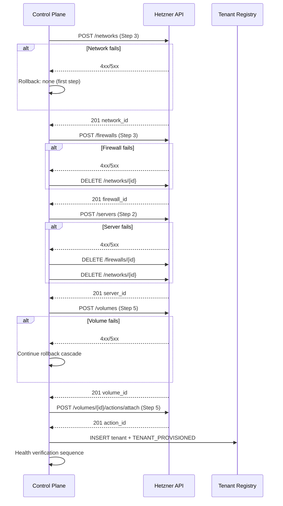

# Tenant Isolation: Hetzner Cloud Provisioning and Network Boundaries

**Document version:** 1.0
**Created:** 2026-02-11
**Requirement traceability:** ISOL-01 (Hetzner provisioning), ISOL-04 (network boundaries)
**References:** [PRD.md](PRD.md) Section 3.4 (Provisioning Actions Detail), Section 3.6 (Deprovisioning Actions Detail); [TECH_DECISIONS.md](TECH_DECISIONS.md) Component #2 (Hetzner Cloud), Component #33 (hcloud SDK >=2.10)

---

## Document Conventions

| Notation | Meaning |
|----------|---------|
| `API Method Path` | HTTP method and endpoint path |
| `{variable}` | Placeholder to be replaced at runtime (e.g. `{tenant_id}`, `{network_id}`) |
| `10.{tenant_octet}.0.0/16` | Tenant private network CIDR; tenant_octet ∈ [1, 254] |
| ALLOW / DENY | Firewall rule action (explicit allow or implicit deny) |
| `GET/POST/DELETE` | HTTP verbs for Hetzner Cloud API calls |

**API base URL:** `https://api.hetzner.cloud/v1`
**Authentication:** Bearer token via `Authorization: Bearer {api_token}` header.

---

## 1. Provisioning Sequence Overview

The provisioning sequence maps directly to [PRD Section 3.4](PRD.md) steps. The order constraint is critical: **network MUST be created before servers** (servers reference `network_id`), **firewall MUST be created before or alongside servers** (servers reference `firewall_id`).

| PRD 3.4 Step | Action | Online Mode | Offline Mode Equivalent |
|--------------|--------|--------------|------------------------|
| 1 | Create isolated project/environment | Hetzner Project or label-based isolation | Docker network with `internal: true` |
| 2 | Provision compute | `POST /servers` (see Section 2) | Docker Compose `deploy.resources.limits` |
| 3 | Provision networking | `POST /networks`, `POST /firewalls` (see Sections 3, 8) | Docker `networks` with `internal: true` |
| 4 | Provision object storage | MinIO bucket (Plan 02-02) | N/A here |
| 5 | Provision volumes | `POST /volumes` (see Section 4) | Docker Compose named volumes |
| 6 | Provision relational/vector/object | Plan 02-02 | Plan 02-02 |
| 7 | Provision secrets | SOPS + age (Plan 02-02) | Plan 02-02 |
| 8 | Configure DNS | `{tenant_id}.pipeline.frostbyte.io` (see Section 5) | N/A |
| 9 | Register in tenant registry | SQL INSERT + audit event (see Section 6) | Local config |
| 10 | Run health checks | Verify all resources respond | Same |
| 11 | Emit completion event | `TENANT_PROVISIONED` | Same |

### Mermaid: Provisioning Flow with Rollback



---

## 2. Compute Provisioning (PRD 3.4 Step 2)

### Server Creation API Call

**Method:** `POST /servers`

**Request body (complete):**

```json
{
  "name": "tenant-{tenant_id}-{role}-{index}",
  "server_type": "cx22",
  "image": "ubuntu-22.04",
  "location": "nbg1",
  "labels": {
    "tenant_id": "{tenant_id}",
    "environment": "production",
    "role": "{worker|gateway|db}"
  },
  "networks": [12345],
  "firewalls": [{"firewall": 67890}],
  "ssh_keys": [11111]
}
```

**Expected response:** `201 Created` with server object containing:

- `id` (integer)
- `name` (string)
- `public_net.ipv4.ip` (string)
- `public_net.ipv6.ip` (string)
- `private_net` (array of network objects)
- `status` (string: `"running"` when ready)

### Polling for Server Readiness

```http
GET /servers/{id}
```

Poll until `response.server.status == "running"`. Typical time: 60–120 seconds.

### Label-Based Resource Filtering

```http
GET /servers?label_selector=tenant_id={tenant_id}
```

Returns all servers for the tenant. Use for deprovisioning and health verification.

### Server Type Recommendations

| Role | server_type | vCPU | RAM | Rationale |
|------|-------------|------|-----|-----------|
| worker (default) | cx22 | 2 | 4 GB | Parse, policy, embed workers |
| gateway | cx22 | 2 | 4 GB | Intake + serving gateway |
| db (heavy) | cx32 | 4 | 8 GB | PostgreSQL + Qdrant if consolidated |
| db (default) | cx22 | 2 | 4 GB | Per-tenant PostgreSQL when small |

### hcloud Python SDK Equivalent

```python
from hcloud import Client
from hcloud.servers.domain import Server

client = Client(token="{api_token}")

server = client.servers.create(
    name=f"tenant-{tenant_id}-worker-1",
    server_type="cx22",
    image="ubuntu-22.04",
    location="nbg1",
    labels={"tenant_id": tenant_id, "environment": "production", "role": "worker"},
    networks=[client.networks.get_by_id(network_id)],
    firewalls=[client.firewalls.get_by_id(firewall_id)],
    ssh_keys=[client.ssh_keys.get_by_id(ssh_key_id)]
)

# Poll until running
client.servers.get_by_id(server.server.id)
# Use client.servers.get_by_id in a loop with sleep until status == "running"
```

### Offline Mode Equivalent

Docker Compose service definitions with resource limits:

```yaml
services:
  intake-gateway:
    deploy:
      resources:
        limits:
          cpus: "2"
          memory: 4G
```

---

## 3. Network Provisioning (PRD 3.4 Step 3)

### Private Network Creation

**Method:** `POST /networks`

**Request body (complete):**

```json
{
  "name": "tenant-{tenant_id}-private",
  "ip_range": "10.{tenant_octet}.0.0/16",
  "labels": {
    "tenant_id": "{tenant_id}"
  },
  "subnets": [
    {
      "type": "cloud",
      "ip_range": "10.{tenant_octet}.1.0/24",
      "network_zone": "eu-central"
    }
  ]
}
```

**Expected response:** `201 Created` with network object (`id`, `name`, `ip_range`, `subnets`).

### CIDR Allocation Scheme

- **tenant_octet derivation:** Map tenant sequence number (1–254) to the second octet of the private range.
  - Tenant A (sequence 1): `10.1.0.0/16`, subnet `10.1.1.0/24`
  - Tenant B (sequence 2): `10.2.0.0/16`, subnet `10.2.1.0/24`
- **Limit:** 254 tenants per /8 block (`10.0.0.0/8`). Escape hatch: use `172.16.0.0/12` or `192.168.0.0/16` for additional tenants.
- **Hetzner constraint:** 100 servers per private network (see 02-RESEARCH.md Pitfall 2). For >100 servers per tenant, plan multiple networks with routing.

### CIDR Normalization (Research Pitfall 1)

Hetzner Cloud API rejects CIDRs with host bits set. Always normalize before API calls:

```python
import ipaddress

def normalize_cidr(cidr_str: str) -> str:
    """Normalize CIDR to have host bits zeroed. Required for Hetzner API."""
    network = ipaddress.ip_network(cidr_str, strict=False)
    return str(network)

# Example
normalize_cidr("10.1.1.5/24")  # Returns "10.1.1.0/24"
```

### Offline Mode Equivalent

```yaml
networks:
  etl-internal:
    driver: bridge
    internal: true
    ipam:
      config:
        - subnet: 172.28.0.0/16
```

---

## 4. Volume Provisioning (PRD 3.4 Step 5)

### Volume Creation

**Method:** `POST /volumes`

**Request body (complete):**

```json
{
  "name": "tenant-{tenant_id}-data",
  "size": 100,
  "location": "nbg1",
  "labels": {
    "tenant_id": "{tenant_id}"
  },
  "format": "ext4"
}
```

**Expected response:** `201 Created` with volume object (`id`, `name`, `size`, `location`).

### Volume Attachment to Server

**Method:** `POST /volumes/{id}/actions/attach`

**Request body:**

```json
{
  "server": 12345
}
```

**Expected response:** `201 Created` with action object. Poll `GET /volumes/{id}/actions/{action_id}` until complete.

**Mount path convention:** `/mnt/tenant-data`

### Offline Mode Equivalent

Docker Compose named volumes with size limits (if supported by driver):

```yaml
volumes:
  tenant-data:
    driver: local
```

---

## 5. DNS Configuration (PRD 3.4 Step 8)

- **DNS record pattern:** `{tenant_id}.pipeline.frostbyte.io` → tenant API endpoint (public IP or CNAME)
- **Hetzner:** Hetzner does not provide a DNS API; use an external DNS provider (e.g. Cloudflare, Route53) for programmatic record creation.
- **Health check URL:** `https://{tenant_id}.pipeline.frostbyte.io/health`
- **Offline mode:** N/A; localhost access via port mapping `127.0.0.1:8080:8080`.

---

## 6. Tenant Registry Integration (PRD 3.4 Step 9)

### SQL INSERT

```sql
INSERT INTO tenants (
  tenant_id, state, endpoints, health_url, network_id, firewall_id,
  created_at, provisioned_at
) VALUES (
  '{tenant_id}',
  'active',
  '{"intake": "https://{tenant_id}.pipeline.frostbyte.io/api/v1/ingest", "query": "https://{tenant_id}.pipeline.frostbyte.io/api/v1/query"}',
  'https://{tenant_id}.pipeline.frostbyte.io/health',
  {network_id},
  {firewall_id},
  NOW(),
  NOW()
);
```

### Audit Event

```sql
INSERT INTO audit_events (event_type, tenant_id, details, timestamp)
VALUES (
  'TENANT_PROVISIONED',
  '{tenant_id}',
  '{"server_ids": [12345], "network_id": 67890, "firewall_id": 11111, "volume_id": 22222}',
  NOW()
);
```

### Health Verification Sequence

1. `GET /servers/{id}` → status `running`
2. `GET /networks/{id}` → network exists
3. `GET /firewalls/{id}` → firewall exists with expected rules
4. `GET https://{tenant_id}.pipeline.frostbyte.io/health` → 200 OK

---

## 7. Deprovisioning Sequence

Maps to [PRD Section 3.6](PRD.md) steps 6–7 (compute and network). Full cascade (steps 1–10) is defined in PRD 3.6; this section covers Hetzner-specific steps.

### Step 6: Delete Compute Resources

**Graceful shutdown first:**

```http
POST /servers/{id}/actions/shutdown
```

Expected: `201 Created` with action. Poll until server `status == "off"`.

**Then delete:**

```http
DELETE /servers/{id}
```

Expected: `200 OK`. Server and associated resources (public IP, etc.) are removed.

### Step 7: Delete Network Resources

**Order:** Detach all servers from network, then delete firewall, then delete network.

**Detach server from network:**

```http
POST /servers/{id}/actions/detach_from_network
```

Request body: `{"network": network_id}`. Expected: `201 Created`.

**Delete firewall:**

```http
DELETE /firewalls/{id}
```

**Note:** Remove all resource associations (servers, etc.) from the firewall first. If the firewall is applied via label selector, delete or relabel the servers before deleting the firewall.

Expected: `200 OK`.

**Delete network:**

```http
DELETE /networks/{id}
```

Expected: `200 OK`. All servers must be detached first.

### Volume Deprovisioning

```http
POST /volumes/{id}/actions/detach
```

Request body: `{"server": server_id}`. Then:

```http
DELETE /volumes/{id}
```

Expected: `200 OK`.

### Verification at Each Step

Each deprovisioning step must include verification before proceeding:

| Step | Verification |
|------|--------------|
| Server delete | `GET /servers/{id}` → 404 |
| Firewall delete | `GET /firewalls/{id}` → 404 |
| Network delete | `GET /networks/{id}` → 404 |
| Volume delete | `GET /volumes/{id}` → 404 |

### Rollback Handling (Mid-Deprovisioning Failure)

If a step fails: log the failure, transition tenant to `FAILED`, record which resources remain. Manual cleanup: list resources by `tenant_id` label, delete in reverse order of creation (volumes → servers → firewall → network).

---

## 8. Hetzner Cloud Firewall Rules (ISOL-04 — Online Mode)

### 8.1 Rule Table

| Rule name | Direction | Protocol | Port | Source/Destination | Description |
|-----------|-----------|----------|------|-------------------|-------------|
| IN-HTTPS-GATEWAY | in | tcp | 443 | `{api_gateway_ip}/32` | ALLOW inbound HTTPS from API gateway only |
| IN-SSH-BASTION | in | tcp | 22 | `{bastion_ip}/32` | ALLOW inbound SSH from control plane bastion |
| IN-INTERNAL | in | tcp | any | `10.{tenant_octet}.0.0/16` | ALLOW inbound all TCP from tenant private network |
| OUT-HTTPS-OPENROUTER | out | tcp | 443 | `{openrouter_cidr}` | ALLOW outbound HTTPS to OpenRouter API (online mode) |
| OUT-INTERNAL | out | tcp | any | `10.{tenant_octet}.0.0/16` | ALLOW outbound all TCP to tenant private network |
| OUT-DNS | out | tcp | 53 | `185.12.64.1/32`, `185.12.64.2/32` | ALLOW outbound DNS to Hetzner resolvers |
| OUT-DNS-UDP | out | udp | 53 | `185.12.64.1/32`, `185.12.64.2/32` | ALLOW outbound DNS (UDP) |

**Implicit behavior (Research Pitfall 4):** Hetzner firewalls default to **outbound ACCEPT** when no outbound rules exist. Defining **one** outbound rule switches to **implicit deny** for all traffic not matching an outbound rule. Therefore, we must explicitly ALLOW every required outbound path.

### 8.2 Cross-Tenant Denial Proof

- **Tenant A** network: `10.1.0.0/16` (tenant_octet=1)
- **Tenant B** network: `10.2.0.0/16` (tenant_octet=2)
- Tenant A's firewall allows source/destination only within `10.1.0.0/16`
- Tenant B's IPs (`10.2.x.x`) are structurally unreachable from Tenant A (cross-tenant traffic denied)

**Verification command (from Tenant A server; confirms Tenant A cannot reach Tenant B):**

```bash
curl -m 5 10.2.1.1:443
# Must timeout or fail (connection refused / no route)
```

### 8.3 Firewall Creation API Call

**Method:** `POST /firewalls`

**Request body (complete):**

```json
{
  "name": "tenant-{tenant_id}-fw",
  "labels": {"tenant_id": "{tenant_id}"},
  "rules": [
    {
      "direction": "in",
      "protocol": "tcp",
      "port": "443",
      "source_ips": ["{api_gateway_ip}/32"]
    },
    {
      "direction": "in",
      "protocol": "tcp",
      "port": "22",
      "source_ips": ["{bastion_ip}/32"]
    },
    {
      "direction": "in",
      "protocol": "tcp",
      "port": "any",
      "source_ips": ["10.{tenant_octet}.0.0/16"]
    },
    {
      "direction": "out",
      "protocol": "tcp",
      "port": "443",
      "destination_ips": ["{openrouter_cidr}"]
    },
    {
      "direction": "out",
      "protocol": "tcp",
      "port": "any",
      "destination_ips": ["10.{tenant_octet}.0.0/16"]
    },
    {
      "direction": "out",
      "protocol": "tcp",
      "port": "53",
      "destination_ips": ["185.12.64.1/32", "185.12.64.2/32"]
    },
    {
      "direction": "out",
      "protocol": "udp",
      "port": "53",
      "destination_ips": ["185.12.64.1/32", "185.12.64.2/32"]
    }
  ]
}
```

**Apply to resources:**

```http
POST /firewalls/{id}/actions/apply_to_resources
```

Request body:

```json
{
  "apply_to": [
    {
      "type": "label_selector",
      "label_selector": "tenant_id={tenant_id}"
    }
  ]
}
```

Expected: `201 Created`.

### 8.4 hcloud Python SDK Equivalent

```python
from hcloud import Client
from hcloud.firewalls.domain import FirewallRule

client = Client(token="{api_token}")

inbound_rules = [
    FirewallRule(direction="in", protocol="tcp", port="443", source_ips=[f"{api_gateway_ip}/32"]),
    FirewallRule(direction="in", protocol="tcp", port="22", source_ips=[f"{bastion_ip}/32"]),
    FirewallRule(direction="in", protocol="tcp", port="any", source_ips=[f"10.{tenant_octet}.0.0/16"]),
]
outbound_rules = [
    FirewallRule(direction="out", protocol="tcp", port="443", destination_ips=[openrouter_cidr]),
    FirewallRule(direction="out", protocol="tcp", port="any", destination_ips=[f"10.{tenant_octet}.0.0/16"]),
    FirewallRule(direction="out", protocol="tcp", port="53", destination_ips=["185.12.64.1/32", "185.12.64.2/32"]),
    FirewallRule(direction="out", protocol="udp", port="53", destination_ips=["185.12.64.1/32", "185.12.64.2/32"]),
]

firewall = client.firewalls.create(
    name=f"tenant-{tenant_id}-fw",
    labels={"tenant_id": tenant_id},
    rules=inbound_rules + outbound_rules
)

client.firewalls.apply_to_resources(
    firewall=firewall,
    resources=[{"type": "label_selector", "label_selector": f"tenant_id={tenant_id}"}]
)
```

### 8.5 Firewall Update Procedure

**Replace all rules:** `POST /firewalls/{id}/actions/set_rules` with a full rules array. Omitting a rule effectively removes it. Must include all rules you want to keep.

**Verification after update:** `GET /firewalls/{id}` and inspect the `rules` array.

---

## 9. Docker Network Isolation (ISOL-04 — Offline Mode)

### 9.1 Docker Compose Network Configuration

```yaml
networks:
  etl-internal:
    driver: bridge
    internal: true
    ipam:
      driver: default
      config:
        - subnet: 172.28.0.0/16
          gateway: ""
```

**Why `internal: true` provides isolation:** With `internal: true`, Docker does not configure a default gateway on the bridge. Containers have no route to external networks. Outbound connectivity is structurally blocked.

### 9.2 Service-to-Network Mapping

| Service | Network | Port mapping | Notes |
|---------|---------|--------------|-------|
| intake-gateway | etl-internal | `127.0.0.1:8080:8080` | Only service exposed to host |
| parse-worker | etl-internal | — | Internal only |
| policy-engine | etl-internal | — | Internal only |
| embed-worker | etl-internal | — | Internal only |
| postgres | etl-internal | — | Internal only |
| minio | etl-internal | — | Internal only |
| qdrant | etl-internal | — | Internal only |

### 9.3 Verification Commands (Offline Mode)

Run these verification commands to confirm Docker network isolation:

```bash
# Verify network is internal
docker network inspect etl-internal
# Expect: "Internal": true, no gateway in IPAM

# Verify no default route in container
docker exec {container} ip route
# Expect: No default route line

# Verify outbound blocked
docker exec {container} ping -c 1 8.8.8.8
# Expect: Network unreachable or timeout

# Verify inter-container connectivity
docker exec {container} ping -c 1 postgres
# Expect: Success (resolves via Docker DNS)
```

### 9.4 Comparison Table

| Aspect | Hetzner Cloud (Online) | Docker Offline |
|--------|------------------------|----------------|
| Isolation mechanism | Firewall rules (explicit allow, implicit deny) | `internal: true` (no gateway) |
| Cross-tenant proof | Separate CIDRs + firewall | Single-tenant stack per host |
| Outbound control | Explicit outbound rules required | Structurally blocked |
| Verification | `curl` to other tenant IP fails | `ping 8.8.8.8` fails |

---

## 10. Isolation Verification Runbook

### 10.1 Online Mode Verification

| Step | Action | Expected |
|------|--------|----------|
| 1 | `GET /servers?label_selector=tenant_id={tenant_id}` | All returned servers have `tenant_id` label |
| 2 | From tenant server: `curl -m 5 10.{other_tenant_octet}.1.1:443` | Timeout or connection refused |
| 3 | From tenant server: `curl -m 5 https://example.com` | Fail (unless explicitly allowed) |
| 4 | From tenant server: `curl http://10.{tenant_octet}.1.2:8080/health` | 200 OK |
| 5 | `GET /firewalls/{id}` | Rules match Section 8 specification |

### 10.2 Offline Mode Verification

| Step | Action | Expected |
|------|--------|----------|
| 1 | `docker network inspect etl-internal` | `"Internal": true` |
| 2 | `docker exec {container} ip route` | No default route |
| 3 | `docker exec {container} ping -c 1 8.8.8.8` | Fail |
| 4 | `docker exec {container} curl -s http://postgres:5432` | Connect or service response |

### 10.3 Verification Evidence Format

```json
{
  "tenant_id": "tenant_abc",
  "mode": "online",
  "timestamp": "2026-02-11T12:00:00Z",
  "checks": [
    {
      "step": "cross_tenant_denial",
      "pass": true,
      "command": "curl -m 5 10.2.1.1:443",
      "output": "Connection timed out"
    },
    {
      "step": "internal_connectivity",
      "pass": true,
      "command": "curl http://10.1.1.2:8080/health",
      "output": "{\"status\":\"ok\"}"
    }
  ],
  "overall_pass": true
}
```

This format can be stored for audit compliance and referenced by the audit system as isolation verification evidence. Each verification step in this runbook produces evidence that isolation is correctly enforced.
