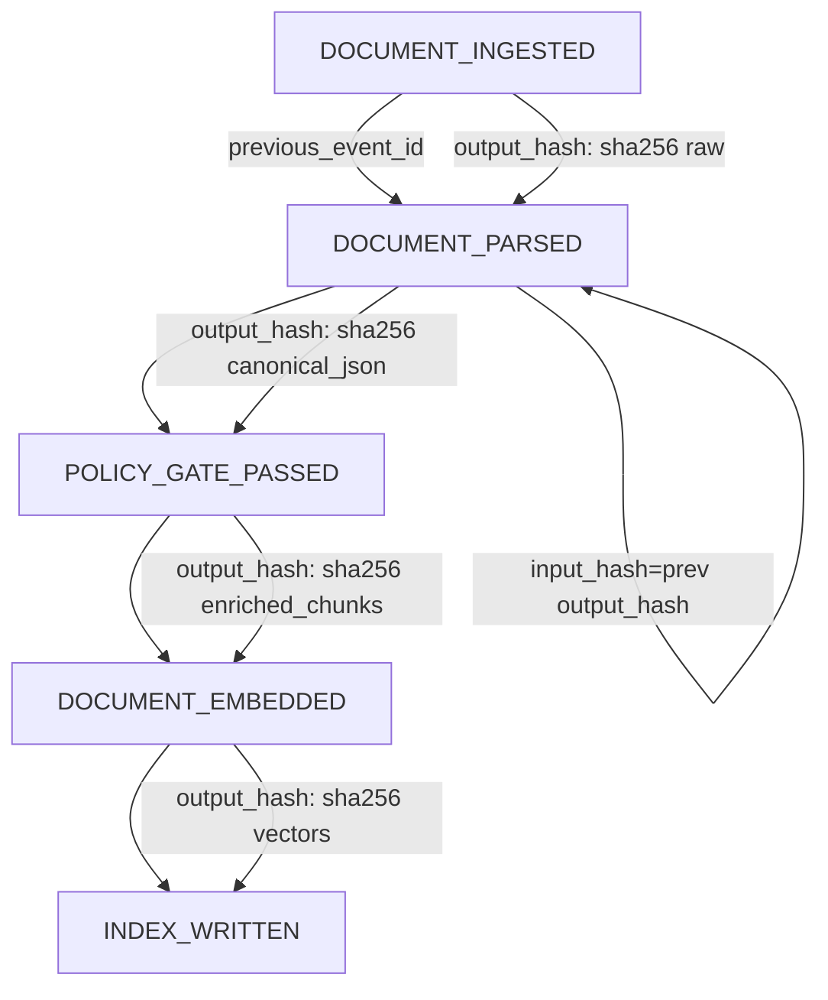

# Audit Stream Architecture

**Version:** 1.0  
**Created:** 2026-02-11  
**Requirements:** AUDIT-01, AUDIT-02, AUDIT-03

## Document Conventions

- **SQL:** PostgreSQL syntax; types and keywords in standard form
- **JSON:** Field names and structure as used in API responses
- **API paths:** Relative to base `/api/v1`
- **Timestamps:** UTC ISO 8601 (`2026-02-11T14:30:00Z`)

---

## 1. Audit Event Schema (AUDIT-01)

### 1.1 Field Definitions

Every audit event conforms to the following schema. Fields are required unless marked optional.

| Field | Type | Required | Description | Validation |
|-------|------|----------|-------------|------------|
| `event_id` | UUID | Yes | Time-ordered unique identifier (UUID v7) | Must be unique; used as primary key |
| `tenant_id` | TEXT | Yes | Tenant that owns the resource | Non-empty; must exist in tenant registry |
| `event_type` | TEXT | Yes | Machine-readable event type | Must be from event type enum (Section 1.2) |
| `timestamp` | TIMESTAMPTZ | Yes | Server-side event time | UTC; never client-supplied |
| `actor` | TEXT | No | Who performed the action | `"system"` for automated; user ID for manual |
| `resource_type` | TEXT | Yes | Type of resource | One of: `document`, `chunk`, `query`, `tenant`, `batch` |
| `resource_id` | TEXT | Yes | Identifier of the resource | Format depends on resource_type |
| `details` | JSONB | Yes | Event-specific metadata | Schema varies by event_type; see below |
| `previous_event_id` | UUID | No | Preceding event in provenance chain | null for chain start or tenant events |

**Details sub-fields (common to most events):**

| Sub-field | Type | Description |
|-----------|------|-------------|
| `component` | string | Pipeline component: `intake-gateway`, `parse-worker`, `policy-engine`, `embedding-service`, `serving-api` |
| `input_hash` | string | SHA-256 of input to this step (for hash chain) |
| `output_hash` | string | SHA-256 of output of this step (for hash chain) |
| `pipeline_version` | string | Version of pipeline code (e.g., `1.0.0`) |
| `duration_ms` | number | Processing time in milliseconds |
| `status` | string | One of: `success`, `failure`, `quarantined` |

**Event-type-specific details fields:**

| Event Type | Additional Details Fields |
|------------|---------------------------|
| `PII_DETECTED` | `pii_types`, `pii_action_taken` (never content) |
| `POLICY_GATE_FAILED` | `gate`, `injection_score`, `patterns_matched[]` |
| `DOCUMENT_QUARANTINED` | `reason`, `injection_score` (if injection) |
| `EMBEDDING_FAILED` | `error_code`, `retry_count` |
| `RETRIEVAL_EXECUTED` | `chunk_count`, `chunk_ids[]` (never query text or content) |
| `TENANT_CONFIG_UPDATED` | `changes[]`, `config_version`, `previous_config_version` |

### 1.2 Event Type Enum

All event types, grouped by pipeline phase. Reference: PRD Appendix A.

**Intake Gateway Events**

| Event Type | Resource Type | Emitted When |
|------------|---------------|--------------|
| `BATCH_RECEIVED` | batch | Batch processing begins after manifest validation |
| `DOCUMENT_INGESTED` | document | File passed all checks, written to object store |
| `DOCUMENT_REJECTED` | document | MIME, size, or checksum check failed |
| `DOCUMENT_QUARANTINED` | document | Malware scanner detected threat |

**Parsing Events**

| Event Type | Resource Type | Emitted When |
|------------|---------------|--------------|
| `DOCUMENT_PARSED` | document | Canonical JSON written to object store |
| `DOCUMENT_PARSE_FAILED` | document | Parser failed after retries |
| `CONTENT_DROPPED` | document | Table/figure/section could not be extracted |

**Policy Gate Events**

| Event Type | Resource Type | Emitted When |
|------------|---------------|--------------|
| `POLICY_GATE_PASSED` | document | PII, classification, or injection gate passed |
| `POLICY_GATE_FAILED` | document | PII BLOCK or injection QUARANTINE |
| `DOCUMENT_QUARANTINED` | document | PII BLOCK or injection score > threshold |
| `PII_DETECTED` | document | PII found (records types only, never content) |

**Embedding and Indexing Events**

| Event Type | Resource Type | Emitted When |
|------------|---------------|--------------|
| `DOCUMENT_EMBEDDED` | document | All chunks embedded for document |
| `INDEX_WRITTEN` | chunk | Batch written to all three stores |
| `EMBEDDING_FAILED` | document | Embedding API failed after retries |

**Serving Events**

| Event Type | Resource Type | Emitted When |
|------------|---------------|--------------|
| `RETRIEVAL_EXECUTED` | query | RAG retrieval completed |
| `GENERATION_EXECUTED` | query | Answer generated with citations |

**Tenant Lifecycle Events**

| Event Type | Resource Type | Emitted When |
|------------|---------------|--------------|
| `TENANT_CREATED` | tenant | create_tenant() processed |
| `TENANT_PROVISION_STARTED` | tenant | Provisioning initiated |
| `TENANT_PROVISIONED` | tenant | Provisioning completed |
| `TENANT_PROVISION_FAILED` | tenant | Provisioning step failed |
| `TENANT_PROVISION_RETRY` | tenant | Retry on failed tenant |
| `TENANT_CONFIG_UPDATED` | tenant | Configuration changed |
| `TENANT_SUSPENDED` | tenant | Kill-switch applied |
| `TENANT_RESUMED` | tenant | Tenant resumed |
| `TENANT_DEPROVISION_STARTED` | tenant | Deprovisioning began |
| `TENANT_DEPROVISIONED` | tenant | Deprovisioning completed |
| `TENANT_DEPROVISION_FAILED` | tenant | Deprovisioning failed |
| `TENANT_ABANDONED` | tenant | Failed tenant abandoned |

### 1.3 Hash Chain Design

For document and chunk resources, events form a provenance chain linked by `previous_event_id`. Each event's `input_hash` must equal the preceding event's `output_hash`.

**Chain structure (successful document):**



**Hash continuity rule:**
- For event N with `previous_event_id` = P: `event_N.details.input_hash` MUST equal `event_P.details.output_hash`
- If they differ, the chain is broken (tampering, ordering error, or processing bug)

**Tenant lifecycle events:** Typically have `previous_event_id = null` (no chain).

**Chain verification logic (pseudocode):**
```
function verify_chain(events: List[Event]) -> List[ChainBreak]:
  breaks = []
  for i in 1..len(events)-1:
    prev = events[i-1]
    curr = events[i]
    if curr.details.input_hash != prev.details.output_hash:
      breaks.append(ChainBreak(index=i, expected=prev.details.output_hash, actual=curr.details.input_hash))
  return breaks
```

### 1.4 JSON Schema Example

Representative chain of three linked events:

```json
[
  {
    "event_id": "01957a3c-8b2e-7000-a000-000000000001",
    "tenant_id": "tenant_abc",
    "event_type": "DOCUMENT_INGESTED",
    "timestamp": "2026-02-11T14:30:00Z",
    "actor": "system",
    "resource_type": "document",
    "resource_id": "file_001",
    "details": {
      "component": "intake-gateway",
      "input_hash": "sha256:a1b2c3d4e5f6...",
      "output_hash": "sha256:a1b2c3d4e5f6...",
      "pipeline_version": "1.0.0",
      "duration_ms": 234,
      "status": "success"
    },
    "previous_event_id": null
  },
  {
    "event_id": "01957a3c-8b2e-7000-a000-000000000002",
    "tenant_id": "tenant_abc",
    "event_type": "DOCUMENT_PARSED",
    "timestamp": "2026-02-11T14:31:00Z",
    "actor": "system",
    "resource_type": "document",
    "resource_id": "file_001",
    "details": {
      "component": "parse-worker",
      "input_hash": "sha256:a1b2c3d4e5f6...",
      "output_hash": "sha256:f6e5d4c3b2a1...",
      "pipeline_version": "1.0.0",
      "duration_ms": 12500,
      "status": "success"
    },
    "previous_event_id": "01957a3c-8b2e-7000-a000-000000000001"
  },
  {
    "event_id": "01957a3c-8b2e-7000-a000-000000000003",
    "tenant_id": "tenant_abc",
    "event_type": "POLICY_GATE_PASSED",
    "timestamp": "2026-02-11T14:32:00Z",
    "actor": "system",
    "resource_type": "document",
    "resource_id": "file_001",
    "details": {
      "component": "policy-engine",
      "input_hash": "sha256:f6e5d4c3b2a1...",
      "output_hash": "sha256:1234567890ab...",
      "pipeline_version": "1.0.0",
      "duration_ms": 89,
      "status": "success",
      "gate": "injection"
    },
    "previous_event_id": "01957a3c-8b2e-7000-a000-000000000002"
  }
]
```

---

## 2. Immutable Storage Design (AUDIT-02)

### 2.1 Append-Only Mechanism

**PostgreSQL:**

- Application role (`frostbyte_app`) has `INSERT` and `SELECT` on `audit_events`
- Application role does NOT have `UPDATE` or `DELETE`
- Auditor role (`frostbyte_auditor`) has `SELECT` only
- DBA/superuser retains full access for emergency operations (documented, audited)

**Grant structure:**
```
GRANT INSERT, SELECT ON audit_events TO frostbyte_app;
REVOKE UPDATE, DELETE ON audit_events FROM frostbyte_app;
GRANT SELECT ON audit_events TO frostbyte_auditor;
```

**Defense in depth (optional):** A `BEFORE UPDATE OR DELETE` trigger raises an exception, ensuring that even with mistaken grants, modifications are blocked.

**Offline mode:** SQLite database with identical schema. File-level integrity: SHA-256 of the audit database file is included in the export manifest.

### 2.2 Tamper Evidence

**Hash chain integrity:** A broken `input_hash`/`output_hash` continuity indicates tampering or data corruption. The provenance chain API verifies this automatically and reports any breaks.

**Detection, not prevention:** Append-only storage prevents modification. The hash chain enables detection of gaps (e.g., if events were somehow deleted externally). For stronger assurance, consider periodic signing of the chain (e.g., sign a Merkle root of event IDs).

### 2.3 PostgreSQL DDL

```sql
-- Audit events table (append-only)
CREATE TABLE audit_events (
  event_id       UUID PRIMARY KEY,
  tenant_id      TEXT NOT NULL,
  event_type     TEXT NOT NULL,
  timestamp      TIMESTAMPTZ NOT NULL,
  actor          TEXT,
  resource_type  TEXT NOT NULL,
  resource_id    TEXT NOT NULL,
  details        JSONB NOT NULL,
  previous_event_id UUID REFERENCES audit_events(event_id)
);

-- Indexes for query patterns
CREATE INDEX idx_audit_tenant_timestamp ON audit_events (tenant_id, timestamp);
CREATE INDEX idx_audit_tenant_resource_timestamp ON audit_events (tenant_id, resource_id, timestamp);
CREATE INDEX idx_audit_event_type_timestamp ON audit_events (event_type, timestamp);
CREATE INDEX idx_audit_previous_event ON audit_events (previous_event_id) WHERE previous_event_id IS NOT NULL;

-- Append-only: revoke UPDATE and DELETE from application role
REVOKE UPDATE, DELETE ON audit_events FROM frostbyte_app;
GRANT INSERT, SELECT ON audit_events TO frostbyte_app;
GRANT SELECT ON audit_events TO frostbyte_auditor;

-- Optional: trigger to block UPDATE/DELETE (defense in depth)
CREATE OR REPLACE FUNCTION block_audit_modification()
RETURNS TRIGGER AS $$
BEGIN
  RAISE EXCEPTION 'Audit events are immutable. UPDATE and DELETE are not allowed.';
END;
$$ LANGUAGE plpgsql;

CREATE TRIGGER audit_immutable_trigger
  BEFORE UPDATE OR DELETE ON audit_events
  FOR EACH ROW
  EXECUTE FUNCTION block_audit_modification();
```

**Note:** For PostgreSQL 11+, use `EXECUTE FUNCTION`; for PostgreSQL 10 and earlier use `EXECUTE PROCEDURE`.

**Table partitioning (optional, for scale):** Partition by month on `timestamp` to enable efficient retention and archival:
```sql
-- Example: create monthly partitions (implementation-specific)
-- audit_events_2026_02, audit_events_2026_03, ...
```

### 2.4 Offline Mode Storage

- **Schema:** Same columns, SQLite types (UUID as TEXT, TIMESTAMPTZ as TEXT).
- **Export format:** JSON Lines (`.jsonl`), one event per line, UTF-8 encoded.
- **Manifest:** `audit_export_manifest.json` with `file_sha256`, `event_count`, `from`, `to`, `tenant_id`, `exported_at`.

---

## 3. Audit Query Patterns (AUDIT-03)

### 3.1 Workflow 1 — By Tenant

**Use case:** "Show me all events for tenant X in the last 30 days."

**SQL:**
```sql
SELECT event_id, event_type, timestamp, resource_type, resource_id, details
FROM audit_events
WHERE tenant_id = $1
  AND timestamp >= $2
  AND timestamp < $3
ORDER BY timestamp ASC
LIMIT 1000 OFFSET $4;
```

**Parameters:** `$1` = tenant_id, `$2` = from (e.g., NOW() - INTERVAL '30 days'), `$3` = to (e.g., NOW()), `$4` = offset for pagination.

**API:**
```
GET /api/v1/audit/{tenant_id}/events?from=2026-01-12T00:00:00Z&to=2026-02-11T23:59:59Z&limit=1000&cursor=...
```

**Response format:** Paginated list:
```json
{
  "events": [...],
  "pagination": {
    "limit": 1000,
    "next_cursor": "01957a3c-8b2e-7000-a000-000000000100",
    "has_more": true
  }
}
```

**Index:** `idx_audit_tenant_timestamp`

### 3.2 Workflow 2 — By Document (Provenance Chain)

**Use case:** "Show me the full provenance chain for document file_001."

**SQL (recursive CTE):**
```sql
WITH RECURSIVE chain AS (
  -- Start from DOCUMENT_INGESTED for this resource
  SELECT event_id, tenant_id, event_type, timestamp, resource_id, details, previous_event_id, 1 AS depth
  FROM audit_events
  WHERE tenant_id = $1 AND resource_id = $2 AND event_type = 'DOCUMENT_INGESTED'
  UNION ALL
  SELECT e.event_id, e.tenant_id, e.event_type, e.timestamp, e.resource_id, e.details, e.previous_event_id, c.depth + 1
  FROM audit_events e
  JOIN chain c ON e.previous_event_id = c.event_id
)
SELECT * FROM chain ORDER BY depth;
```

**Alternative (simpler for single chain):** Start from earliest event (DOCUMENT_INGESTED) and iterative query by `previous_event_id` in reverse, or by walking forward from `event_id` where `resource_id` matches.

**API:**
```
GET /api/v1/audit/{tenant_id}/chain/file_001
```

**Response format:**
```json
{
  "resource_id": "file_001",
  "chain": [...],
  "integrity": {
    "verified": true,
    "breaks": []
  }
}
```

If chain is broken:
```json
{
  "integrity": {
    "verified": false,
    "breaks": [
      {"index": 2, "expected_hash": "sha256:abc...", "actual_hash": "sha256:xyz..."}
    ]
  }
}
```

**Chain verification:** For each consecutive pair (events i and i+1), check `events[i+1].details.input_hash == events[i].details.output_hash`.

**Index:** `idx_audit_tenant_resource_timestamp`, `idx_audit_previous_event`

### 3.3 Workflow 3 — By Time Range (Export)

**Use case:** "Export all events for tenant X between date A and date B for compliance evidence."

**SQL:**
```sql
SELECT event_id, tenant_id, event_type, timestamp, actor, resource_type, resource_id, details, previous_event_id
FROM audit_events
WHERE tenant_id = $1
  AND timestamp >= $2
  AND timestamp < $3
  AND ($4::text[] IS NULL OR event_type = ANY($4))
ORDER BY timestamp ASC;
```

**Parameters:** `$1` = tenant_id, `$2` = from, `$3` = to, `$4` = optional event_types filter.

**API:**
```
POST /api/v1/audit/{tenant_id}/export
Content-Type: application/json

{
  "from": "2026-01-01T00:00:00Z",
  "to": "2026-02-11T23:59:59Z",
  "event_types": ["DOCUMENT_INGESTED", "DOCUMENT_PARSED", "POLICY_GATE_PASSED"],
  "format": "jsonl"
}
```

**Response:** Asynchronous job. Returns `job_id` or, when ready, `download_url` for the export file.

### 3.4 Export Format Specification

**JSON Lines (`.jsonl`):**
- One JSON object per line
- UTF-8 encoded
- Each line = complete audit event as stored
- No trailing commas; each line is valid JSON

**File naming:**
```
audit_export_{tenant_id}_{from_date}_{to_date}.jsonl
```
Example: `audit_export_tenant_abc_20260101_20260211.jsonl`

**Manifest file (`audit_export_manifest.json`):**
```json
{
  "tenant_id": "tenant_abc",
  "from": "2026-01-01T00:00:00Z",
  "to": "2026-02-11T23:59:59Z",
  "event_count": 15420,
  "file_sha256": "a1b2c3d4e5f6...",
  "exported_at": "2026-02-11T15:00:00Z",
  "format": "jsonl"
}
```

**SIEM integration:** Events can be shipped to Splunk, Elastic, or syslog. Common fields for SIEM: `event_id`, `tenant_id`, `event_type`, `timestamp`, `resource_id`, `details.component`, `details.status`. Map to vendor-specific schemas as needed.

### 3.5 Pagination and Limits

| Parameter | Default | Max | Description |
|-----------|---------|-----|-------------|
| `limit` | 100 | 1000 | Events per page |
| `cursor` | (first page) | — | Opaque cursor for next page (e.g., last `event_id` + timestamp) |
| `from` | — | — | Start of time range (inclusive) |
| `to` | — | — | End of time range (exclusive) |
| `event_type` | — | — | Filter by single event type |
| `event_types` | — | — | Filter by multiple (export only) |

**Rate limits:** 300 requests/minute per tenant for audit API (per PRD Section 5).
