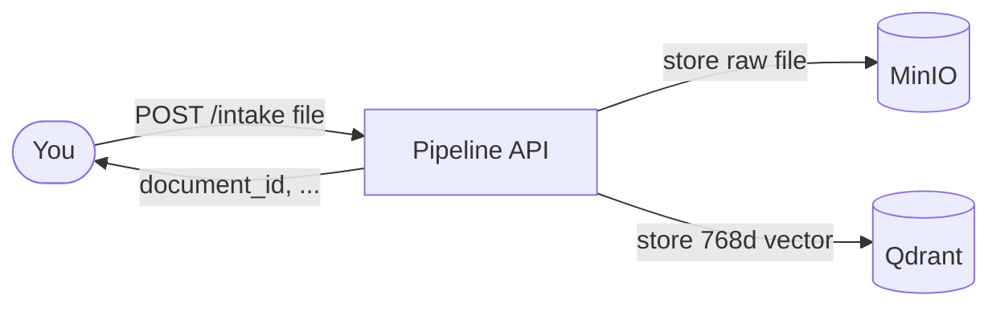
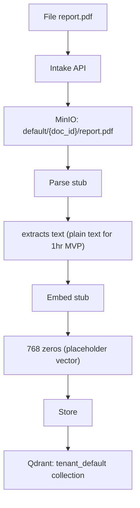

# Frostbyte Pipeline — Visual Flow

High-level view of how data moves. Diagrams are Mermaid (professional rendering). Full architecture: `diagrams/architecture.mmd`.

---

## 1. Overall flow (numbered steps)

See also: `diagrams/architecture.mmd` for full pipeline architecture.

**In words:**

1. You send a file to the Pipeline API.
2. The API stores the raw file in MinIO.
3. The API creates a vector and stores it in Qdrant.
4. The API returns a document_id to you.

---

## 2. What runs where (list)

| # | Service       | Port | Role                            |
|---|---------------|------|---------------------------------|
| 1 | Pipeline API  | 8000 | Receives uploads, coordinates   |
| 2 | MinIO         | 9000 | Stores raw files (S3-compatible)|
| 3 | PostgreSQL    | 5432 | Metadata (future use)           |
| 4 | Redis         | 6379 | Queue (future use)              |
| 5 | Qdrant        | 6333 | Stores 768-dimensional vectors  |

---

## 3. Live status (when pipeline is running)

Open in a browser:

- **http://localhost:8000** — Dashboard (flow diagram + service status)
- **http://localhost:8000/docs** — Swagger API explorer
- **http://localhost:9001** — MinIO web console (optional)
- **http://localhost:6333/dashboard** — Qdrant UI (if enabled)

---

## 4. One document’s path

