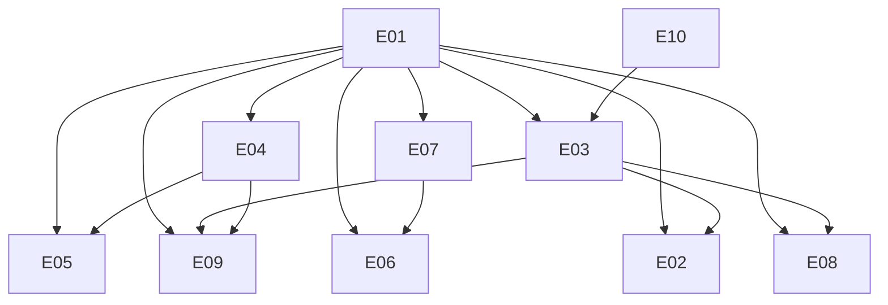

# Frostbyte Cross-Cutting Enhancements Implementation Guide

**Generated:** 2026-02-12T05:30:55.194271Z
**Version:** 1.0.0
**Total Enhancements:** 10

## Executive Summary

This guide provides deterministic, platform-independent instructions for implementing
all 10 cross-cutting product enhancements identified in the Frostbyte Product Vision.

## Implementation Phases

### Phase 1: Foundation & Quick Wins

**Duration:** 5-7 days

**Description:** High-value, low-effort enhancements that unblock later work

**Prerequisites:**
- Node.js 18+
- TypeScript project structure
- Existing API routes

**Enhancements in this phase:**
- E01: OpenAPI/Swagger Spec for All APIs (Low effort)
- E04: Configurable Schema Extensions (Low effort)
- E10: Automated Test Suite with Compliance Templates (Low effort)

### Phase 2: Core Platform Features

**Duration:** 10-14 days

**Description:** Table stakes features required for enterprise adoption

**Prerequisites:**
- Phase 1 complete
- Database schema established
- Authentication system

**Enhancements in this phase:**
- E07: SSO/SAML/OIDC Integration (Medium effort)
- E03: Batch Processing API with Progress Streaming (Medium effort)
- E06: Web-Based Admin Dashboard (Medium effort)

### Phase 3: Infrastructure & Integration

**Duration:** 7-10 days

**Description:** Infrastructure automation and data portability

**Prerequisites:**
- Phase 2 complete
- Cloud provider accounts
- CI/CD pipeline

**Enhancements in this phase:**
- E02: Terraform/Pulumi Provider for Infrastructure Provisioning (Medium effort)
- E08: Signed Export Bundles with Verification (Medium effort)

### Phase 4: Advanced Capabilities

**Duration:** 14-21 days

**Description:** High-effort differentiating features

**Prerequisites:**
- Phase 3 complete
- GPU resources for ML models
- Graph database

**Enhancements in this phase:**
- E05: Graph RAG Support (High effort)
- E09: Multi-Modal Document Support (High effort)

## Detailed Implementation Instructions

Each enhancement follows the same structure:
1. **Pre-conditions** - What must be true before starting
2. **Implementation Steps** - Exact, unambiguous actions
3. **Verification** - How to confirm correct implementation
4. **Rollback** - How to undo if issues arise


---

## E01: OpenAPI/Swagger Spec for All APIs

**Type:** Table Stakes  
**Value:** High  
**Effort:** Low  
**Phase:** 1  
**Estimated Duration:** 1-2 days

**Rationale:** Critical for all verticals—legal, defense, pharma, and SaaS all require documented contracts for integration.

### Pre-conditions

Before starting this enhancement, verify:

```bash
# Verify repository structure
test -d $FROSTBYTE_REPO_ROOT/packages || exit 1

# Verify database connection
psql $DATABASE_URL -c 'SELECT 1' || exit 1

# Verify Node.js version
node --version | grep -E '^v(18|20|22)' || exit 1
```

### Implementation Steps

1. Install Fastify Swagger plugin:
   ```bash
   cd $FROSTBYTE_REPO_ROOT/packages/api
   npm install @fastify/swagger @fastify/swagger-ui
   ```

2. Register plugin in server.ts:
   ```typescript
   import swagger from '@fastify/swagger';
   import swaggerUi from '@fastify/swagger-ui';
   
   await fastify.register(swagger, {
     openapi: {
       info: { title: 'Frostbyte API', version: '1.0.0' },
     },
   });
   ```

3. Add schema decorators to all routes

4. Export OpenAPI spec:
   ```bash
   npm run generate-openapi
   ```

### Verification Criteria

All of the following must pass:

1. OpenAPI 3.1 spec file exists at docs/api/openapi.yaml

   Verification command:
   ```bash
   ./verify-implementations.sh --check 1.1
   ```

2. All API endpoints are documented with request/response schemas

   Verification command:
   ```bash
   ./verify-implementations.sh --check 1.2
   ```

3. Swagger UI is accessible at /docs endpoint

   Verification command:
   ```bash
   ./verify-implementations.sh --check 1.3
   ```

4. Spec validates without errors using openapi-validator

   Verification command:
   ```bash
   ./verify-implementations.sh --check 1.4
   ```

### Deliverables

The following artifacts must exist:

- `docs/api/openapi.yaml - Complete OpenAPI specification`
- `scripts/validate-openapi.sh - Validation script`
- `packages/api/src/routes/swagger.ts - Swagger UI route`

### Rollback Steps

If implementation fails, execute:

```bash
cd $FROSTBYTE_REPO_ROOT
git stash push -m 'E01-rollback-20260212'
git checkout HEAD -- $(echo 'docs/api/openapi.yaml scripts/validate-openapi.sh packages/api/src/routes/swagger.ts')
echo 'E01 rolled back successfully'
```

---

## E04: Configurable Schema Extensions

**Type:** Value Added  
**Value:** High  
**Effort:** Low  
**Phase:** 1  
**Estimated Duration:** 1-2 days

**Rationale:** Allow tenants to define custom metadata fields on documents/chunks. Critical for legal (matter numbers), pharma (trial IDs), defense (classification markings).

**Dependencies:**
- E01: OpenAPI/Swagger Spec for All APIs

### Pre-conditions

Before starting this enhancement, verify:

```bash
# Verify repository structure
test -d $FROSTBYTE_REPO_ROOT/packages || exit 1

# Verify database connection
psql $DATABASE_URL -c 'SELECT 1' || exit 1

# Verify Node.js version
node --version | grep -E '^v(18|20|22)' || exit 1
```

### Implementation Steps

1. Create database migration:
   ```bash
   cd $FROSTBYTE_REPO_ROOT
   npx knex migrate:make add_custom_metadata
   ```

2. Add JSONB column to documents table:
   ```sql
   ALTER TABLE documents ADD COLUMN custom_metadata JSONB DEFAULT '{}';
   CREATE INDEX idx_custom_metadata ON documents USING GIN (custom_metadata);
   ```

3. Create schema validation service:
   ```bash
   mkdir -p packages/core/src/services
   cat > packages/core/src/services/schema-extension.service.ts << 'EOF'
   // Service implementation here
   EOF
   ```

4. Add API endpoints for schema management

5. Run migration:
   ```bash
   npm run migrate
   ```

### Verification Criteria

All of the following must pass:

1. Tenant can define custom schema via API

   Verification command:
   ```bash
   ./verify-implementations.sh --check 4.1
   ```

2. Custom fields are stored in JSONB column

   Verification command:
   ```bash
   ./verify-implementations.sh --check 4.2
   ```

3. Schema validation rejects invalid custom fields

   Verification command:
   ```bash
   ./verify-implementations.sh --check 4.3
   ```

4. Custom fields appear in retrieval results

   Verification command:
   ```bash
   ./verify-implementations.sh --check 4.4
   ```

### Deliverables

The following artifacts must exist:

- `packages/core/src/services/schema-extension.service.ts`
- `schemas/tenant-custom-schema.json - Validation schema`
- `migrations/004_add_custom_metadata.sql`

### Rollback Steps

If implementation fails, execute:

```bash
cd $FROSTBYTE_REPO_ROOT
git stash push -m 'E04-rollback-20260212'
git checkout HEAD -- $(echo 'packages/core/src/services/schema-extension.service.ts schemas/tenant-custom-schema.json migrations/004_add_custom_metadata.sql')
echo 'E04 rolled back successfully'
```

---

## E10: Automated Test Suite with Compliance Templates

**Type:** Essential  
**Value:** High  
**Effort:** Low  
**Phase:** 1  
**Estimated Duration:** 1-2 days

**Rationale:** Pre-built test suites for common compliance scenarios (GDPR, HIPAA, FedRAMP). Essential for all verticals' audit requirements.

### Pre-conditions

Before starting this enhancement, verify:

```bash
# Verify repository structure
test -d $FROSTBYTE_REPO_ROOT/packages || exit 1

# Verify database connection
psql $DATABASE_URL -c 'SELECT 1' || exit 1

# Verify Node.js version
node --version | grep -E '^v(18|20|22)' || exit 1
```

### Implementation Steps

1. Create compliance test directory structure:
   ```bash
   mkdir -p tests/compliance/{gdpr,hipaa,fedramp}
   ```

2. Install test dependencies:
   ```bash
   npm install --save-dev jest @types/jest supertest
   ```

3. Create GDPR test suite:
   ```bash
   cat > tests/compliance/gdpr/data-residency.test.ts << 'EOF'
   // Test implementation
   EOF
   ```

4. Create HIPAA test suite for PHI handling

5. Create FedRAMP audit trail tests

6. Add npm script:
   ```json
   "test:compliance": "jest tests/compliance --coverage"
   ```

### Verification Criteria

All of the following must pass:

1. Compliance test suite runs with npm run test:compliance

   Verification command:
   ```bash
   ./verify-implementations.sh --check 10.1
   ```

2. GDPR data residency tests pass

   Verification command:
   ```bash
   ./verify-implementations.sh --check 10.2
   ```

3. HIPAA PHI handling tests pass

   Verification command:
   ```bash
   ./verify-implementations.sh --check 10.3
   ```

4. FedRAMP audit trail tests pass

   Verification command:
   ```bash
   ./verify-implementations.sh --check 10.4
   ```

5. All tests produce machine-readable evidence

   Verification command:
   ```bash
   ./verify-implementations.sh --check 10.5
   ```

### Deliverables

The following artifacts must exist:

- `tests/compliance/gdpr/ - GDPR compliance tests`
- `tests/compliance/hipaa/ - HIPAA compliance tests`
- `tests/compliance/fedramp/ - FedRAMP compliance tests`
- `scripts/generate-compliance-report.sh`

### Rollback Steps

If implementation fails, execute:

```bash
cd $FROSTBYTE_REPO_ROOT
git stash push -m 'E10-rollback-20260212'
git checkout HEAD -- $(echo 'tests/compliance/gdpr/ tests/compliance/hipaa/ tests/compliance/fedramp/ scripts/generate-compliance-report.sh')
echo 'E10 rolled back successfully'
```

---

## E07: SSO/SAML/OIDC Integration

**Type:** Table Stakes  
**Value:** High  
**Effort:** Medium  
**Phase:** 2  
**Estimated Duration:** 3-5 days

**Rationale:** Enterprise requirement across all verticals. Critical for legal firms with existing identity providers, defense with ICAM, pharma with corporate SSO.

**Dependencies:**
- E01: OpenAPI/Swagger Spec for All APIs

### Pre-conditions

Before starting this enhancement, verify:

```bash
# Verify repository structure
test -d $FROSTBYTE_REPO_ROOT/packages || exit 1

# Verify database connection
psql $DATABASE_URL -c 'SELECT 1' || exit 1

# Verify Node.js version
node --version | grep -E '^v(18|20|22)' || exit 1
```

### Implementation Steps

1. Install authentication libraries:
   ```bash
   npm install passport passport-saml passport-openidconnect
   npm install @node-saml/passport-saml
   ```

2. Create SAML strategy configuration:
   ```bash
   mkdir -p packages/auth/src/sso
   ```

3. Implement SAML authentication flow

4. Implement OIDC authentication flow

5. Create SSO middleware for route protection

6. Add session management with Redis

7. Configure SSO in environment variables

### Verification Criteria

All of the following must pass:

1. SAML 2.0 authentication flow works

   Verification command:
   ```bash
   ./verify-implementations.sh --check 7.1
   ```

2. OIDC authentication flow works

   Verification command:
   ```bash
   ./verify-implementations.sh --check 7.2
   ```

3. User attributes are correctly mapped

   Verification command:
   ```bash
   ./verify-implementations.sh --check 7.3
   ```

4. Session management follows security best practices

   Verification command:
   ```bash
   ./verify-implementations.sh --check 7.4
   ```

5. Logout (SLO) works correctly

   Verification command:
   ```bash
   ./verify-implementations.sh --check 7.5
   ```

### Deliverables

The following artifacts must exist:

- `packages/auth/src/sso/saml.strategy.ts`
- `packages/auth/src/sso/oidc.strategy.ts`
- `packages/auth/src/middleware/sso.middleware.ts`
- `docs/integration/sso-setup.md`

### Rollback Steps

If implementation fails, execute:

```bash
cd $FROSTBYTE_REPO_ROOT
git stash push -m 'E07-rollback-20260212'
git checkout HEAD -- $(echo 'packages/auth/src/sso/saml.strategy.ts packages/auth/src/sso/oidc.strategy.ts packages/auth/src/middleware/sso.middleware.ts docs/integration/sso-setup.md')
echo 'E07 rolled back successfully'
```

---

## E03: Batch Processing API with Progress Streaming

**Type:** Table Stakes  
**Value:** High  
**Effort:** Medium  
**Phase:** 2  
**Estimated Duration:** 3-5 days

**Rationale:** All verticals need visibility into large document batch processing. Essential for legal discovery, pharma trial document loads, defense bulk ingestion.

**Dependencies:**
- E01: OpenAPI/Swagger Spec for All APIs
- E10: Automated Test Suite with Compliance Templates

### Pre-conditions

Before starting this enhancement, verify:

```bash
# Verify repository structure
test -d $FROSTBYTE_REPO_ROOT/packages || exit 1

# Verify database connection
psql $DATABASE_URL -c 'SELECT 1' || exit 1

# Verify Node.js version
node --version | grep -E '^v(18|20|22)' || exit 1
```

### Implementation Steps

1. Create batch processor service:
   ```bash
   mkdir -p packages/core/src/services
   ```

2. Implement job queue with Bull/Redis:
   ```bash
   npm install bull @types/bull
   ```

3. Create progress streamer using SSE:
   ```typescript
   // Server-Sent Events implementation
   ```

4. Add batch API endpoints:
   - POST /api/v1/batches (submit)
   - GET /api/v1/batches/:id/status
   - GET /api/v1/batches/:id/progress (SSE)
   - DELETE /api/v1/batches/:id (cancel)

5. Implement job tracking database schema

### Verification Criteria

All of the following must pass:

1. Batch submission returns job ID immediately

   Verification command:
   ```bash
   ./verify-implementations.sh --check 3.1
   ```

2. Progress events stream via SSE/WebSocket

   Verification command:
   ```bash
   ./verify-implementations.sh --check 3.2
   ```

3. Job status can be queried via API

   Verification command:
   ```bash
   ./verify-implementations.sh --check 3.3
   ```

4. Failed items are tracked separately

   Verification command:
   ```bash
   ./verify-implementations.sh --check 3.4
   ```

5. Batch can be cancelled mid-processing

   Verification command:
   ```bash
   ./verify-implementations.sh --check 3.5
   ```

### Deliverables

The following artifacts must exist:

- `packages/api/src/routes/batch.routes.ts`
- `packages/core/src/services/batch-processor.service.ts`
- `packages/core/src/services/progress-streamer.service.ts`
- `docs/api/batch-processing.md`

### Rollback Steps

If implementation fails, execute:

```bash
cd $FROSTBYTE_REPO_ROOT
git stash push -m 'E03-rollback-20260212'
git checkout HEAD -- $(echo 'packages/api/src/routes/batch.routes.ts packages/core/src/services/batch-processor.service.ts packages/core/src/services/progress-streamer.service.ts docs/api/batch-processing.md')
echo 'E03 rolled back successfully'
```

---

## E06: Web-Based Admin Dashboard

**Type:** Table Stakes  
**Value:** High  
**Effort:** Medium  
**Phase:** 2  
**Estimated Duration:** 3-5 days

**Rationale:** All personas (Dana, Frode, auditors) need UI beyond APIs. Essential for adoption across all verticals.

**Dependencies:**
- E01: OpenAPI/Swagger Spec for All APIs
- E07: SSO/SAML/OIDC Integration

### Pre-conditions

Before starting this enhancement, verify:

```bash
# Verify repository structure
test -d $FROSTBYTE_REPO_ROOT/packages || exit 1

# Verify database connection
psql $DATABASE_URL -c 'SELECT 1' || exit 1

# Verify Node.js version
node --version | grep -E '^v(18|20|22)' || exit 1
```

### Implementation Steps

1. Initialize dashboard package:
   ```bash
   mkdir -p packages/dashboard
   cd packages/dashboard
   npx create-vite@latest . --template react-ts
   ```

2. Install UI dependencies:
   ```bash
   npm install tailwindcss @radix-ui/react-*
   npx shadcn-ui@latest init
   ```

3. Create tenant selector component

4. Create audit log viewer page

5. Create batch monitoring dashboard

6. Add API integration layer

7. Configure build and deployment

### Verification Criteria

All of the following must pass:

1. Dashboard loads in under 3 seconds

   Verification command:
   ```bash
   ./verify-implementations.sh --check 6.1
   ```

2. All API functions have UI equivalents

   Verification command:
   ```bash
   ./verify-implementations.sh --check 6.2
   ```

3. Tenant isolation is visually clear

   Verification command:
   ```bash
   ./verify-implementations.sh --check 6.3
   ```

4. Audit log is searchable and filterable

   Verification command:
   ```bash
   ./verify-implementations.sh --check 6.4
   ```

5. Dashboard is responsive (mobile-friendly)

   Verification command:
   ```bash
   ./verify-implementations.sh --check 6.5
   ```

### Deliverables

The following artifacts must exist:

- `packages/dashboard/src/ - React dashboard application`
- `packages/dashboard/src/components/tenant-selector.tsx`
- `packages/dashboard/src/pages/audit-log.tsx`
- `packages/dashboard/src/pages/batch-monitor.tsx`

### Rollback Steps

If implementation fails, execute:

```bash
cd $FROSTBYTE_REPO_ROOT
git stash push -m 'E06-rollback-20260212'
git checkout HEAD -- $(echo 'packages/dashboard/src/ packages/dashboard/src/components/tenant-selector.tsx packages/dashboard/src/pages/audit-log.tsx packages/dashboard/src/pages/batch-monitor.tsx')
echo 'E06 rolled back successfully'
```

---

## E02: Terraform/Pulumi Provider for Infrastructure Provisioning

**Type:** Value Added  
**Value:** High  
**Effort:** Medium  
**Phase:** 3  
**Estimated Duration:** 3-5 days

**Rationale:** Enables consistent tenant provisioning across all deployment modes. High value for FoundationRAG (SaaS customers).

**Dependencies:**
- E01: OpenAPI/Swagger Spec for All APIs
- E03: Batch Processing API with Progress Streaming

### Pre-conditions

Before starting this enhancement, verify:

```bash
# Verify repository structure
test -d $FROSTBYTE_REPO_ROOT/packages || exit 1

# Verify database connection
psql $DATABASE_URL -c 'SELECT 1' || exit 1

# Verify Node.js version
node --version | grep -E '^v(18|20|22)' || exit 1
```

### Implementation Steps

1. Initialize Terraform provider project:
   ```bash
   mkdir -p terraform-provider-frostbyte
   cd terraform-provider-frostbyte
   go mod init github.com/frostbyte/terraform-provider-frostbyte
   ```

2. Install Terraform SDK:
   ```bash
   go get github.com/hashicorp/terraform-plugin-framework
   ```

3. Define provider schema

4. Implement tenant resource

5. Implement Hetzner Cloud integration

6. Add acceptance tests

7. Build and publish to registry

### Verification Criteria

All of the following must pass:

1. Terraform provider installs from registry

   Verification command:
   ```bash
   ./verify-implementations.sh --check 2.1
   ```

2. Hetzner Cloud resources provision correctly

   Verification command:
   ```bash
   ./verify-implementations.sh --check 2.2
   ```

3. Tenant isolation is enforced at network level

   Verification command:
   ```bash
   ./verify-implementations.sh --check 2.3
   ```

4. State management is configured (S3 backend)

   Verification command:
   ```bash
   ./verify-implementations.sh --check 2.4
   ```

5. Destroy operation cleans up all resources

   Verification command:
   ```bash
   ./verify-implementations.sh --check 2.5
   ```

### Deliverables

The following artifacts must exist:

- `terraform-provider-frostbyte/ - Terraform provider source`
- `examples/terraform/tenant-deployment/`
- `docs/infrastructure/terraform-setup.md`

### Rollback Steps

If implementation fails, execute:

```bash
cd $FROSTBYTE_REPO_ROOT
git stash push -m 'E02-rollback-20260212'
git checkout HEAD -- $(echo 'terraform-provider-frostbyte/ examples/terraform/tenant-deployment/ docs/infrastructure/terraform-setup.md')
echo 'E02 rolled back successfully'
```

---

## E08: Signed Export Bundles with Verification

**Type:** Value Added  
**Value:** Medium  
**Effort:** Medium  
**Phase:** 3  
**Estimated Duration:** 3-5 days

**Rationale:** Enable cryptographically signed data exports for inter-organization transfer. High value for legal (discovery production), defense (intel sharing).

**Dependencies:**
- E01: OpenAPI/Swagger Spec for All APIs
- E03: Batch Processing API with Progress Streaming

### Pre-conditions

Before starting this enhancement, verify:

```bash
# Verify repository structure
test -d $FROSTBYTE_REPO_ROOT/packages || exit 1

# Verify database connection
psql $DATABASE_URL -c 'SELECT 1' || exit 1

# Verify Node.js version
node --version | grep -E '^v(18|20|22)' || exit 1
```

### Implementation Steps

1. Install cryptographic libraries:
   ```bash
   npm install tweetnacl @types/tweetnacl
   ```

2. Create export signer service:
   ```typescript
   // Ed25519 signing implementation
   ```

3. Implement bundle creation with manifest:
   - Collect documents
   - Generate checksums
   - Create manifest.json
   - Sign manifest
   - Create tar.gz bundle

4. Implement verification service

5. Add API endpoints for export/verify

6. Create CLI verification script

### Verification Criteria

All of the following must pass:

1. Exports are signed with tenant-specific key

   Verification command:
   ```bash
   ./verify-implementations.sh --check 8.1
   ```

2. Signature verification succeeds with public key

   Verification command:
   ```bash
   ./verify-implementations.sh --check 8.2
   ```

3. Bundle includes manifest with checksums

   Verification command:
   ```bash
   ./verify-implementations.sh --check 8.3
   ```

4. Tampered bundle fails verification

   Verification command:
   ```bash
   ./verify-implementations.sh --check 8.4
   ```

5. Export format is documented and versioned

   Verification command:
   ```bash
   ./verify-implementations.sh --check 8.5
   ```

### Deliverables

The following artifacts must exist:

- `packages/core/src/services/export-signer.service.ts`
- `packages/core/src/services/verify-export.service.ts`
- `scripts/verify-export-bundle.sh`
- `docs/integration/export-format.md`

### Rollback Steps

If implementation fails, execute:

```bash
cd $FROSTBYTE_REPO_ROOT
git stash push -m 'E08-rollback-20260212'
git checkout HEAD -- $(echo 'packages/core/src/services/export-signer.service.ts packages/core/src/services/verify-export.service.ts scripts/verify-export-bundle.sh docs/integration/export-format.md')
echo 'E08 rolled back successfully'
```

---

## E05: Graph RAG Support

**Type:** Value Added  
**Value:** Medium  
**Effort:** High  
**Phase:** 4  
**Estimated Duration:** 7-10 days

**Rationale:** Extend beyond vector retrieval to entity/relationship graphs. High value for legal (citation networks), pharma (adverse event relationships).

**Dependencies:**
- E01: OpenAPI/Swagger Spec for All APIs
- E04: Configurable Schema Extensions

### Pre-conditions

Before starting this enhancement, verify:

```bash
# Verify repository structure
test -d $FROSTBYTE_REPO_ROOT/packages || exit 1

# Verify database connection
psql $DATABASE_URL -c 'SELECT 1' || exit 1

# Verify Node.js version
node --version | grep -E '^v(18|20|22)' || exit 1
```

### Implementation Steps

1. Set up Neo4j database:
   ```bash
   docker run -p 7474:7474 -p 7687:7687 neo4j:latest
   ```

2. Install Neo4j driver:
   ```bash
   npm install neo4j-driver
   ```

3. Create entity extraction service using spaCy/NER

4. Implement graph builder service

5. Create hybrid retrieval (vector + graph)

6. Add Cypher query endpoints

7. Implement graph export (RDF, Cypher)

### Verification Criteria

All of the following must pass:

1. Entity extraction identifies named entities

   Verification command:
   ```bash
   ./verify-implementations.sh --check 5.1
   ```

2. Relationship extraction creates graph edges

   Verification command:
   ```bash
   ./verify-implementations.sh --check 5.2
   ```

3. Graph queries return connected entities

   Verification command:
   ```bash
   ./verify-implementations.sh --check 5.3
   ```

4. Hybrid search (vector + graph) works

   Verification command:
   ```bash
   ./verify-implementations.sh --check 5.4
   ```

5. Graph is exportable in standard formats (RDF, Neo4j)

   Verification command:
   ```bash
   ./verify-implementations.sh --check 5.5
   ```

### Deliverables

The following artifacts must exist:

- `packages/core/src/services/entity-extraction.service.ts`
- `packages/core/src/services/graph-builder.service.ts`
- `packages/core/src/services/hybrid-retrieval.service.ts`
- `docs/architecture/graph-rag.md`

### Rollback Steps

If implementation fails, execute:

```bash
cd $FROSTBYTE_REPO_ROOT
git stash push -m 'E05-rollback-20260212'
git checkout HEAD -- $(echo 'packages/core/src/services/entity-extraction.service.ts packages/core/src/services/graph-builder.service.ts packages/core/src/services/hybrid-retrieval.service.ts docs/architecture/graph-rag.md')
echo 'E05 rolled back successfully'
```

---

## E09: Multi-Modal Document Support

**Type:** Value Added  
**Value:** High  
**Effort:** High  
**Phase:** 4  
**Estimated Duration:** 7-10 days

**Rationale:** Extend beyond text to images, audio, video transcription. Critical for legal (bodycam footage), defense (drone imagery), pharma (medical imaging).

**Dependencies:**
- E01: OpenAPI/Swagger Spec for All APIs
- E03: Batch Processing API with Progress Streaming
- E04: Configurable Schema Extensions

### Pre-conditions

Before starting this enhancement, verify:

```bash
# Verify repository structure
test -d $FROSTBYTE_REPO_ROOT/packages || exit 1

# Verify database connection
psql $DATABASE_URL -c 'SELECT 1' || exit 1

# Verify Node.js version
node --version | grep -E '^v(18|20|22)' || exit 1
```

### Implementation Steps

1. Install processing dependencies:
   ```bash
   npm install sharp # Image processing
   # Audio: Use Python whisper via child process
   # Video: ffmpeg for frame extraction
   ```

2. Create image processor:
   - Extract frames/thumbnails
   - Generate CLIP embeddings
   - Store in vector index

3. Create audio processor:
   - Transcribe with Whisper
   - Index transcription
   - Link to audio segments

4. Create video processor:
   - Extract key frames
   - Transcribe audio track
   - Create unified index

5. Implement cross-modal search

6. Update pipeline to route by MIME type

### Verification Criteria

All of the following must pass:

1. Image files are processed and indexed

   Verification command:
   ```bash
   ./verify-implementations.sh --check 9.1
   ```

2. Audio files are transcribed and indexed

   Verification command:
   ```bash
   ./verify-implementations.sh --check 9.2
   ```

3. Video files have frame extraction + transcription

   Verification command:
   ```bash
   ./verify-implementations.sh --check 9.3
   ```

4. Multi-modal embeddings are consistent

   Verification command:
   ```bash
   ./verify-implementations.sh --check 9.4
   ```

5. Cross-modal search works (text query finds images)

   Verification command:
   ```bash
   ./verify-implementations.sh --check 9.5
   ```

### Deliverables

The following artifacts must exist:

- `packages/pipeline/src/processors/image-processor.ts`
- `packages/pipeline/src/processors/audio-processor.ts`
- `packages/pipeline/src/processors/video-processor.ts`
- `docs/pipeline/multimodal-processing.md`

### Rollback Steps

If implementation fails, execute:

```bash
cd $FROSTBYTE_REPO_ROOT
git stash push -m 'E09-rollback-20260212'
git checkout HEAD -- $(echo 'packages/pipeline/src/processors/image-processor.ts packages/pipeline/src/processors/audio-processor.ts packages/pipeline/src/processors/video-processor.ts docs/pipeline/multimodal-processing.md')
echo 'E09 rolled back successfully'
```

## Dependency Graph



## Verification Matrix

| Enhancement | Verification Command | Expected Result |
|-------------|---------------------|-----------------|
| E01: OpenAPI/Swagger Spec for All APIs | `./verify-implementations.sh --check 1` | PASS with exit code 0 |
| E04: Configurable Schema Extensions | `./verify-implementations.sh --check 4` | PASS with exit code 0 |
| E10: Automated Test Suite with Compliance Templates | `./verify-implementations.sh --check 10` | PASS with exit code 0 |
| E07: SSO/SAML/OIDC Integration | `./verify-implementations.sh --check 7` | PASS with exit code 0 |
| E03: Batch Processing API with Progress Streaming | `./verify-implementations.sh --check 3` | PASS with exit code 0 |
| E06: Web-Based Admin Dashboard | `./verify-implementations.sh --check 6` | PASS with exit code 0 |
| E02: Terraform/Pulumi Provider for Infrastructure Provisioning | `./verify-implementations.sh --check 2` | PASS with exit code 0 |
| E08: Signed Export Bundles with Verification | `./verify-implementations.sh --check 8` | PASS with exit code 0 |
| E05: Graph RAG Support | `./verify-implementations.sh --check 5` | PASS with exit code 0 |
| E09: Multi-Modal Document Support | `./verify-implementations.sh --check 9` | PASS with exit code 0 |

## Environment Variables

The following environment variables must be set before execution:

| Variable | Required | Description |
|----------|----------|-------------|
| `FROSTBYTE_REPO_ROOT` | Yes | Absolute path to repository root |
| `FROSTBYTE_ENV` | Yes | Target environment (dev/staging/prod) |
| `DATABASE_URL` | Yes | PostgreSQL connection string |
| `REDIS_URL` | Phase 2+ | Redis connection string |
| `HETZNER_TOKEN` | Phase 3+ | Hetzner Cloud API token |
| `SSO_CERT_PATH` | Phase 2+ | Path to SSO certificate |

## Rollback Procedures

Each phase has a rollback command:

```bash
# Rollback Phase 1
./execute-implementations.sh --rollback --phase 1

# Rollback all (destructive)
./execute-implementations.sh --rollback --all
```